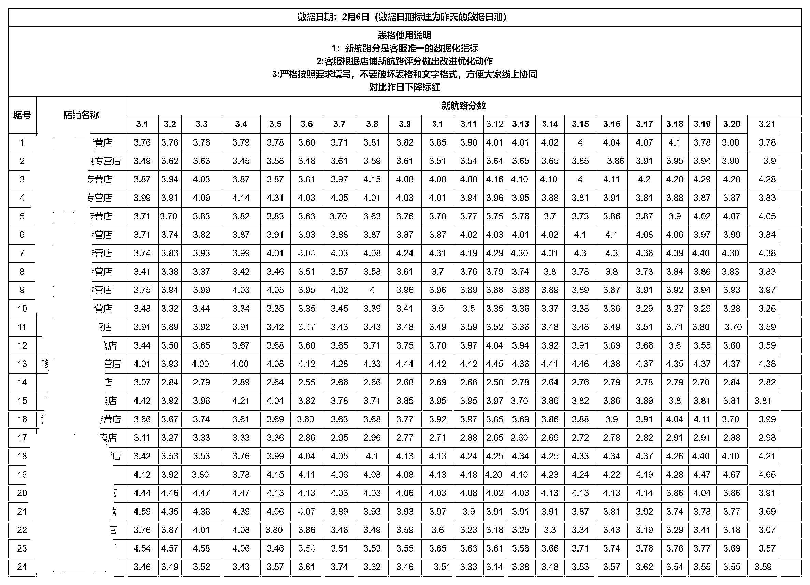

# 8.2.4 合理安排客服时间 @吕远超

客服的日常工作目的就是做好服务以及拍单，增加询单转化率减少损失。

这里分享一下我们客服的日常工作流程。

•客服上班时间

白班：8：00-17：00

夜班：16：00-24：00

•处理紧急重要的事情（8：00-8：30）

例如深夜的客户咨询、投诉、检查违规罚款。

•新航路表格更新跟进维护（8：30-8：50）

下图为我们的客服日更新表格，每天上班后 1 小时内发出：

根据上图我们可以时时跟进店铺的评分，然后对新航路评分低的店铺进行优化。

一般新航路分客服能把控的就是几个部分：

① 回复速度：日常客服机器人 24 小时全开，如有回复不及时，看看是不是哪个店铺一段时间离线；

② 发货速度：及时采购拍单发货；

③ 退货情况：新航路分低的话，能不退就不退，为了客服分可以给客户补偿，不赔就行。

•评价回复（8：50-9：00）

新航路评分有客户评价回复，每天拿出十分钟回复就能增长 0.1 分，差评多的产品反馈给运营。

•核对退款成功的订单（一天三次）

美团出了极速退款，没有发货的都可以不经过商家同意就退款，为了避免损失，我们要一天三次核对退款成功的订单，然后找淘宝上家退款。

•拍单

正常一小时拍单一次，拍单了才能更早的发货。

•发货

时间段为 ：9 点 12 点 14 点 16 点 17 点

每天发货 5 次，发货了客户就不好退了，同时发货快还能避免新航路扣分。

16：00 是商家集中发货的时间段，可以多发几次。

•交接

白班客服有遗留的问题，跟夜班客服交接好，也是彼此沟通的时间。

白班客服要求无特殊原因不得遗留订单，退款核对到 16:00。

内容来源：《美团电商运营管理分析》@吕远超

