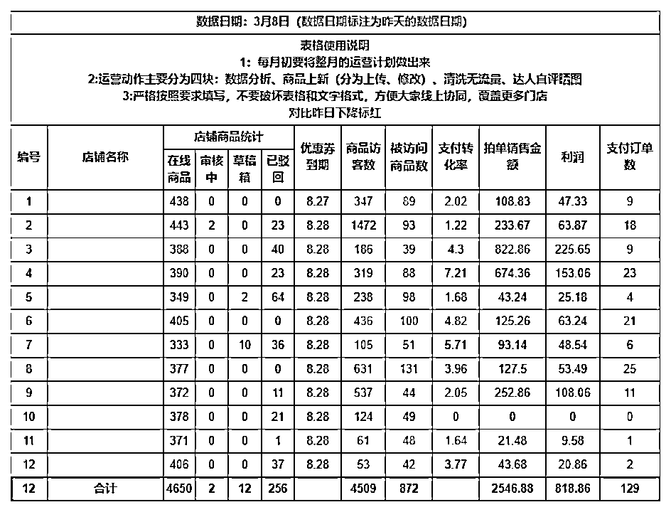

# 8.3.2 技巧二：店铺分析

随着我们规模的扩大，我们的店铺也会变多，那么就要优先去优化差的店铺，这些店铺优化空间大，坑位多。

下图就是我们在运营店铺中用到的表格，这个表格每天早晨运营都会在上班后半个小时内发出：

作用有二：

① 让运营对自己的店铺数据有充分的认知，运营团队互相也有竞争压力

② 可以根据表格针对性的优化店铺

如何使用上表呢？主要看以下几点：

1.在线商品数分析店铺空缺的坑位数量，优先补齐

2.商品访客数分析店内的爆款数量

3.支付转化率分析宝贝的质量，是否有高流量宝贝溢价过高，是否主图详情页较差

4.销售金额跟利润还有支付订单就是大家关心的店铺产出，我们拿出来跟昨日相比，及时跟进异常店铺

5.优惠券跟活动到期时间，不要让产品裸奔，提前安排

有了数据的支撑，所有的分析才不是摸着石头过河，才能做出对应的可落地的优化方法。