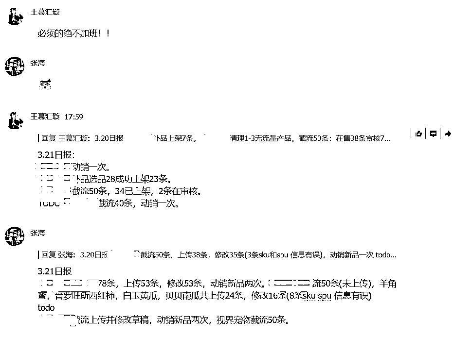
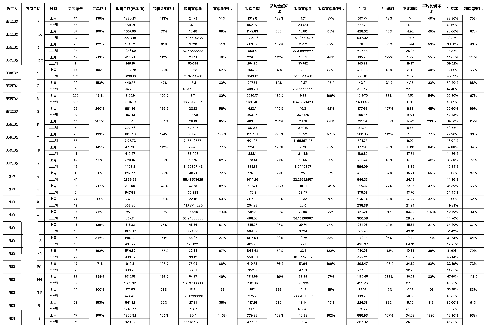
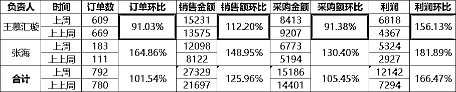

# 8.3.3 技巧三：日报复盘+周报分析

•日报

日报是运营的总结复盘，以及明日的规划。如果你是团队作战，可以善用日报的形式来做复盘。

作为管理人员我们要日维度跟进，好的表扬，差的协助解决：

•周报

周报是我们周维度跟进的表格。

具体内容有：本周日均流水，订单，利润等环比上周的对比。

表格中的数据可以这样标注：红色标注下降数据，绿色标注上升数据。

日维度去对比是相对不准确的，而周维度对比就会好一些，月维度更精准一些。

数据才是结果，我们关注的过程，更要关注结果。

下图就是周报的部分展示：

根据上面的图我们可以跟进相对数据增长较差的运营人员，也可以把上周数据做的比较好的运营的工作方法拿出来分享。

根据店铺的数据我们来分析店铺，再有针对性的细化优化店铺的宝贝。

内容来源：《美团电商运营管理分析》@吕远超

