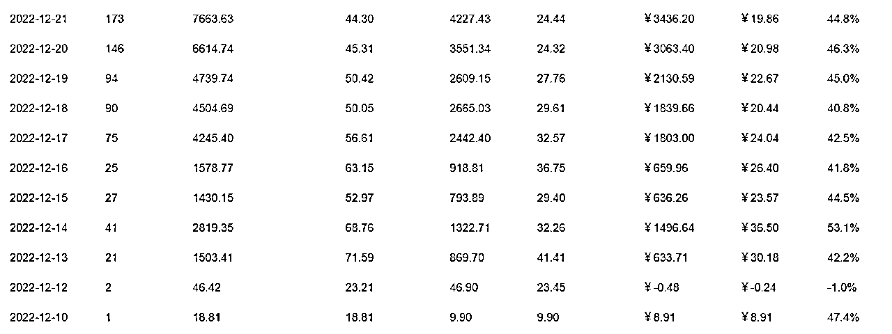

# 8.4.1 准备阶段：商户入驻和上架商品

商户入驻：

因为是准备做店群，而且美团的入驻流程还是比较复杂的，我培养了 2 名兼职专门进行入驻操作，熟悉入驻信息的填写逻辑（主要是商品类目、质检报告、入驻类目、商品信息是否匹配）。

具体各步骤如何执行，大家可以回顾本手册前面的相关内容。

培训完了以后每次入驻的时候只需要自己安排好入驻类目、商标、对应的账号密码即可，这样每次下来营业执照后第一时间就入驻了。

这里注意一点，管理员手机号一定要填写自己的（所有店使用同一个号没问题）。

一是避免兼职后面不干了，不好改手机号；二是方便第一时间知道入驻结果还有就是后面出现客诉美团能第一时间联系到负责人

上架商品：

这里的兼职可以分为“选品+采集”岗位和“草稿箱审核”岗位。

“选品+采集”：帮她们制定选品方向和筛选商品的基础方法，每人每天选品 200 个+采集到草稿箱 200 个当天必须完成，一般兼职薪资开到 50 元 -80 元/天。

选品和采集工作也可以再拆分，选品的工作人员每天选品 300 个费用在 50-80 元；再安排人单独做采集采集费用在 0.1 元/条。

负责商家入驻+上架商品的兼职可能会出现的问题：

① 会出现一个四级类目给你选出来五六十个品；② 选的品严重不贴题，例如手表店给你选出来一堆衣服；③ 四级类目商品不多，给你选一些低销量、店铺服务分低的品；④ 凑活事儿，给你选出来一堆图片上带价格、品牌和带运费的品。

草稿箱审核：

“草稿箱审核”岗位 5 个兼职一组，创建一个小群，每次给了店铺账号后把群名称改成对应的店铺名。

从组中找个代表开通美团秀秀会员用于扣白底图用，5 个人同时登录不会被封号（再多了会有封号风险），安排好每个人做第几页，以防做重。兼职薪资在 0.4-0.8 元/个商品。

草稿箱审核兼职可能出现的问题：

① 现在采集软件自动扣白底图，兼职会求快不看白底图怎么样就直接上传，驳回率比较高；② 凑活事儿，图上带着价格、品牌、平台就直接提交审核。

对蓝海市场来说，效率第一，因使用人海战术，快速起店，当时只用了两天时间订单就上去了：

