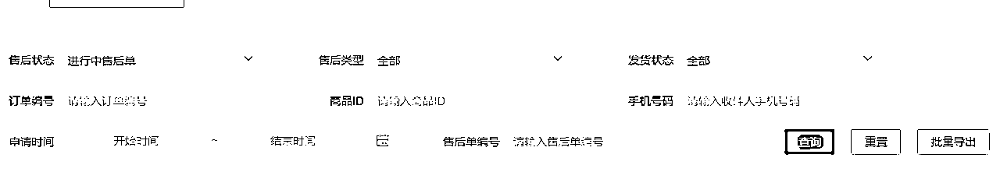
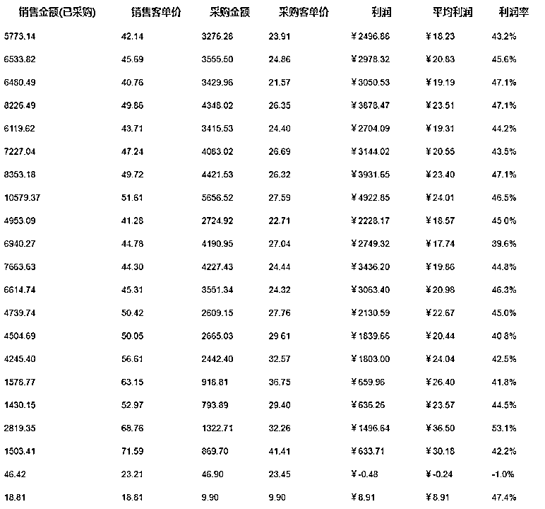

# 8.4.2 运营阶段：人员架构

运营阶段主要分享下我们的人员架构和人员参考。

【人员参考】

人员分为客服、运营、草稿箱审核、达人点评。

目前运营 24 家店铺，客服 1 名+运营 1 名+草稿箱审核 2 名+达人点评 2 名

成本核算（使用兼职）：

客服薪资 2500-3500 元/月

运营 1500-2500 元/月

草稿箱审核（计件） 0.4-0.8 元/个

达人点评（计件）30 个商品 50 元

【客服】

客服主要负责拍单、发货、售后、回复客户消息。

这里讲一下我总结出来的客服注意事项和方法（仅供参考）：

拍单：因为涉及到拍单付款，会给到客服支付宝号和淘宝号，每个账号存放固定的采购费用，这样在每个月结算的时候能够清楚的计算费用情况，如出现亏损均有客服承担。
发货：因美团要求是 24 小时发货的，一般其他平台都是 48 小时发货，所以一定要勤点“发货”有发出的第一时间发出，尽量降低超时率；同时好多顾客都是以为当天送达或者第二天送达，尽快发货也能避免退款率。
售后：每天早上上班现看下未发货已退款的订单。

因平台的机制是超时发货订单申请仅退款是秒通过的，避免出现损失每天需要检查最少 3 次未发货仅退款的订单。

然后再看“进行中售后单”：

这里可以理一下“待商家处理”和“待商家收货”的订单。

所有售后单能处理就第一时间处理，平台考核主动退款率，有很多订单在顾客下单后一两个小时就申请退款了，原因是“对发货速度不满”这种也是可以直接同意的，找平台运营确认过这是不扣分的。

客服消息如何回复：

因每个人的打法不同，店群形式基本上是简单回复，不出现客诉就可以，因为客服岗位需要做的工作很多，不能在客服消息上投放过多时间。精细化运营就需要拉转化了，目前我们还没有到拉转化的阶段。

【运营】

运营的工作内容：

1.整理需要做点评的商品然后导出商品 ID 备用

2.处理需要下架的商品

3.选品+采集至草稿箱

4.活动填报和活动下架

【草稿箱审核】

草稿箱审核需要每天查看店铺草稿箱，将运营采集至草稿箱的商品审核上架。

【达人点评】

达人点评，需要收到运营派发的点评商品 ID 进行点评。

下面晒一下日常数据

整体上我们的投产比还是非常高的，严格意义上来说只用了一个客服和一个运营，而且都是使用兼职，在人员成本上基本上没有压力，大家有兼职资源的话可以在初期尝试下。

最后总结下，所有项目都会有时效性，把工作拆分，变成可复制性，然后增量去干，形成质变。

内容来源：《0 电商经验如何使用兼职低成本快速打爆美团电商》@Jason 张

