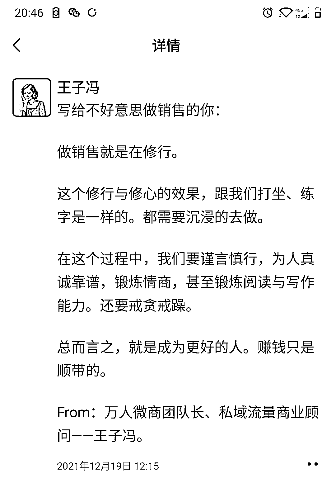
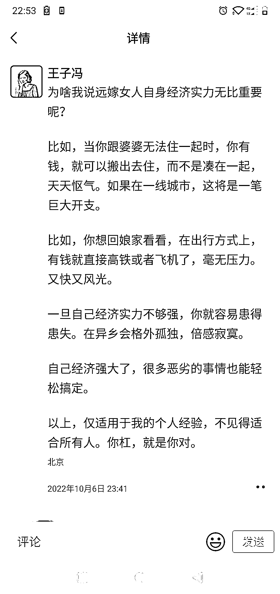
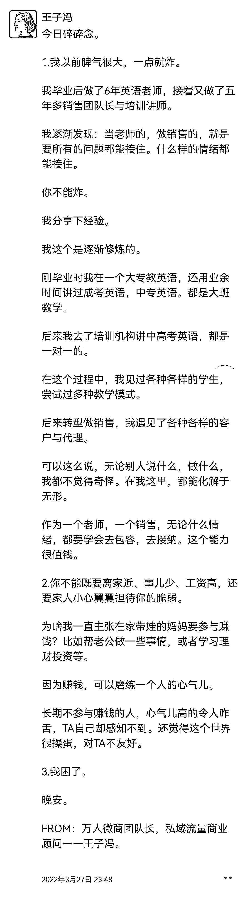
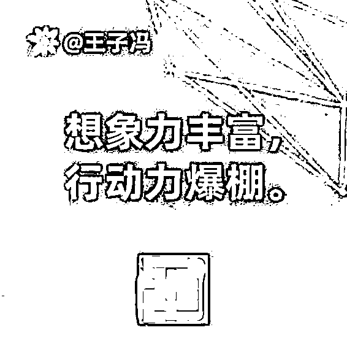
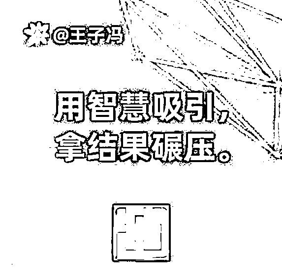

# 第一种：以某个人的身份，在朋友圈打卡

1）XX 说

比如：王子冯说。万人微商团队长王子冯的肺腑之言。二胎妈妈王子冯敬上。

以上三个，就是三个身份，事实上都是我。只不过写某一条文案的时候，是以某个特定的身份写的，让不同的人群有强烈代入感。

看例子（点击查看大图）：

2）金句打卡

要么是延伸内容，要么是讲个故事方便读者理解，要么是讲讲我为什么会写这几句。

大家可以看几个我以前写的金句：

金句的格式是：提出问题，解决问题。大家可以多多写金句，慢慢摸索出自己的风格来。这样你发出去了，就会形成传播势能。

这一招，对于我们打造个人品牌非常友好。