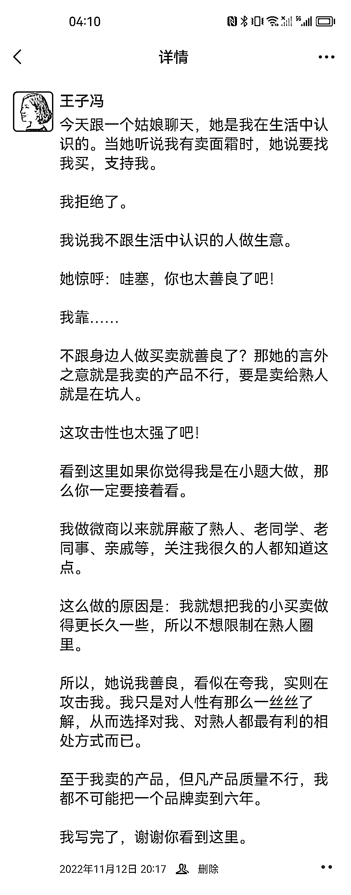
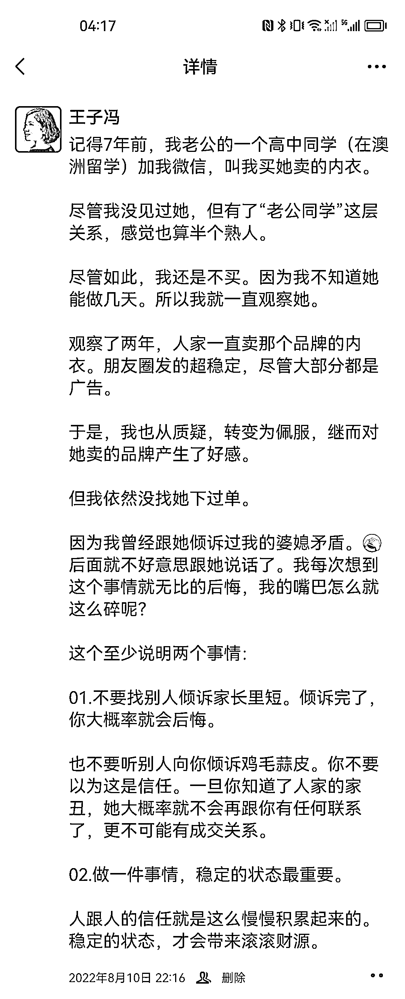
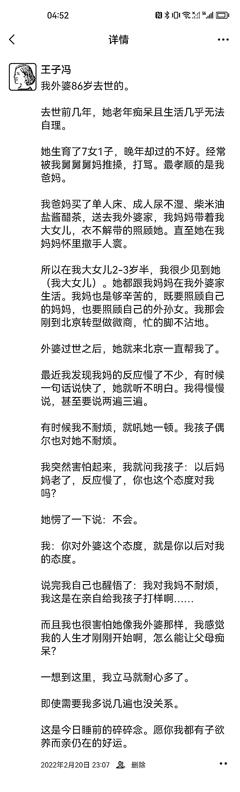
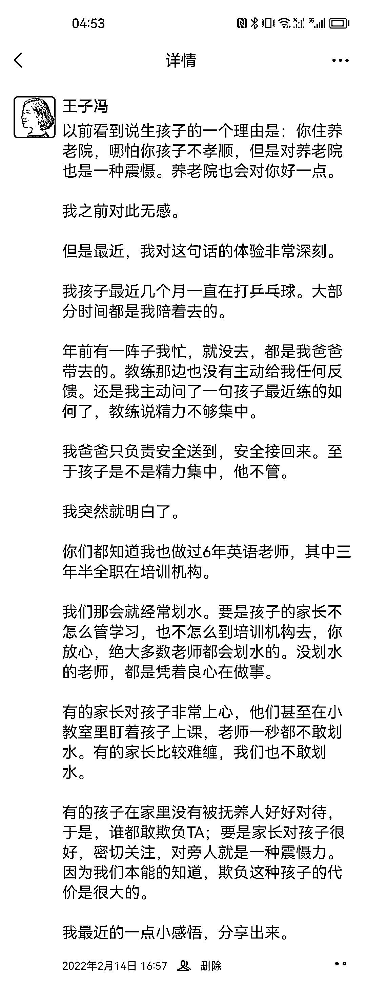
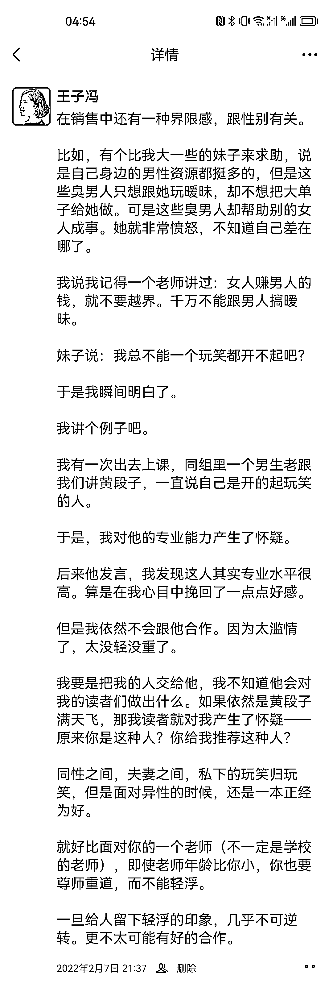

# 第二种：故事引出价值观

先直接看例子：

第 1 条核心观点是：在表达上，不要有攻击性。这个故事是很多人都会遇到的，所以读者有很强的代入感。看到最后会觉得我说得有些道理，从而反思自己的表达。

那我的目的就达到了：读者觉得有道理，且能改变自己的言行。

第 2 条核心观点是：为人父母是不会自在的，作为子女我们不要撒谎。这个故事也很有代表性，很多子女对父母都是报喜不报忧，从而搞得自己不堪重负，结局很难看。

我希望这一条能给读者的内心松松绑。

第 3 条核心观点是：不要随便对人吐露你的隐私。因为你会失去一切关系，甚至都是悄无声息失去的。

这个例子也会让很多人反思自己的行为。确实很多人喜欢到处讲自己的隐私，也喜欢听别人的隐私。

再来看三条：

第 1 条核心观点是：我们对父母要有耐心。我讲了自己外婆的故事，会引起很多人的共鸣。很多人对自己父母是没有耐心的，看完这个故事跟我的观点，我相信很多人至少当下想对父母温言细语一些的。

第 2 条核心观点是：有了孩子，对外界来说就是一种震慑力。这个观点其实很有争议性，我只根据自己养孩子、我当英语老师的经历来看的话，这个观点是非常对的。也算是跟有相似认知的读者交流。

第 3 条核心观点是：要注意销售中的性别界限。这个例子我相信很多人会有共鸣，很多群体里都有一两个喜欢开黄腔的人，他们可能不觉得自己油腻，而是觉得自己幽默吧？看完这条，或许能让一些人警醒，从而更注意性别界限，让自己更受欢迎。