# 2.1.4 来源四：随时所想

这类素材往往有以下几个角度来源：

1）工作中的片段

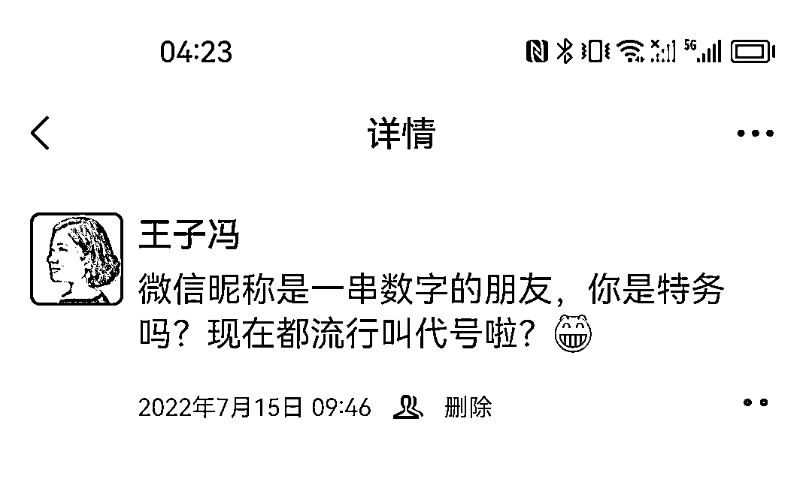

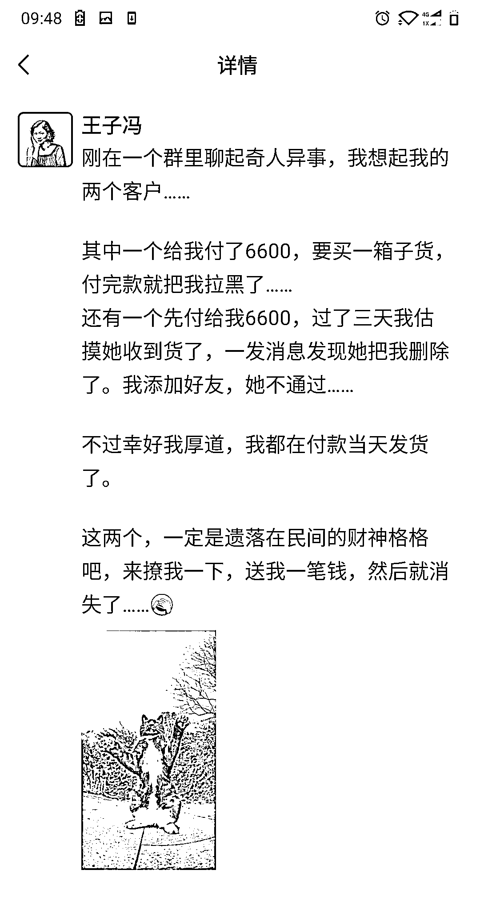

2）亲子（点击可查看大图）

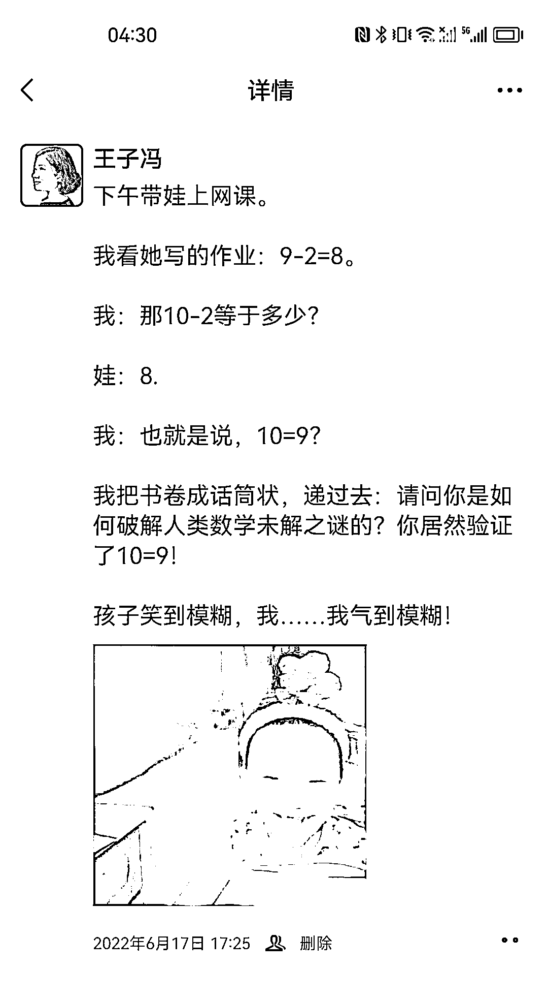

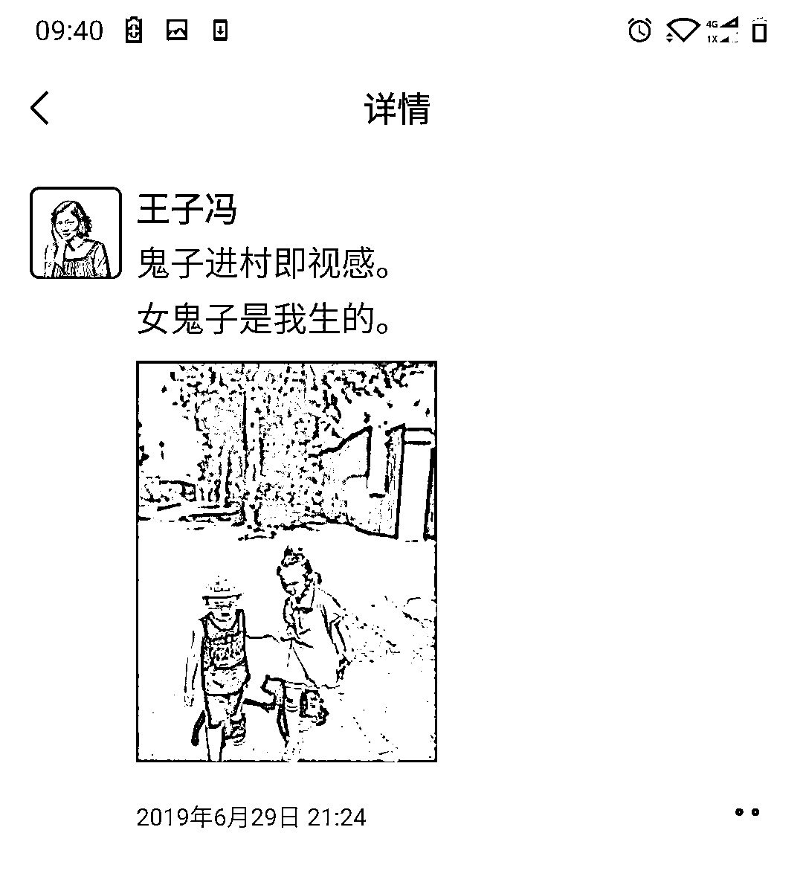

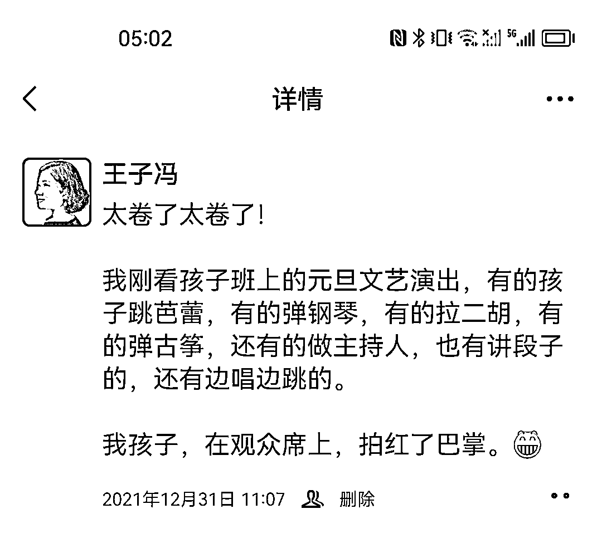

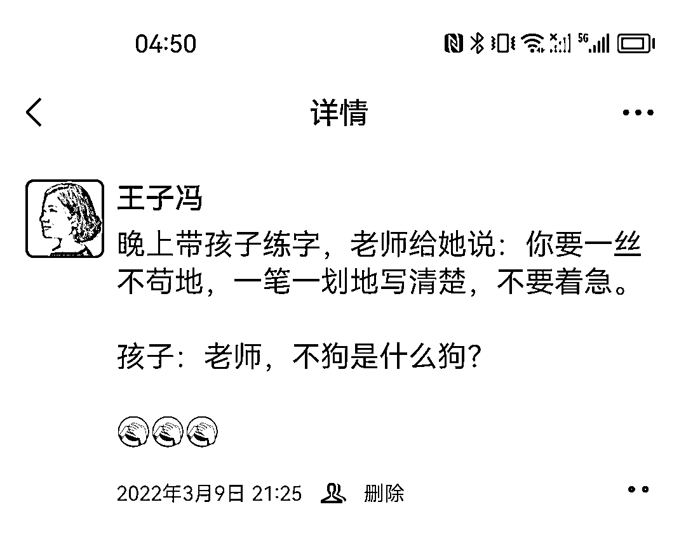

3）夫妻 CP

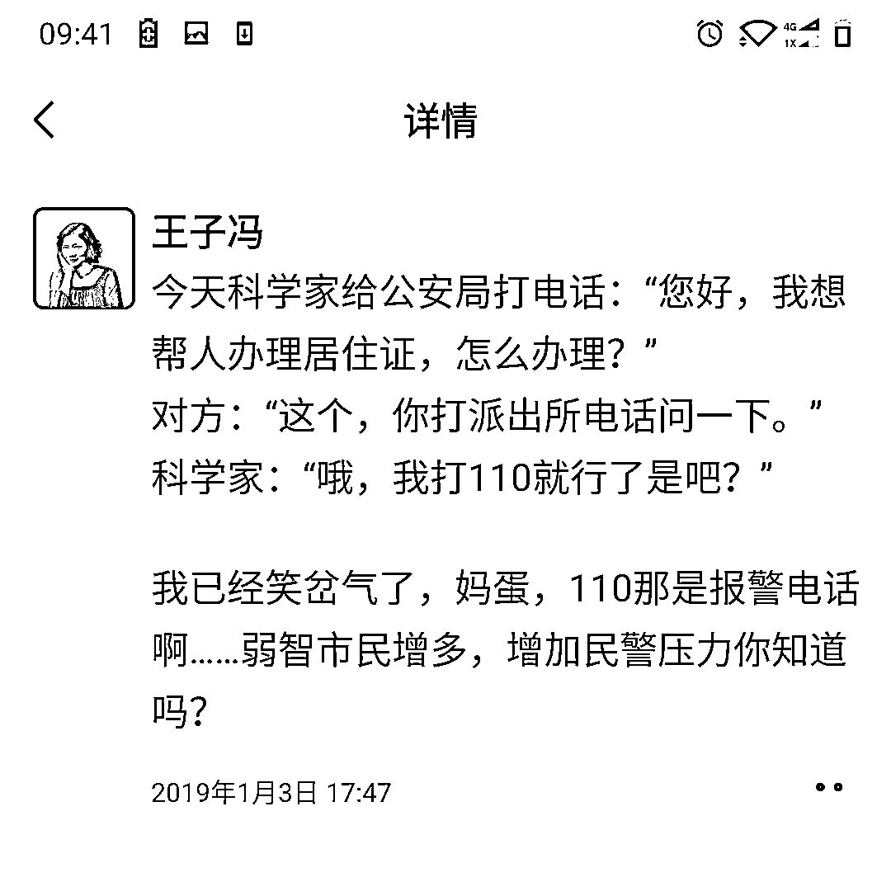

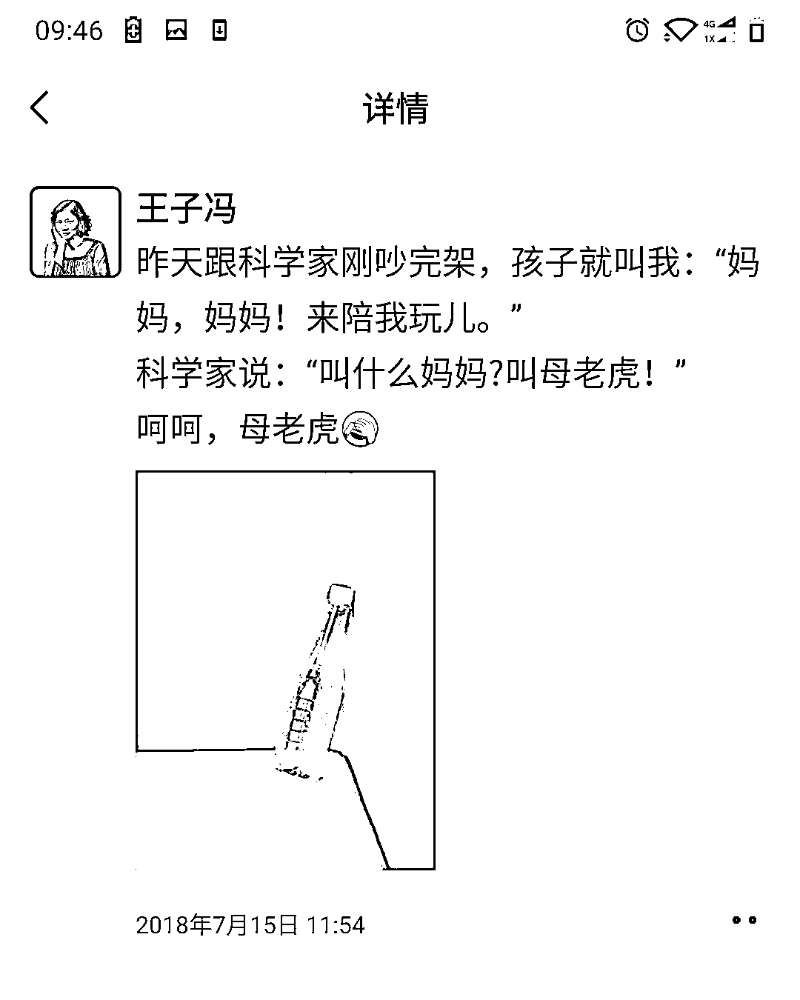

4）日常其他生活片段

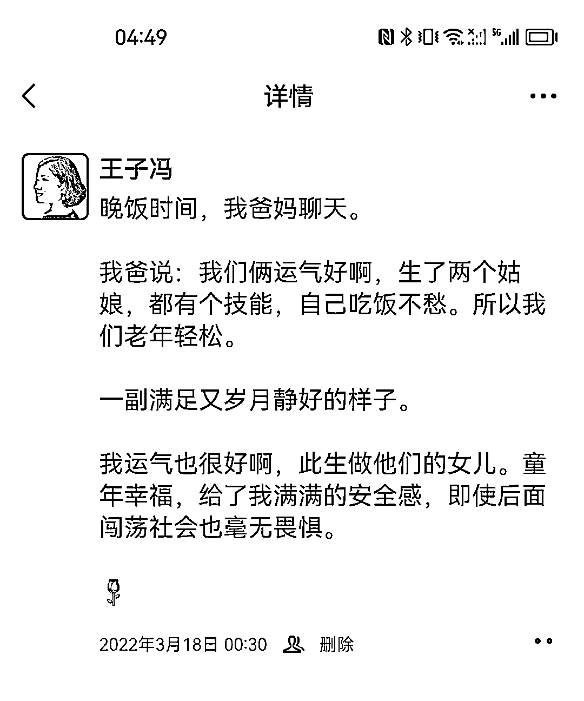

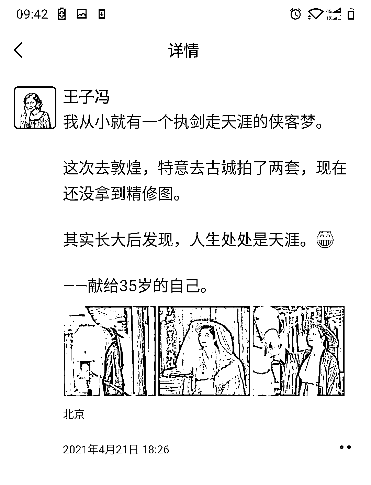

这部分没有任何技巧，大家要学会观察生活，留意生活中的各种美好，或者各种丑陋。

比如下图，是我跟一个公务员朋友聊完之后写的。他羡慕我时间自由，赚钱比他多。但实际上，大家在其位谋其政，大家的生活方式和目标不必一样：

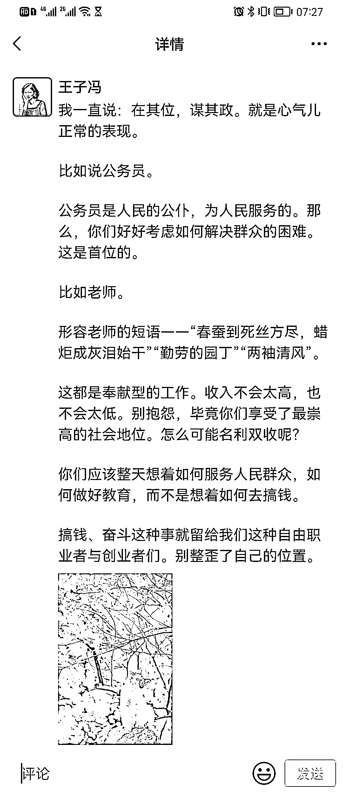

再比如下图，是我刷抖音看到一个视频，国家奖励一个立下战功的士兵。再一次强调我们作为社会人，要各司其职，不要羡慕别人：

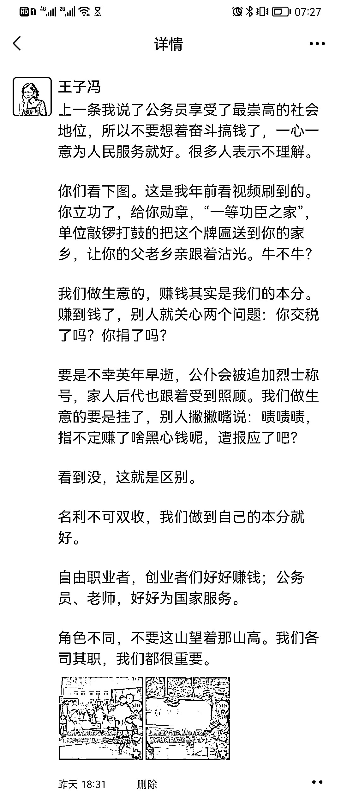