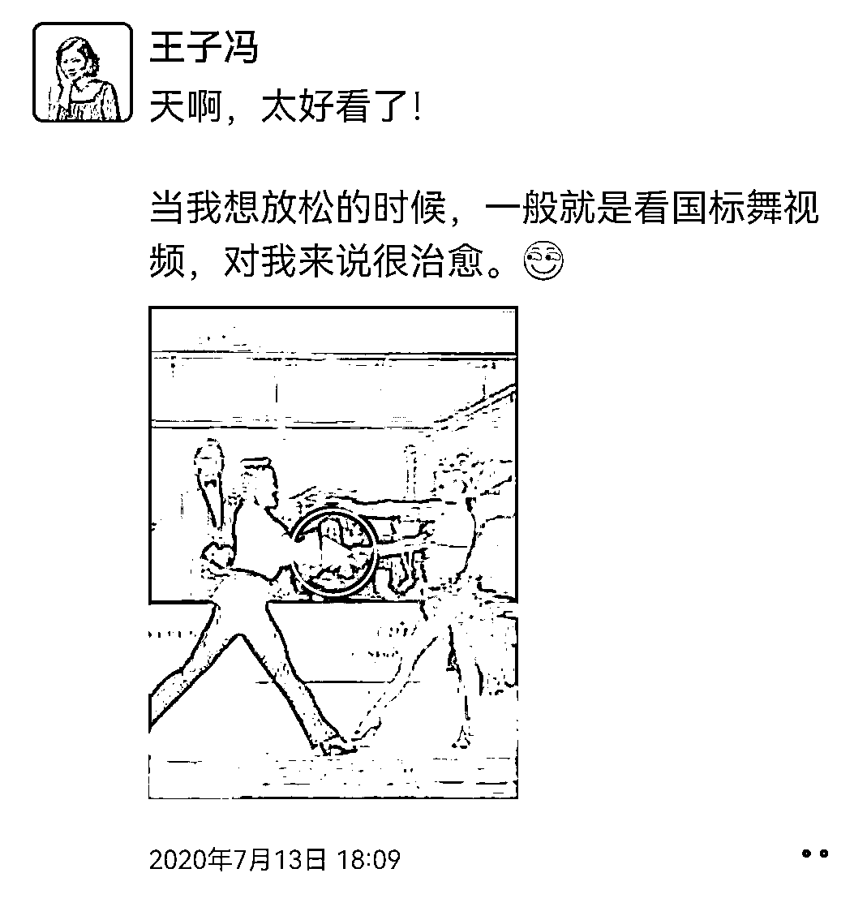
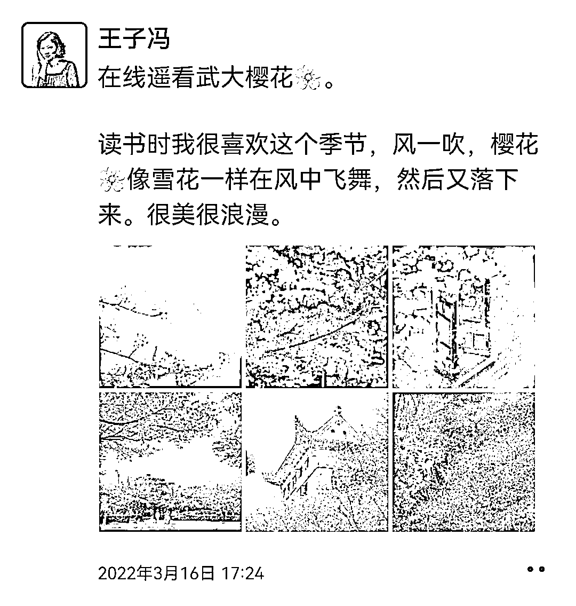

# 技巧一：观赏价值的文案，引导大家看图即可

观赏价值的文字千万不要发表观点。

既然是发观赏价值给读者看，那么文案传递的意思就只有一个：这个图好好看，我发给你看吧！

所以，新的思考题来了：美图、美景、美人儿的图片（或视频），这是素材，引导读者看图的文案可以怎么写呢？大家现在想想？

可以看看我的参考答案：

比如，这图很美啊，分享给大家。比如，这是 XXX 的美景，刚拍的，还是热乎的，赶紧分享给大家～

所以观赏价值的文案就一个意思：请你看图，千万不要整鸡汤，也不要讲别的。

我发观赏类内容是干嘛的？就是让大家看、让大家欣赏的，我觉得很好看，所以分享给你。

大家 get 了吗？

•看例子

