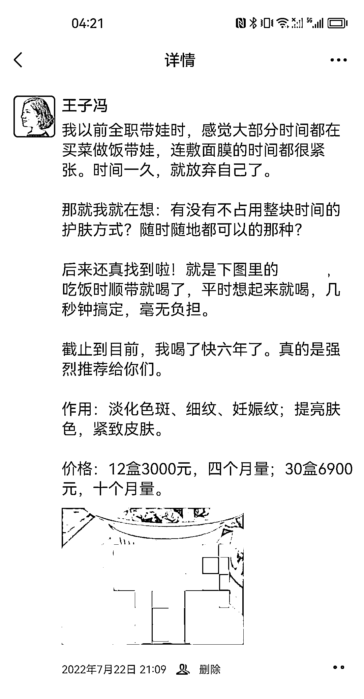
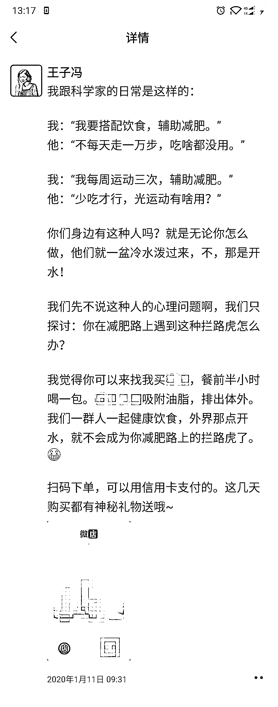
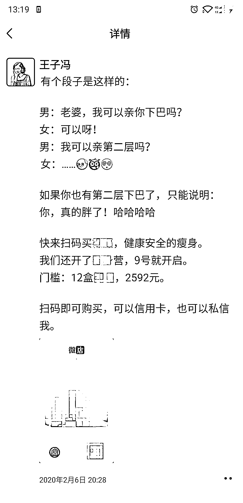
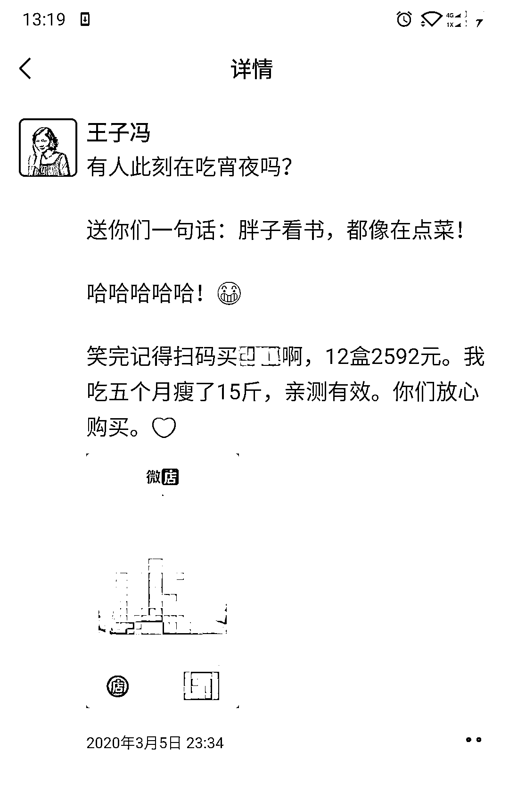
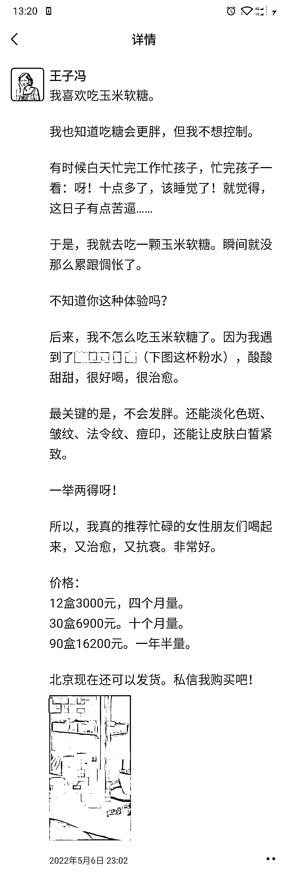
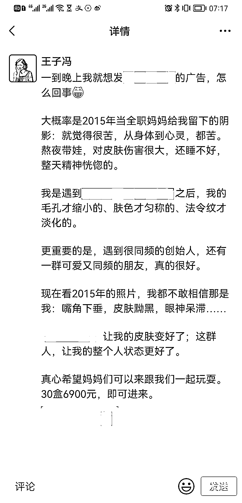

# 2.4.1.1 第一类：生活场景带出产品

•格式：先说生活场景，引出产品，下单指令

•重点解析：结尾下指令

来看一组案例：

上述六张图都是有生活场景的，比如我家里的生活、吃宵夜的、被家人泼冷水的、熬夜带娃的等等……

这些都是生活化的场景，而且基本都是大部分人的日常。这些场景很容易把读者带进自己的生活场景中。

以上的案例，基本每一条的结尾我都有一个指令：扫码购买/找我报名。读者是需要指令的，不然读者看完前面精彩的文案，看完就完了。

这点在其他自媒体写作上也是如此。

我曾经试过，在公众号文章的结尾处加上一句：看完请点赞、转发。点赞与转发的数量就比平时更多。如果不加那句，点赞与转发的数量就大大减少。

所以，读者是需要指令的。那么，我们就勇敢的在文案结尾处下个指令。