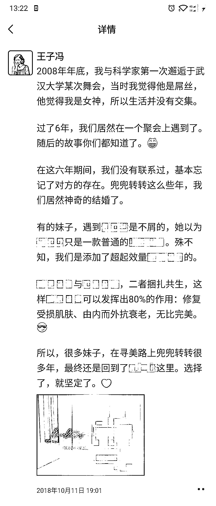
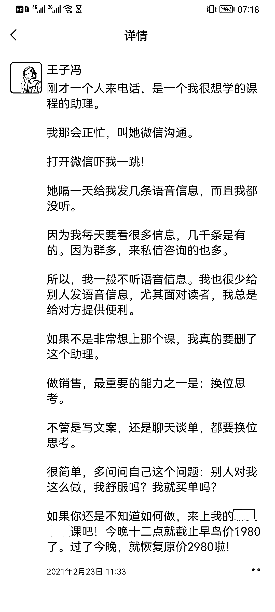
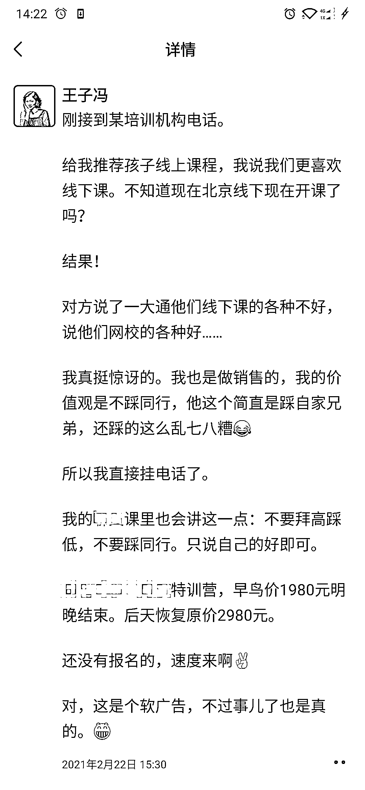

# 2.4.1.2 第二类：故事带出产品

•格式：前面是故事，后面是广告。

来看案例：

故事的可读性很强，读者一般是顺着读下去。结尾处猝不及防的一个软广告，读者一般会觉得你很可爱。这类软广告的文案是最受欢迎的。

关于这一部分，建议大家可以参考罗振宇老师的跨年演讲的文稿，他会讲很多小故事，最后带出来一个广告，效果极好：[《罗振宇 2023「时间的朋友」跨年演讲全文稿》](https://mp.weixin.qq.com/s/DNC5TsJg-RK8GOHzhLHStA)