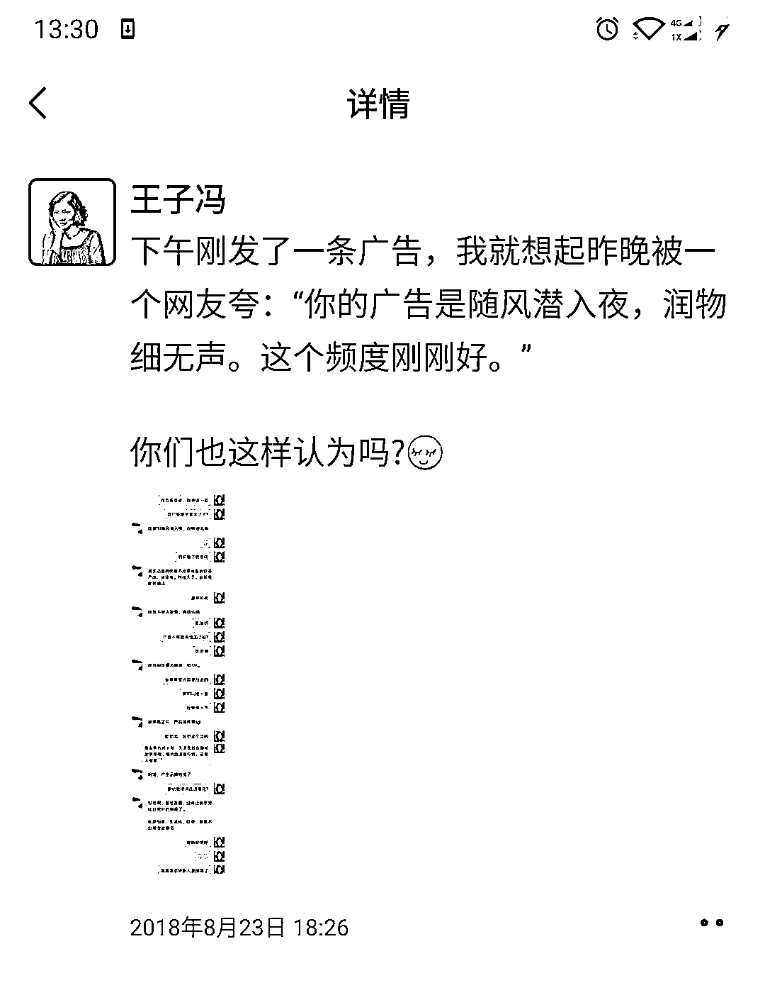
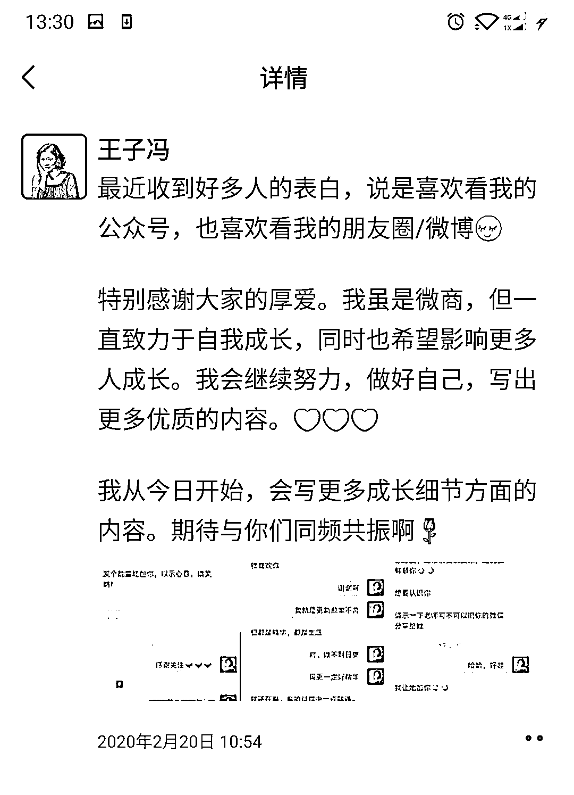
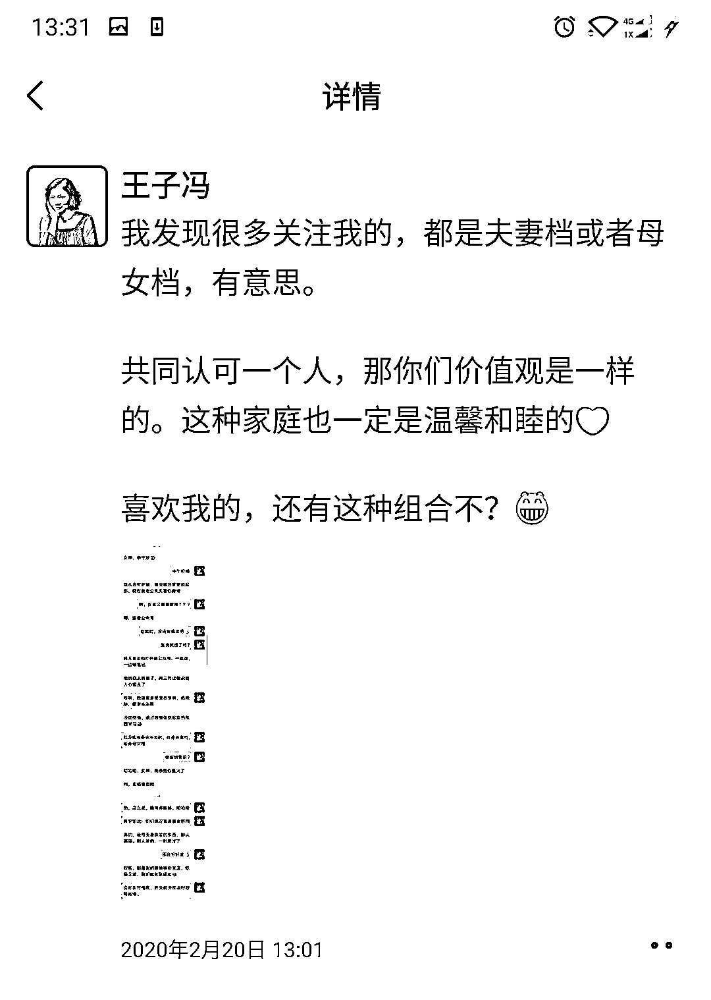
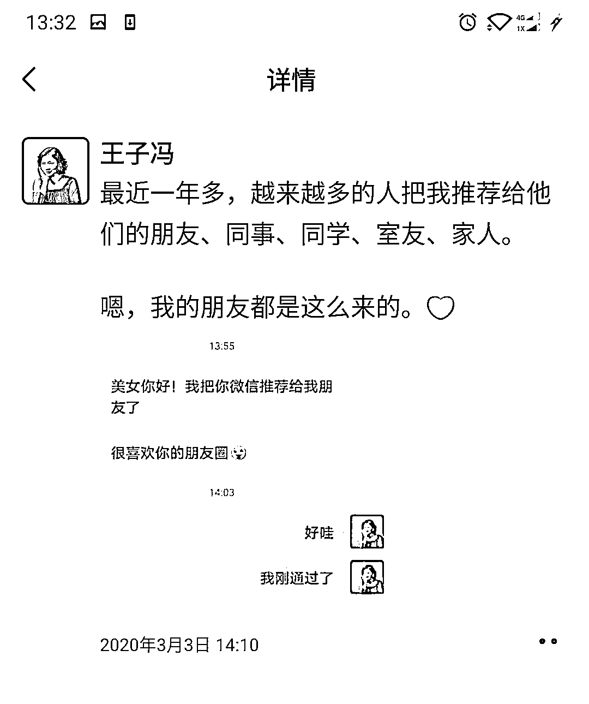
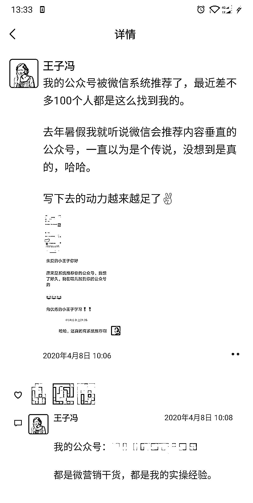

# 2.4.1.4 第四类：别人对我们的评价与喜欢，要王婆卖瓜

先来看案例：

这一类朋友圈的核心价值是什么呢？是你觉得自己很好，别人也觉得你很好，想让更多的人知道你很好。

如何输出这类朋友圈呢？

那就是借别人的嘴，把别人对你的夸奖发到朋友圈，让更多人知道，同时让更多人感知到你的实力。这种情况下你能看到谁一直在关注你，还能开启私聊。

重点提示：你跟别人的对话，得到授权才能发圈

别人对你的赞美，一定要经过授权才可以发圈。做一个真正靠谱、让人放心的人才行。