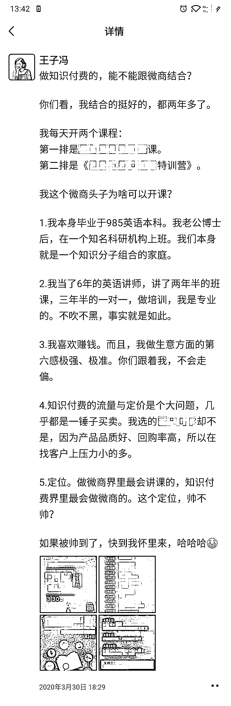
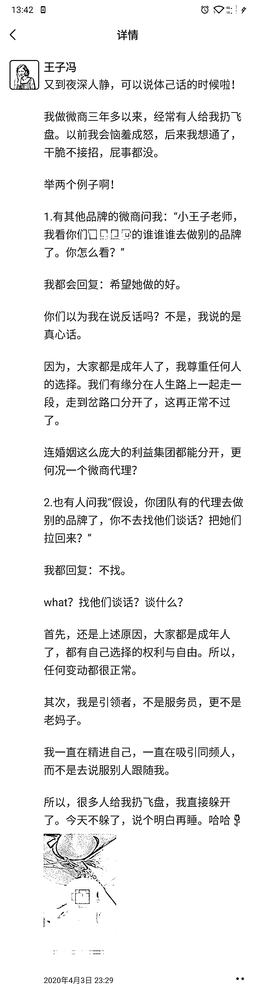
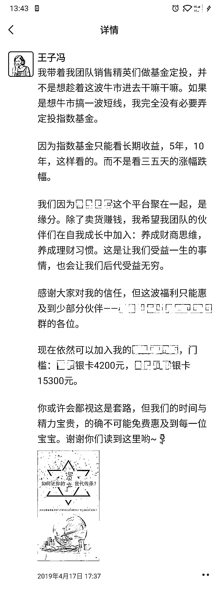
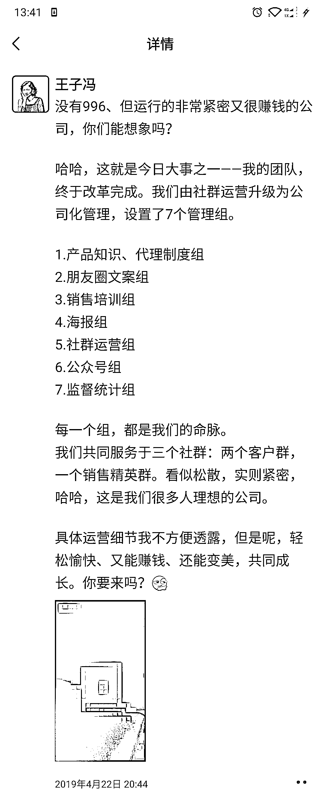

# 2.4.1.6 第六类：扩大格局，输出可为行业做什么

我们在本行业做的时间越久，写的观点越应该处于顶端。

来看案例（点击查看大图）：

比如我经常写团队长应该做什么？商业顾问应该做什么？我这个团队长，能为行业做什么？

不能一直站在新人的位置写东西，也不能一直站在最上面写东西。上上下下，要自如。

这一点不强求，如果你高度到了，你就可以往这个方向写；如果高度暂时没到，可以不写。

我们写这个，不一定能马上收到钱，但是会让别人对我们有全方位的认知，至少段位比较高的人会很欣赏你。我们写朋友圈不仅仅只是吸引客户，有时候会吸引到段位很高的老师。正向圈子的能量往往也能提升自己。