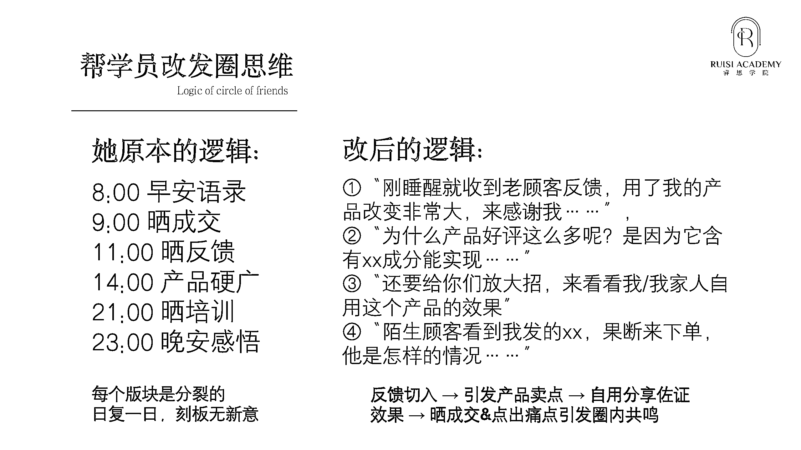

# 3.1.1 朋友圈调整前后对比

① 先去掉所有时间节点，把一天要发的内容打散

——让别人看到你每天的布局都是不同的，有新鲜感，才会对你的圈感兴趣

② 接下来，找到一条「逻辑线」串联起要发的内容

——比如先发一条“刚睡醒就收到老顾客反馈，用了我的产品改变非常大，来感谢我……”，再发一条“为什么产品好评这么多呢？是因为它含有 xx 成分能实现……”继续“还要给你们放大招，来看看我/我家人自用这个产品的效果”之后“陌生顾客看到我发的 xx，果断来下单，他是怎样的情况……”

「反馈切入-引发产品卖点-自用分享进一步佐证效果-晒成交&点出痛点引发圈内共鸣」，这就是一条简单的小逻辑线，成功串起来了 4 条朋友圈，而且如同讲故事一般，循序渐进的展开了

③ 再在圈里加上一些出其不意的灵感性内容，比如你的生活故事、你的突发奇想、你看到一个新闻引发的观点，让你的圈整体灵活生动起来

逻辑线发圈，需要先找到一根线，把一个或者多个事件串联起来，按照一定的逻辑呈现，就像电视剧一样展开。

所以从这个点可以得知：这个逻辑线，它不是说一成不变的，每天是可以有不同的逻辑线的。

内容来源：《巧用「逻辑线」发圈法，让用户越看越上瘾》

