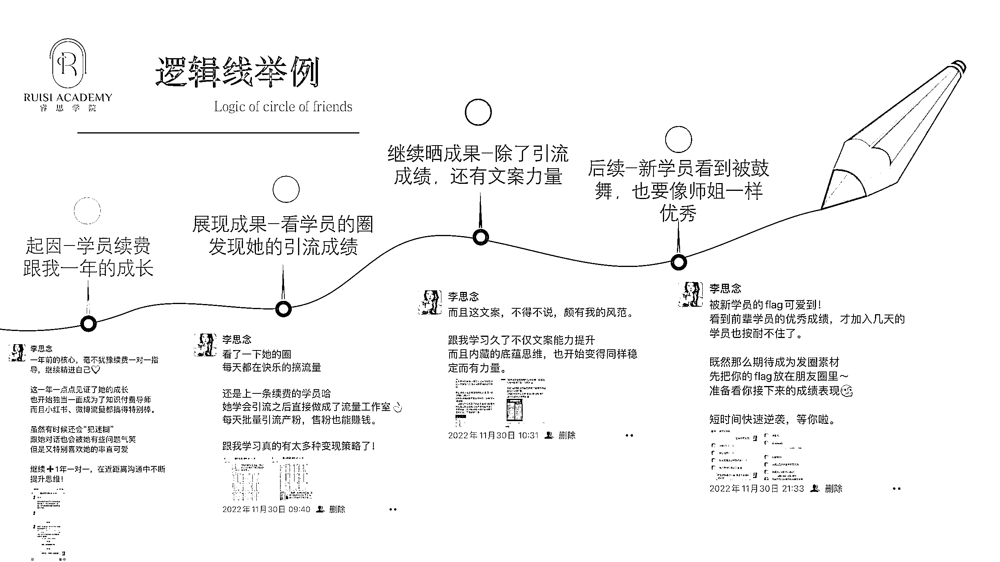

# 3.1.2 案例一：如何用逻辑写用户反馈

第一个案例是反馈型事件。

这个案例的开端，是我的一位学员续费了。这名学员跟了我一年，我一步步陪伴她的成长，所以有较多内容可以发在朋友圈。

那么这条朋友圈的逻辑线怎么写呢？

我们可以展开讲讲她是怎么成长的，这部分属于一个成果展示：这位学员每天都在快乐的搞流量，而且还做成了流量工作室。

当然，她也不止学引流，文案上也有很大进步，写的文案充满了力量感。所以我就将她的变化作为素材发圈，多方位、全面地展示学员成长。

这个发完了之后，其实我本身是没打算有后续的了，但是这种逻辑线朋友圈的好处是，非常吸引人，结果刚发完就有一个新学员来跟我说，“看到前辈学员的成绩被鼓舞了，也要努力去做，争取被我晒出来”——于是我又发了最后一条。

这一天朋友圈的逻辑就是非常圆满的，既成功地宣传了我这里能够带学员做出来的成绩、又让大家感受到了我这边学员整体状态的积极性，会被这种向上的能量所感染。

这是我通常晒反馈的一大技巧，我晒反馈不是单独一条去晒的，而是像这样，把反馈形成一个事件去晒。有起因、有经过、有结果、有后续。

这个中间的过程，不要刻板，要根据具体情况来，如果当天有随机事件发生，这个事件恰好能跟你的主逻辑是连上的，那么就可以加上一起发。

内容来源：《巧用「逻辑线」发圈法，让用户越看越上瘾》

