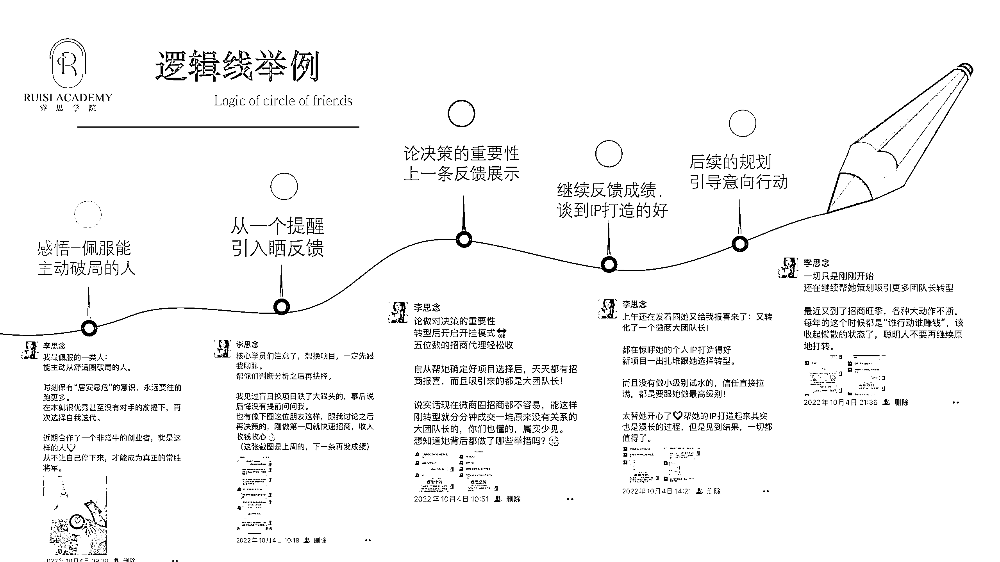

# 3.1.3 案例二：如何用逻辑输出观点 ①

再比如这一天的朋友圈，我早晨是先发了一条自己的观点文案，说“最佩服能主动从舒适圈破局的人”，在写这一条文案的时候，我心里就已经定下了这一天的主逻辑线，是要讲一讲「主动的效果」。

接着，我发了一条圈，提醒学员遇到问题需要判断选择的时候，一定要多来找找我，然后从这一条，引入一位学员的成绩。

从这里开始，具体地阐述成绩，谈到我帮助这位学员敲定转型之后她的改变。

晒完这几条之后，我又提到，我还在继续帮这位学员做规划布局，到了招商的旺季，一定要行动起来。这里就扣回了这条逻辑线的主题，引导大家主动行动。

也就是说，我们去设计的逻辑线，一定是围绕着一个主旨的，然后在这个主旨之下，你可以通过各种案例去进行佐证，案例必须是真实并且紧扣主题的，层层递进，这样当用户看完你这一天的朋友圈，就仿佛看了一篇爽文，情绪就被拔高起来了，也会忍不住想要跃跃欲试。

如果当天有一个重要事件，可以直接围绕事件展开朋友圈。

内容来源：《巧用「逻辑线」发圈法，让用户越看越上瘾》

