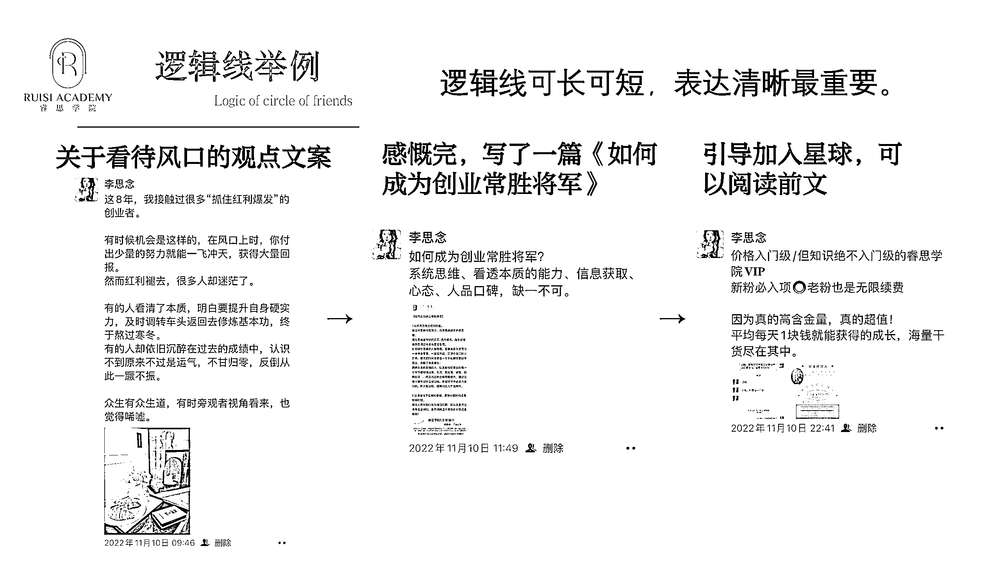

# 3.1.4 案例三：如何用逻辑输出观点 ②

我用 3 条文案，就完成了一个「引导大家付费我的星球」的逻辑线。

首先，我是写了一条关于看待风口上的创业者的观点文案，就是说“很多人在风口时赚到了，但是红利褪去之后却迷茫了，沉浸在过去的成绩中，结果最后什么都没有”。然后这条文案当时获得了非常多的点赞，能感受到，有很多创业者是有共鸣的。

于是我就趁热打铁，赶紧围绕这个主题写了一篇《如何成为创业常胜将军》的文章，这篇文章是发布在我的星球上的，需要付费才能看到，所以我会先发一条关于文章半屏截图的朋友圈，这是一种间接引导付费的方式。之后再晒一个加入星球的成交订单，直接的引导付费。

观点文案+提供价值间接引导+宣传产品直接引导，这个小逻辑线非常简单，大家在宣传自己的产品的时候都可以用起来。

想在朋友圈引导成交，千万别直接硬生生的去发广告，你不先给别人价值，谁会被你吸引呢，对不对？

比如你有什么产品，你可以先围绕着这个产品相关的某个知识点去写写，比如你是卖减肥产品的，你可以写写错误的减肥方法有哪些，再写写正确的减肥是怎样的，再引导到你这里是如何帮助用户去减肥的，最后提到你的产品，引导成交。

内容来源：《巧用「逻辑线」发圈法，让用户越看越上瘾》

