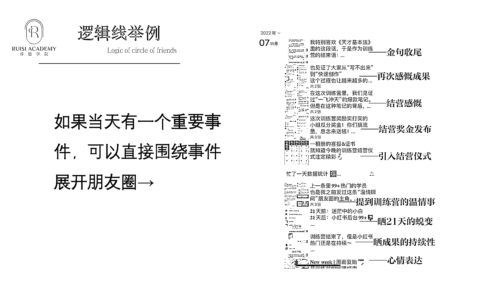

# 3.1.5 案例四：如何用逻辑写重要事件

这个案例是我之前开的一个训练营结营那天的朋友圈。那天的圈发出去之后，无论是参与了还是没参与这次训练营的小伙伴，都看得很激动，都对下一次的训练营充满了兴趣，还有很多想要提前预定下一期的。这种促进成交的效果，也是可以通过朋友圈的营造实现的。

虽然结营仪式在晚上，但是要早早做起铺垫。所以早晨先进行了一次心情表达，说“训练营的结束，刚好是双十一周的开始，每一个运营节点都卡得刚刚好”，这样首先能让用户感受到我做事的规划性。

接着开始铺垫成绩：“训练营虽然结束了，小红书热门还是在继续”，这里是为了展示一个整体成果的持续性。然后再晒具体细分的成果，晒了其中一个学员，21 天前和 21 天后的变化，从这一点就能体现出给学员带来的成长，而这个学员，正好还是之前发生的训练营温情事件的主角之一，这样一下子就加深了大家对他的印象，既能体现真实性，又能体现温度。

到了晚上，引入结营仪式，满满的喜报和证书，一张截图发出来，哪怕没参与训练营的朋友，也能感受到今天这里有大事发生，成功勾起来受众的好奇心。然后宣布了不仅有奖励还有奖金，这是属于营造惊喜，到这里把大家的情绪引向了一个高潮。

最后是发表我对训练营的感慨，感慨大家做出成绩背后的不易，是大家的坚持努力和训练营共同的结果，这是比较低调的一种表达，因为我也不喜欢那种疯狂晒成绩很自嗨式的发法。咱们做事的时候，记得一定要让你的圈子好友感受到你的态度，这样才会有同频的人愿意来学习，因为价值观而吸引来的人粘性往往是更高的。

在感慨的结尾，还引用了当时比较火的一个电视剧，《天才基本法》里的一段金句，作为那一天朋友圈的收尾，一下子就把朋友圈的高度拉上来了。

等于既能结合热点时事，又能表达态度，给大家一种内心燃起的感觉。

所以大家发现了吗？虽然是围绕事件去展开发圈，但本质还是得想明白主旨。

咱们是要去单纯地发一个结营仪式吗？其实不是的，训练营都结束了，宣传结营仪式还有什么意义呀？之所以我要构建逻辑线去用心地宣传结营仪式，最终的目的其实是想让更多的朋友被成果、温度所吸引，所以通过这一天的圈，就有很多人迫不及待想参与下一次我的训练营。

所以，这个逻辑线其实是，「围绕结营仪式宣传我训练营的效果」。

发圈不止是为了此时此刻的成交，也是为了铺垫未来的成交。

逻辑线一定要长吗？不一定的。

逻辑线可长可短，短则 2 条，长则多条。

有时候你写不出那么多条，也觉得没必要写那么多条，能不能贯彻逻辑线呢？

也是可以的，你能表达清晰才是最重要的。

内容来源：《巧用「逻辑线」发圈法，让用户越看越上瘾》

