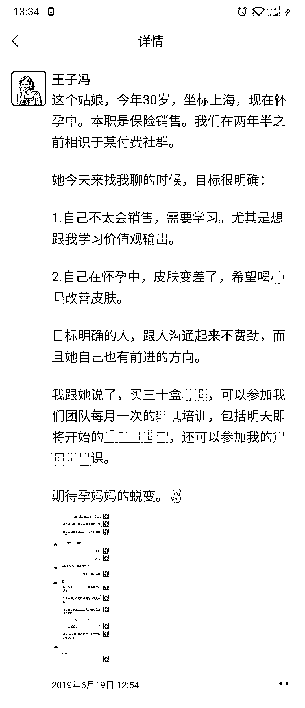
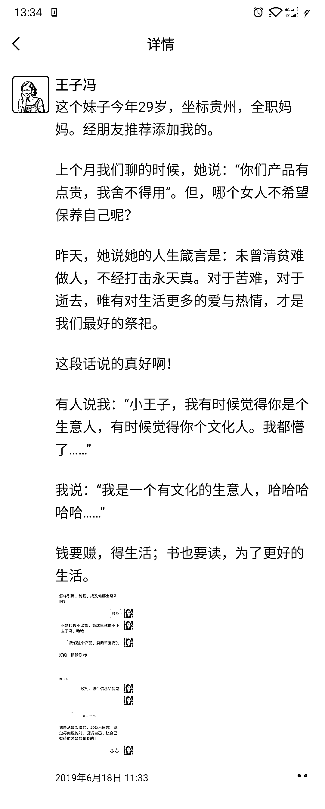
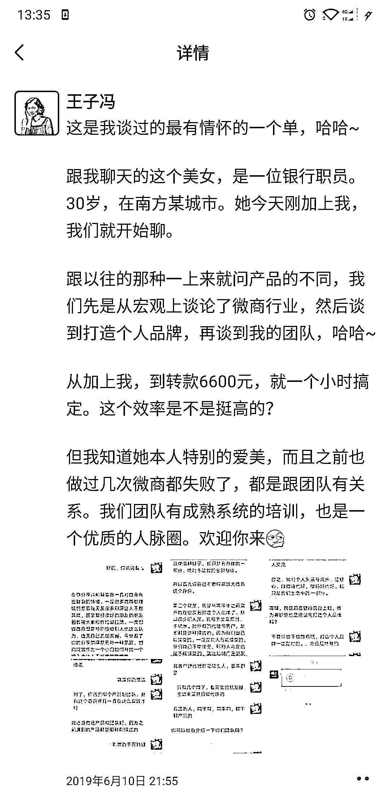

# 3.2 技巧二：写用户故事体朋友圈 @王子冯

写用户故事，主要目的是让潜在用户有代入感，激发他们的购买欲。

格式如下：

第一段，交代背景（让读者有代入感）第二段，讲述我们是如何相识的（故事性，更容易吸引读者读下去）第三段，讲成交过程（依然是故事性，关于钱的，大家都喜欢看，继续吸引读者看下去）最后，号召读者来买（给读者下指令，也就是广告）

•案例展示：

•重点提示

交代背景这一块，大家看上面的例子，基本就是开篇就写用户的年龄、坐标、职业、身份。

这是非常非常重要的信息。因为这些信息是最让读者有代入感的。

举例子，

当你在人群中看到一个人居然跟你是老乡，即使还没开口，你是不是感觉亲切多了？当你看发现有个人跟你是同一个行业的，也在用某个产品，你是不是潜意识觉得自己也可以试试？当你看到一个人跟你一样也是宝妈，你是不是立刻就有了共鸣？当你看到「90 后」「80 后」这种字眼的时候，你是不是很想继续看下去？

所以，用户背景的这个四个要素，是非常关键的。

