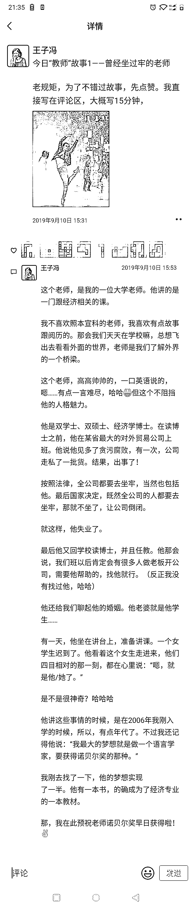
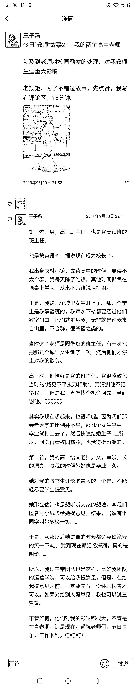
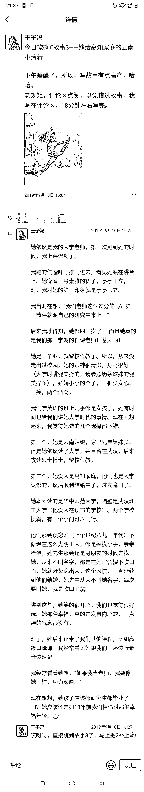
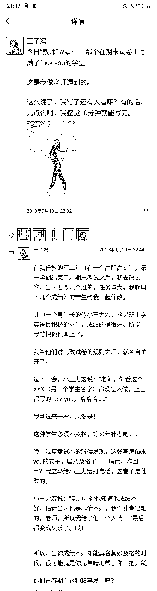
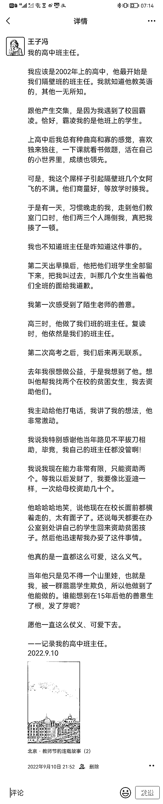
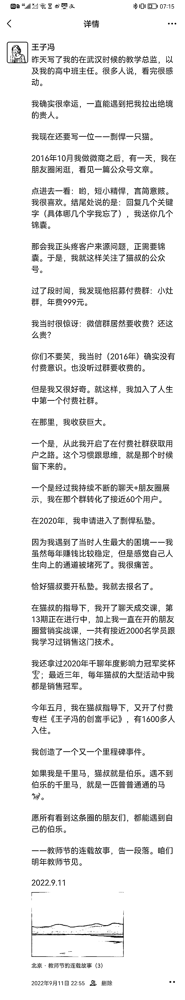

# 3.3.2 举例：主题故事

点击可查看大图：

故事一：曾经坐牢的老师

故事二：两位高中老师

故事三：嫁给高知家庭的云南小清新

点击可查看大图：

故事一：在期末试卷上写满了 fxck you 的学生

故事二：仗义可爱的高中班主任

故事三：我的伯乐——剽悍一只猫

故事类的朋友圈没有什么特定模板，把握好故事六要素（时间、地点、人物、起因、经过、结果），慢慢就会写故事了。