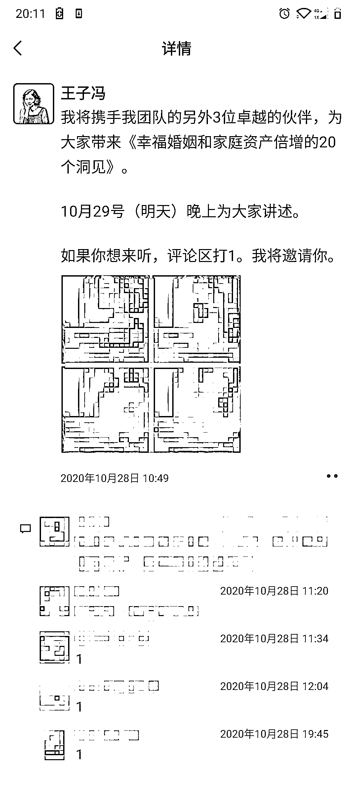
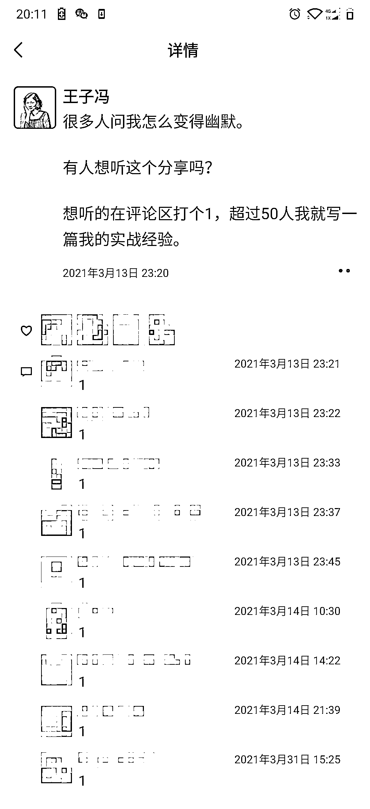
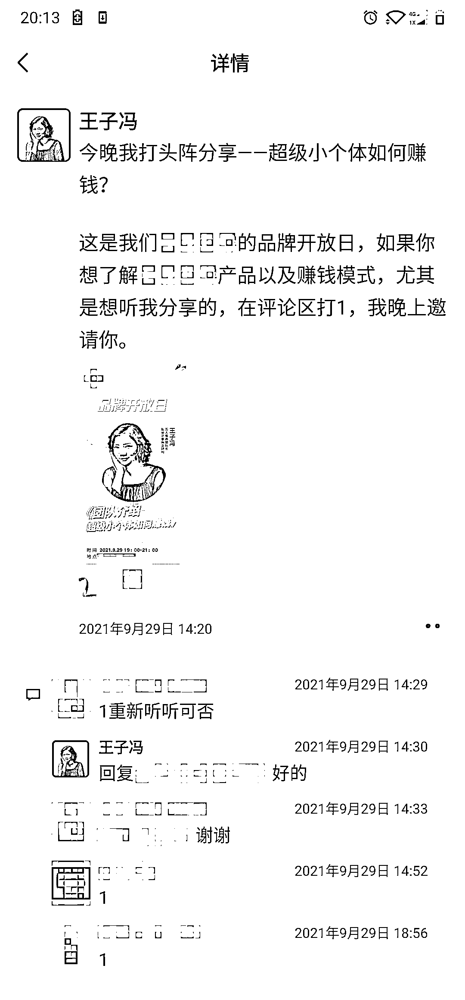

# 3.5.1.2 正面案例二：读者只需回复「1/2/3」或「是」「不是」

这几个互动，读者只需要回复「是」「不是」，从看完到写完，顶多 3 秒钟。而且图片好看，还是高清的，读者看的时候也是愉悦的，再加上不需要怎么动脑子，回复只要写一个字即可，所以读者就愿意互动。

总结：来而不往非礼也

也有人很疑惑：我们不是应该在朋友圈提供价值给读者么，怎么你又叫我们给读者下指令，求关注呢？

价值，有来有往才行，千万不要只付出，不索取。我们跟读者的关系也是如此。

所以我们跟读者的适当互动是非常有必要的。

直接互动的频率一年七八次足够。次数太多，显得你贪得无厌。次数太少，读者对你没有感知。