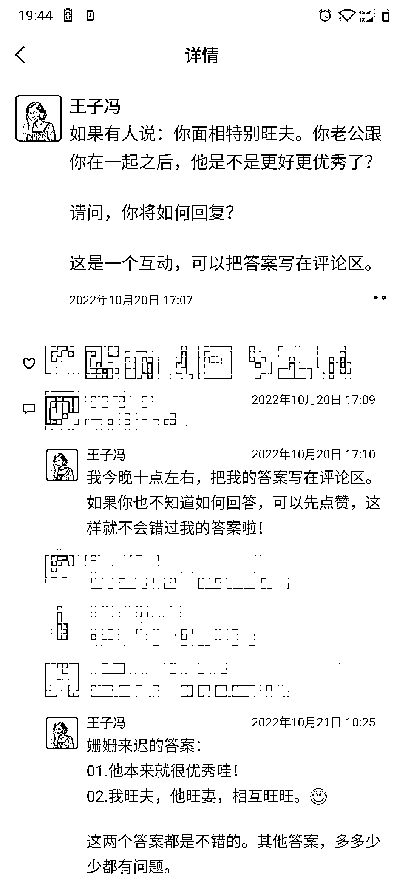
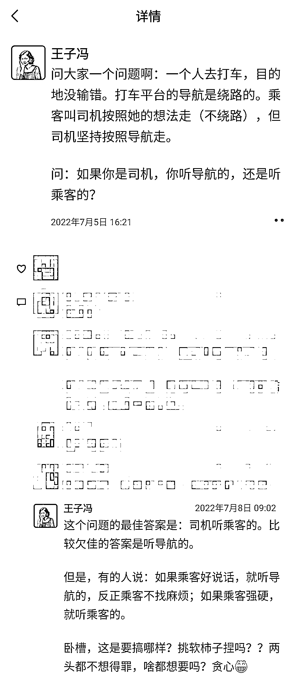
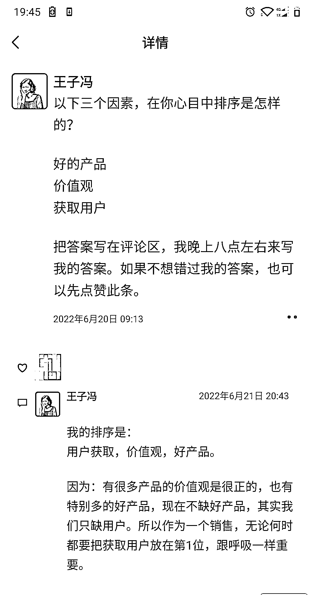
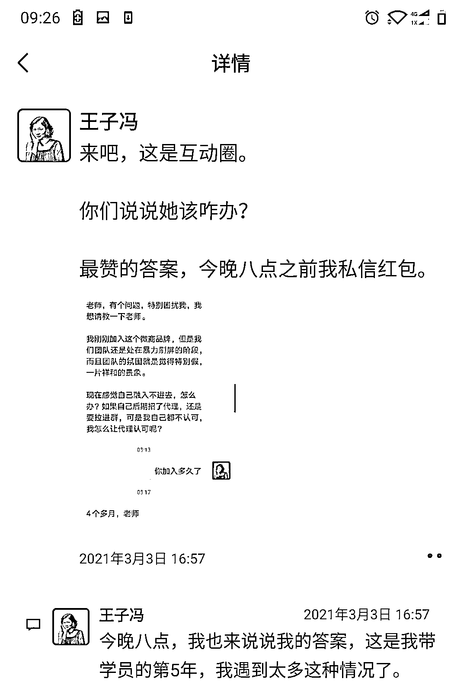
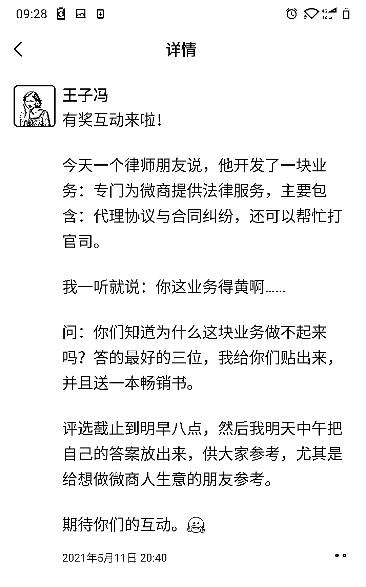
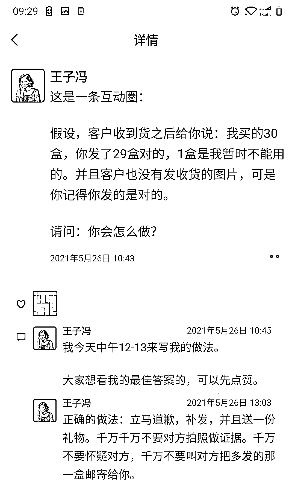

# 3.5.1.3 深度案例：有奖互动圈

有时候可以在朋友圈发业务方面的互动，比如：

我的一个代理碰见这种情况，大家觉得应该怎么处理比较好呢？好的答案，我会私信红包。

这个是需要读者深度思考的，对我们提出问题的人来说，也是一种考验。因为你出了题目，就得给答案。

如果你没有答案，是万万不可以发这种互动的，发了就是砸自己的脚。

来看示例：

这种互动就深度多了。

凡是在下面写答案的，都是经过深思熟虑的。为啥呢？

因为每个人都是要面子的，生怕自己的答的不好被鄙视。所以大家在日常业务中碰到的一些问题，如果你已经有了明确答案，可以发圈互动，也从侧面看看客户们的想法，他们的答案，你一定要无比重视，因为那是他们最真实的想法。