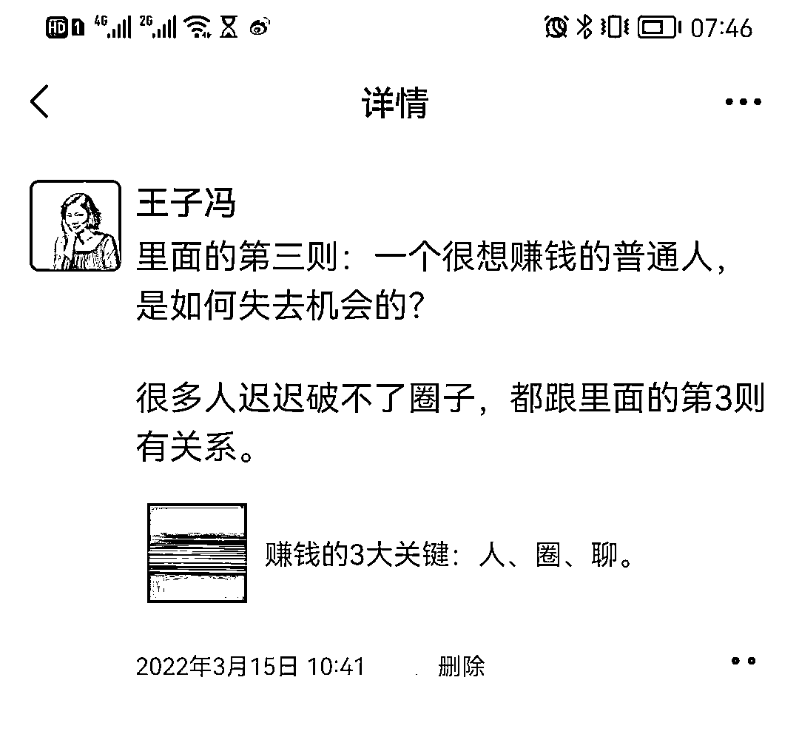
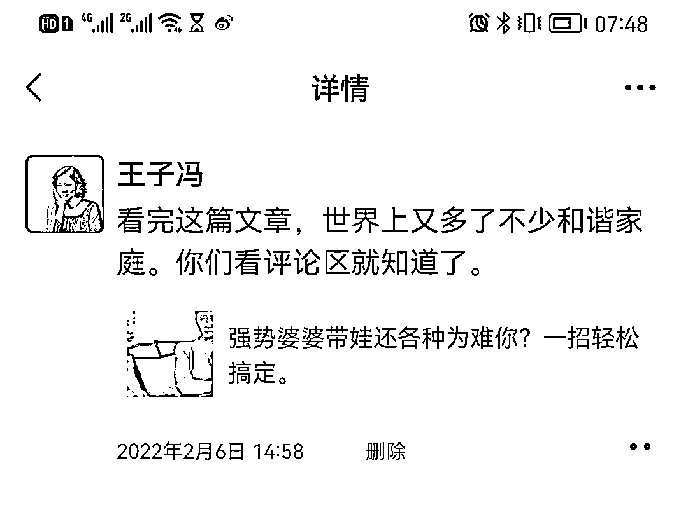
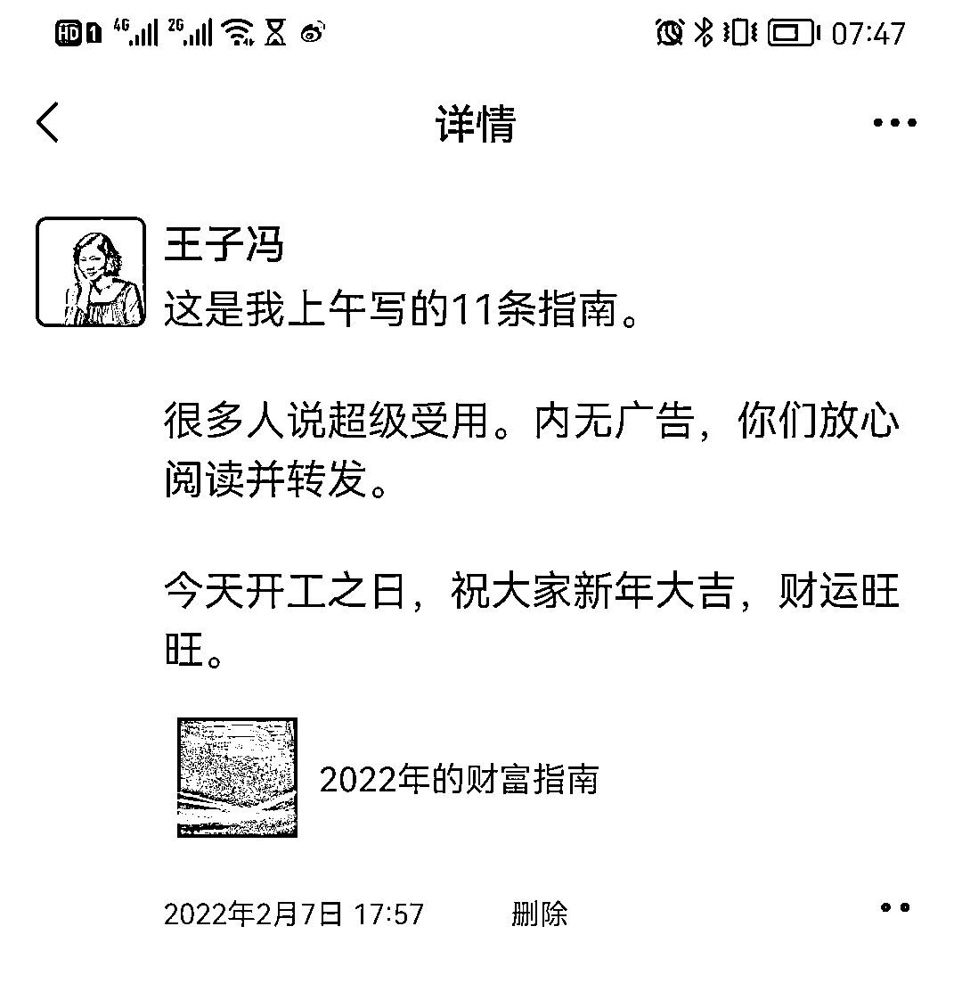
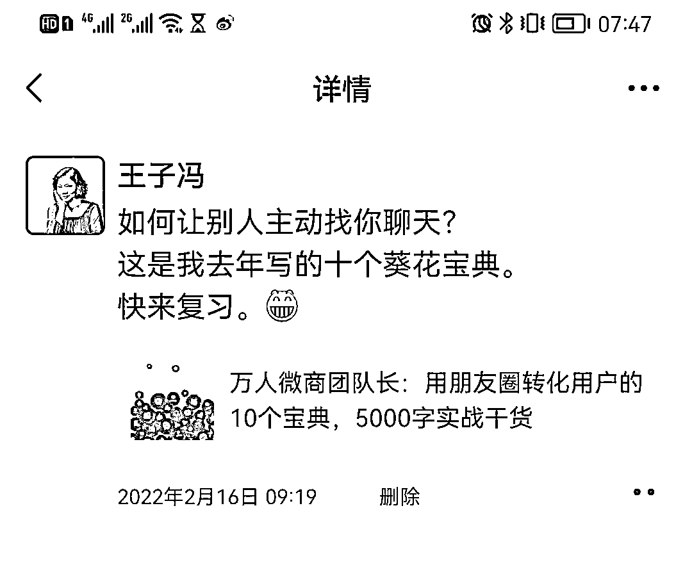
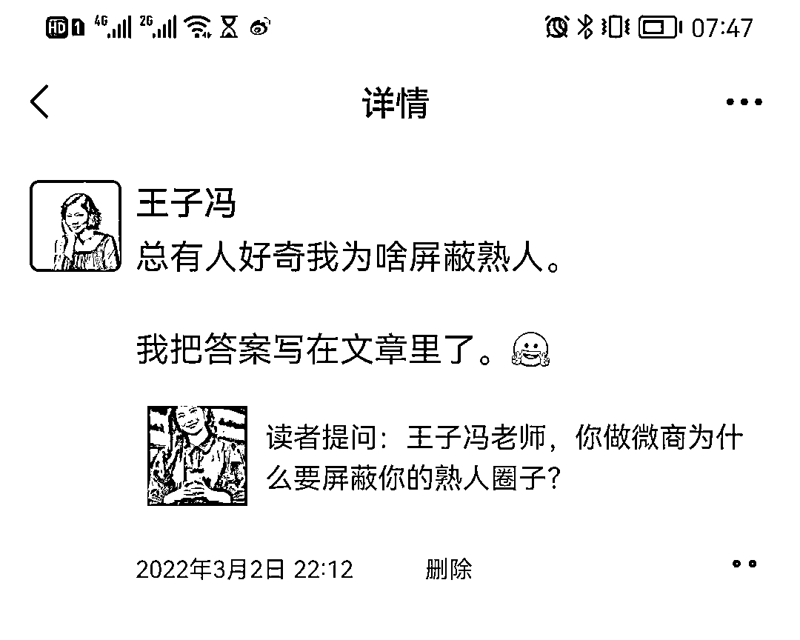

# 3.7 技巧七：推荐高价值文章/链接的朋友圈 @王子冯

素材来源我们在「2.1 高效获取朋友圈素材」中提到过，这里不展开叙述。

转发这类内容到我们的朋友圈后，该如何搭配文案呢？

1）写推荐语的三个要点

文章是讲什么的？——兴趣点读者能得到什么？需要读者做什么？

跟读者的利益息息相关，他们就愿意花时间，如果跟他们利益没关系的话，他们是不愿意花时间的。

当然不是说每一篇文章都必须有干货，哪怕这只是幽默段子也可以，读者可以得到开怀大笑嘛，也是他能得到的。

以上三点，至少得满足前面两点。

示例：

核心：推荐语不在于长，在于可以抓住读者心理。

2）转发链接的其他方式

比如转发好听的音乐、好玩的视频等。

原则依然是文字不要太长，一两句话抓住读者心理即可。我们要的效果就是读者通过我们简短的推荐，然后迅速打开链接。

