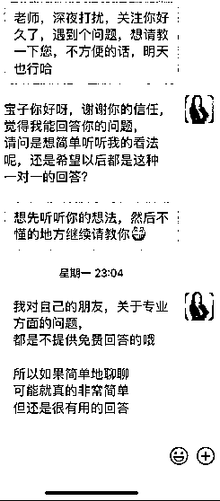

# 4.1.2 技巧一：销售自己比销售产品更重要 @小女巫忻忻

这是我个人情况，仅供参考。

做知识付费半年的时间，还没有做出非常成形的系列课程，甚至社群运营经验也不太丰富的时候，我很难确定自己出一个什么课就能卖爆。但同时，我也是深信自己有能力解决行业问题。

这里头有个微妙的时间成本和能力成本。十几年的经验，进行问题咨询是非常容易上手的，但是把这么多东西提炼成课程，线上交付，还得相当有网感。

在这种情况下，我的朋友圈要达到什么目的呢？当然是更高效地卖出去东西！

当卖产品却没有很好很丰富的产品的时候，卖自己当然更重要。尤其是做知识付费的人，先有客户，有需求，问清楚预算和想达成的目标，再来为他定制产品都可以。

标准课、咨询、知识星球或者私教陪跑……先有足够的客户想要买你的产品，你才晒更多产品，甚至在这个过程里是不断试错的。

我的引流品，两个 30 多的产品，根本卖不动，卖得更好的是知识星球，带来最多收益的是私教陪跑。所以在我看来，为客户定制产品的前提，是我已经把自己销售出去了。

而这些，都是在我的朋友圈里不断输出，才能让从公域过来的人说出，“关注我好久，想要请教”。

朋友圈的经营，像是灌溉一朵花，耐得住寂寞是基础，懂得阳光雨露的比例是盛开的要素，然后交给时间就可以了。

当然还有个很重要的前提，那就是一定要热爱自己的产品

内容来源：《低互动朋友圈带来每月五位数变现，我是怎么做到的？》

