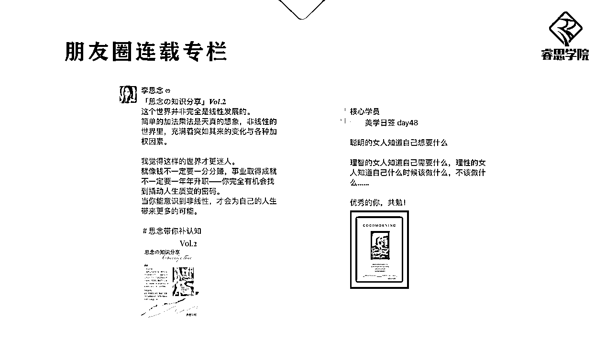

# 4.3.1.4 朋友圈连载专栏

什么是「连载专栏」呢？就是通过对专业知识或者是创业打卡的记录，来凸显你的专业性；也可以分享日签、感恩日记、每日复盘等形式的内容，来烘托自己的 IP，塑造个人魅力。上文中也有提到连载专栏「3.3 技巧三：写主题/连载故事体朋友圈」

我在朋友圈开的是一个知识分享型的专栏，像右侧我的学员做美学的，她开的就是美学日签专栏，那么你也可以开不同形式的：

比如每日复盘专栏、XX 打卡专栏、感恩日记专栏……

重点是一定要配上数字，DAY 1、DAY 2 或者 VOL.1、VOL.2 等，这样才能让别人看到你的进步与成长。

而且，这类连载专栏它有一个附加的属性，叫做正能量。

不管你在做的是什么事，只要你能长期坚持下去，都会形成一股力量。

一个系列连载持续 100 期，当别人能够感受到，你是个能坚持的人，也会对你多一分敬佩感和信任感。

而这股力量一定也会反溯回来给到你，对于你自身心态和毅力的提升都很有帮助。

我们做私域营销，其实本质就是能量的传递。

如果你能在朋友圈里，把自己强大的正向能量展示出来，传递给他人，就能收获他人的喜欢和欣赏——这个过程也是自动成交的过程。

内容来源：《如何打造自动成交的朋友圈系统》

