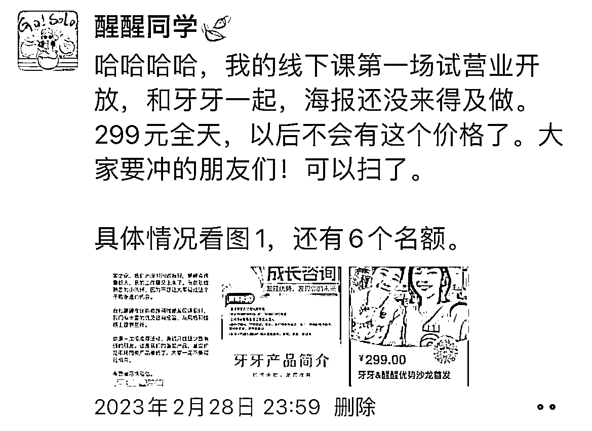
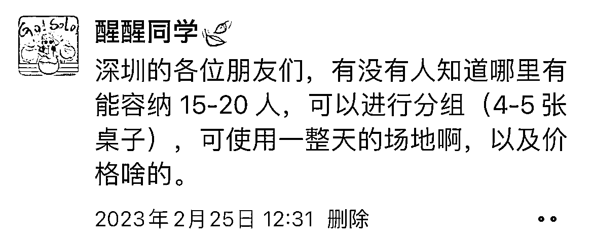
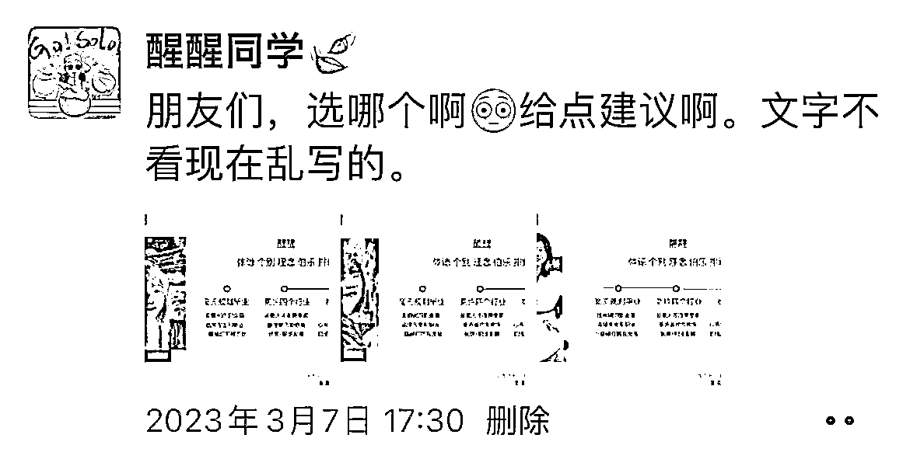
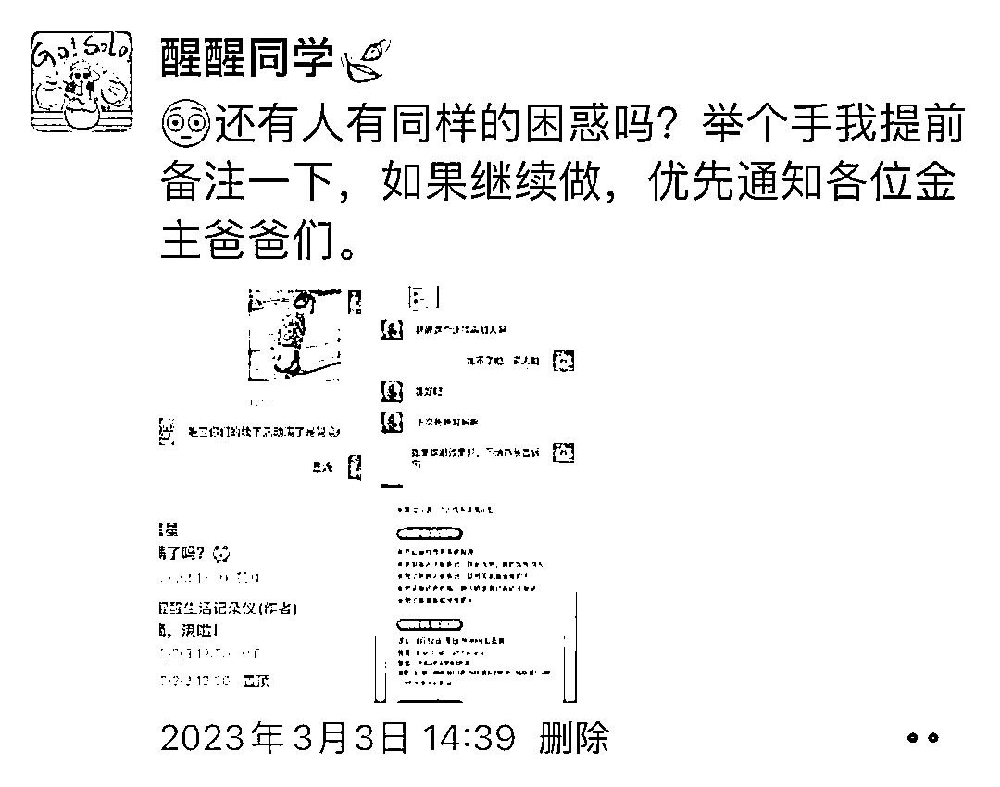
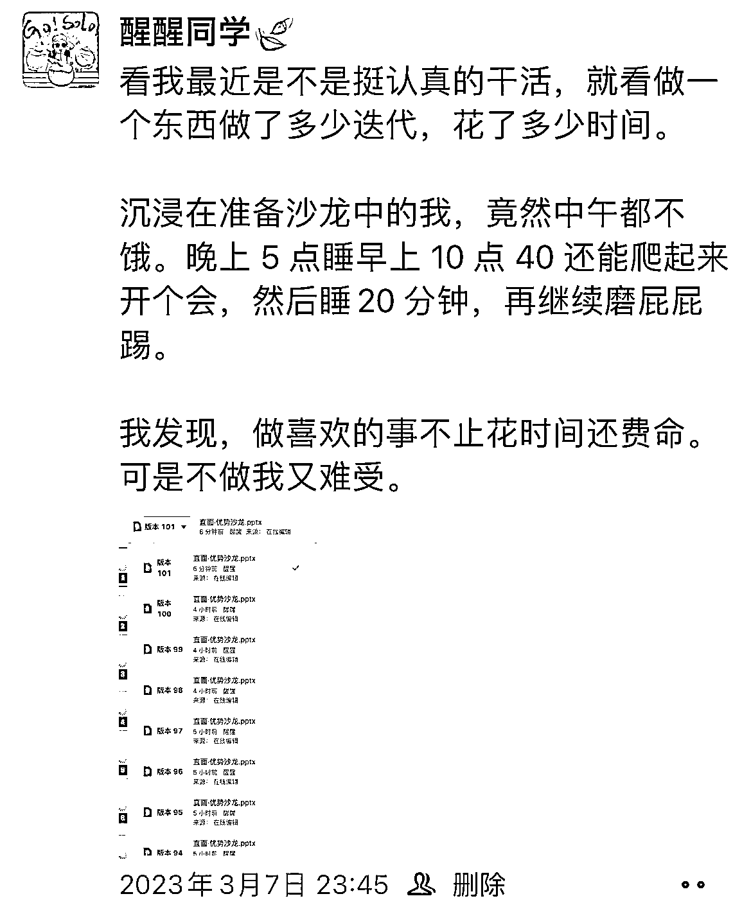
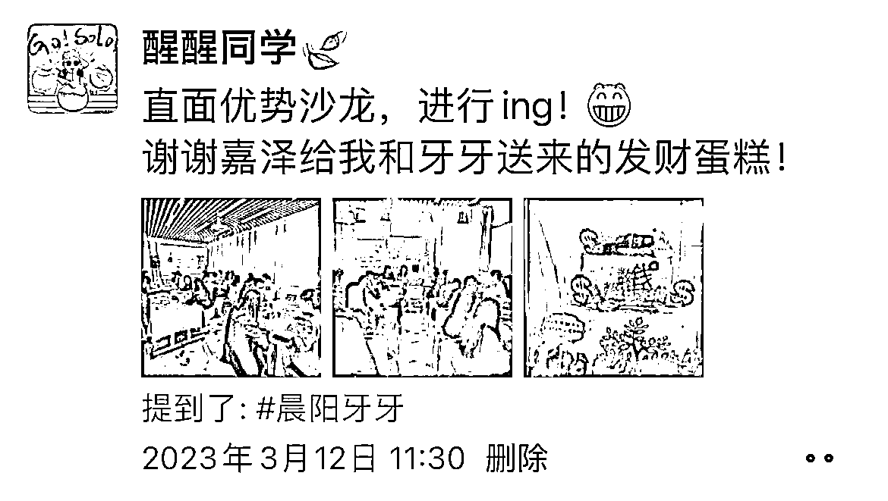
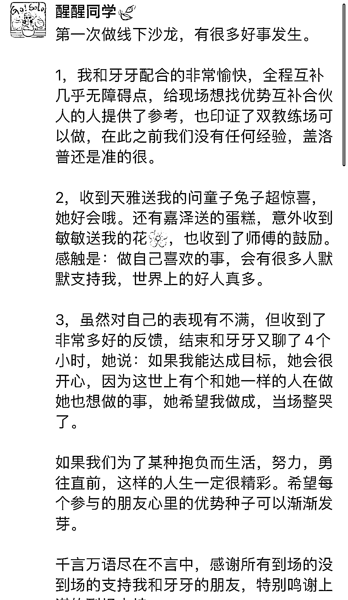

# 4.2 通过朋友圈推出新产品/新活动 @醒醒同学🍃

先分享一个做线下活动的过程朋友圈。

大家有没有去过餐厅，当你坐下来吃饭时，它的厨房是透明开放的，比如西***村，你能看到一个食材从准备到做成菜的过程，对卫生的信任度会提高，敢吃敢买。

为什么外卖让很多人担心，其中一个原因就是完全看不到过程，担心黑心厨房。发朋友圈也类似，如果你让用户参与到你的产品研发过程，她会更放心，甚至有的人觉得像自己生出来的孩子，看哪哪好，不买一个说不过去，这不是说要套路别人，是要用公开的方式反向提醒自己好好做事。

以我前两周首次做线下沙龙举例，从有想法到决定做活动、准备物料、到做活动，朋友圈全程参与，报名人数报满两度换场地。

第一步：宣布自己要做一个活动

大家不一定要什么物料都准备好再开始，跟随你的准备状态宣传就行，越是没有包袱，后面越有进步，越让人能看到我们有认真做事。

可询问场地、海报、物料选择等建议，让朋友圈的人参与进来，对于朋友圈来说，最怕的其实不是写得不好，是根本没人看，任何信息都触达不了。

这条朋友圈帮我一次性收集了 4-5 个场地，甚至还来了要报名的人。珍惜每一次能和用户对话以及获得资源的机会。

第二步：活动准备过程公开在朋友圈

准备活动期间所有关于活动的思考，准备过程，都可以适当发朋友圈，和用户同步历程，比如说我会问海报哪个好看，会问某个模块设计大家更喜欢哪个，会问朋友要穿什么衣服。

这条朋友圈有大概几十个回复，参与难度很低，只需要打个序号不用大量思考，像这种轻松参与的可以多发。

还有这种报满后有人要加位置的，也可以在朋友圈询问，这样无论是增加报名人数还是锁定目前人数，都会让人知道这个活动还蛮多人参加的，也是表达对没报上名同学的重视。

这条朋友圈是我改 ppt 后发的，当时有感而发。但也因为这些过程的披露，办活动当天我们还收到同行朋友送来的蛋糕，朋友送来的花。

这个世界有时候特别有意思，你发声就容易和他人相连，相连就会产生记忆和惊喜，带来意外惊喜。人和人的感情很多时候不能放在天平上称，当交易产生还能不影响感情，一定是交易前就已经有感情了，顺其自然就成交了。

第三步：正式办活动的时候适当转播

活动过程中将发生的事件在朋友圈同步，让人看到阶段性成果。

第四步：活动结束后总结

总结的内容方向可以有：活动当天的感悟、活动复盘给其他人参考、用户反馈当宣传案例。

这个朋友圈发出后又来了 3 个想报名线下的，并持续带来了专栏和咨询产品用户。后续决定尝试其他场次时，发了个朋友圈，几个小时报了 15 个人。

在此之前我没做过线下活动，海报也是临时做的，但持续分享过程这件事帮助过我很多次。

其实是啥呢，一个人突然朋友圈发个海报，说办了个活动出了个课，除非是大 V 能瞬间报满，素人阶段还是需要持续展示自己的专业+用心来积累信任的。

一场活动期间的过程分享，要让用户像看电视剧一样，跟随你的心态波动来了解你，当他确定需要你的服务，就差下单了。不需要太多售前咨询成本。

内容来源：《仅靠微信+朋友圈赚七位数，我是如何长期经营朋友圈的？》

