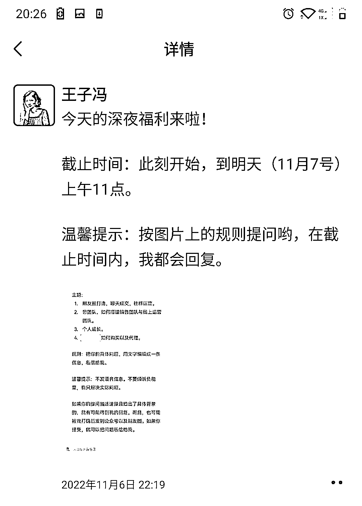
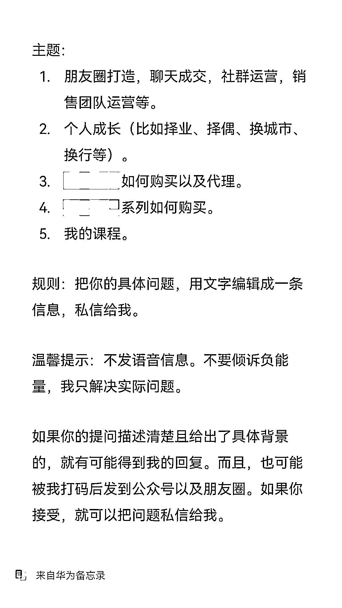

# 4.3.4 技巧四：解决用户问题

大家需要注意，不要张口闭口就是你的产品。

如果你非常想经营私域，那么聊天的本质是帮人解决问题，而不是去聊产品。价值观跟故事可以吸引人，产品不可以。

我常用的方式是在朋友圈发”深夜福利“，吸引别人来提问：

更多互动召集式朋友圈的写法，大家可以参考「3.4.4 发布聊天召集令」

看到问题后，我们需要做到就是，以自己的经验或者经历，适时给出适宜的回答，解决大家的提问。

这里我举 3 个新例子，辅助大家理解。

•案例 1：生活类问题

读者提问：

王子冯老师，您好，这么晚打扰您了刚好看到您发的朋友圈，最近我也比较迷茫，所以就给您发这条信息请教一下。我是一名体制内的老师，今年刚生了宝宝，生活消费增大，仅靠工资生活捉襟见肘。同时，看到很多人做直播，都说视频号是留给普通人的一个机会，我也想着我可不可以也做直播赚钱养家，但是我不知道自己是否适合？因为我大学毕业就进入体制，生活过的比较安稳，缺乏社会锻炼，我自己也不是很了解我自己的潜能，但是又不甘心。想听听您的建议？

我的回答：

这个问题，我分两部分来回答。1）关于你着急赚钱体制内的人着急赚钱，不是好事啊。体制内的人做副业很有可能会葬送自己的前途。比如，被熟人或同事举报等等，真的没有这个必要。副业之所以叫副业，因为它是相对于主业来说的，而且随时能被砍掉。你为了一个随时能砍掉的工作，万一把你体制内的工作搞丢了，得不偿失。2）关于养育孩子在养育孩子上，有多大的能力就给多大的条件，不要超出自己能给的。我自己的原则是，我吃啥我孩子就吃啥，绝对不可能比我吃的更好，都是在能力范围内的。我一直告诫大家，降低心气儿。尤其是在养育孩子以及物质追求上。我还发现，很多朋友都是年龄越大，心气儿越高，越难以相处；越是不好相处，赚钱越是难。作为一名教师，这个行业的最高职称是什么？拿到了吗？区优秀教师，省级优秀教师，特级教师，据我所知是按照这个顺序来的。既然这是个图名气的行业，那就拿到最高荣誉称号。也就是，在你的本行业内，做到本分，追求极致。至于收入这一块，国家有数的很：撑不死，饿不死。因为体制内的职责更多还是为人民服务啊。如果你依然不满意，或许是不是心气儿太高了，花费是不是可以节制一点呢？

•案例 2：专业类问题

读者提问：

老师，我看你发的这几张朋友圈，都有配一两句话（不是鸡汤），那我们有时候可不可以偷懒，只发图一个字都不写呢？

我的回答：

只发图，不发引导语，效果直接打一折。你也说了，我就配一两句话而已。不难啊。读者都是偷懒思维的。你偷的懒，都是哗哗流逝的人民币。读者都是希望作者把饭做好了，喂在嘴边，自己嚼两口就可以了。我们自己作为读者不也一样吗？你希望读者去揣测你的心思，跪求你收钱。 这个，讲真很难。不要那么傲慢。做好销售的本分。做好 IP 的本分。

•案例 3：生活&专业类问题

读者提问：

老师好，我现在读大一，学校不咋样。想询问一下，你的微商产品如何代理？还有学生应该如何打造自己的朋友圈去聊天成交？我想赚钱改变命运，目前也不想考研，我想等我可以养活自己的以后，再考虑考研的事情，不想再花父母的钱。

我的回答：

我给你一个非常良心的建议：你才读大一，好好读书吧，不要去做微商了。好好学英语，冲击 985 研究生。在你独立之前，该花父母的钱就大大方方地花，他们生了你，就该养你。工作之后再考研，难度是在校期间的十倍二十倍，不要去挑战这么高难度的事情。人越大，记忆力越退化，精力越是无法集中。在什么年龄就做什么事情。你现在是读书的黄金年龄，好好读书，冲击好学校的研究生，之后考个事业编制或者公务员之类的，才算是改变命运了。而不是在该好好读书的年龄，去赚那三瓜俩枣，把最重要的事情给耽搁了。我给出以上建议，是因为你出身普通，自身条件也普通。如果你出身不普通，自身条件非常卓越，比如貌若刘亦菲，富如董大小姐，以上建议就不适合你。我的产品是抗衰产品，跟你现在的年龄段也不是很符合。如果你没有自媒体账号，你只能靠身边的同学买一买，而且我们单价高，你几乎卖不出去，最后只能你自己吃了。好好读书吧，把眼光放长远一点，该花父母钱的年龄，大大方方地花，后面再回报就是。冲刺一下 985 或者其他好学校的研究生，再考个好单位，彻底改变家族命运。

我就是这么帮读者解决问题的，很少往我的产品上面带。除非他们真的很需要、很适合，不然我也不会开口。

不合适的人我们自己带着往往也很累，是一种消耗。所以不轻易做消耗自己的事情。如果他们真的很合适，我也会迅速出手。

还有一种解决问题属于售后，这里依然是举例子。

•案例 4：售后类问题

一个客户买了 6000 多元的产品，收到货之后，她说经过她的仔细确认，发现我少发了三盒（单卖的话价值 900 多元）。我二话没说，直接又快递过去三盒，而不是要对方拍照方便我核实。

过了大约一年，客户主动找到我，说是非常不好意思，这三盒掉在柜子里了，这次搬家给扫出来了。

真实情况就是客户描述的那样——我确实是发了，我这边出去的货，每一笔都有记录。

但我为啥二话没说就直接补发呢？因为对方买的金额不低，同时她也说了”经过我的仔细确认“，也就是说对方也很谨慎。如果我要对方发照片方便我核实，客户就会觉得我不信任她。

还有一点，我从她那里赚到的利润，早就能覆盖这三盒的成本了。所以为了我跟客户的友好关系，直接补发即可，不需要搞其他动作。

温馨提示：

这个售后的例子仅限我这种超级小个体、单价高、利润高、高度私域的模式。如果你是做天猫、京东的，且客单价非常高，且这种情况经常有，那么该拍照核实就拍照核实。

