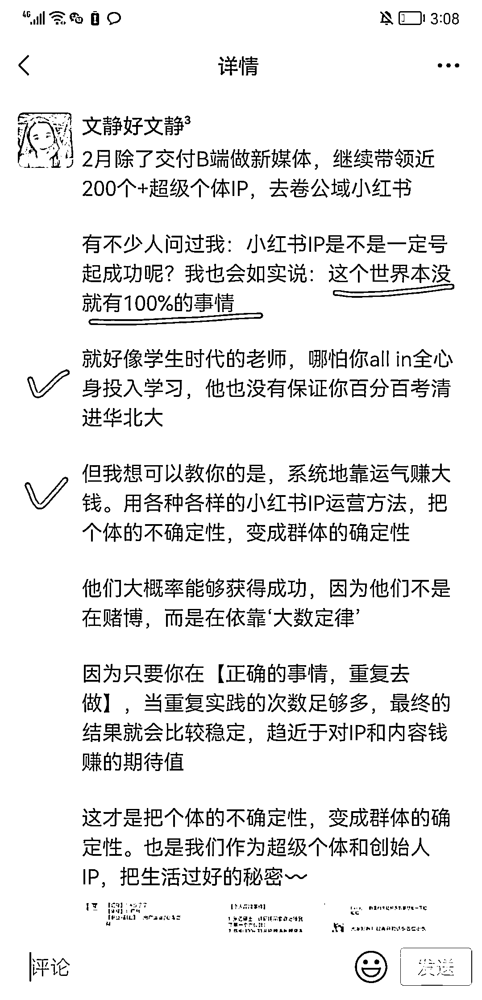
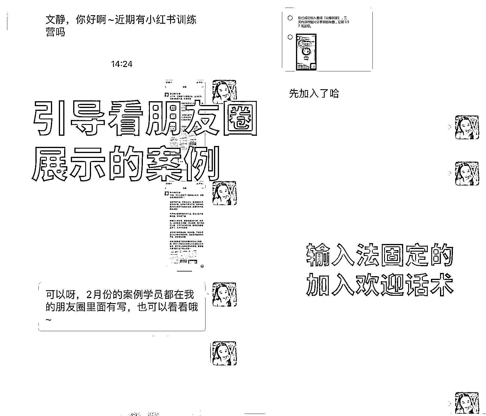
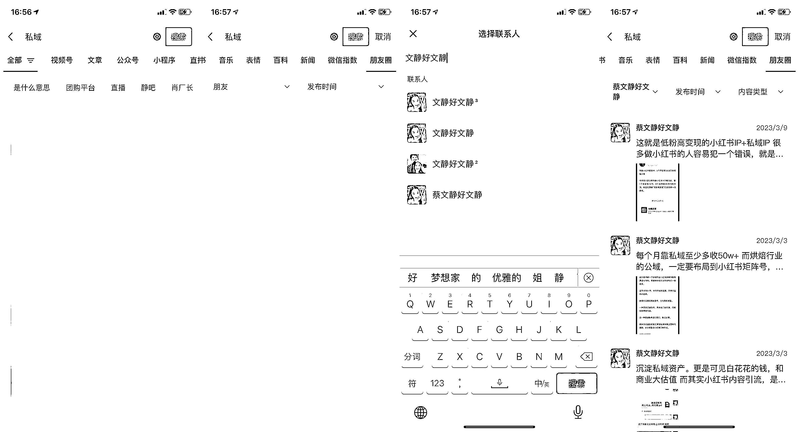

# 4.4 朋友圈助力销售 @蔡文静好文静

很多时候，做私域的我们，总会遇到一对一销售。也会遇到一些很多问题的客户，可能你会觉得很烦。但从另一角度来说，说明这个客户有真正购买的需求，那我们可以结合朋友圈的功能，来助力销售。

所有你跟某个客户私聊的某个话题某个痛点，都可以变成线上自媒体 IP 的事情，马上发朋友圈，变成一个可以重复使用，直接复制黏贴转发用的内容。这也是在提高你的时间管理和精力管理～

比如之前有客户问我，做 IP 怎么保证什么时候有收入？那我朋友圈之前刚好就写了一条内容：我直接甩了一个截图给客户

也有客户问我有什么产品训练营，可以报名？我直接截图最近刚发的《案例+产品圈》，配合销售成交。她就马上付费加入了

而且微信是有强大的搜一搜功能，我们可以搜索某个关键词，关于自己的所有朋友圈内容，就可以马上调用了～

路径：微信搜索-朋友圈-选择朋友（你自己），还可以筛选发布时间、内容类型等等

来源：《从副业 IP 到开公司：在私域流量时代，如何通过朋友圈变现？》

