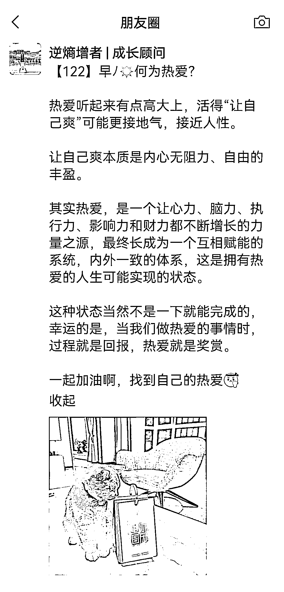
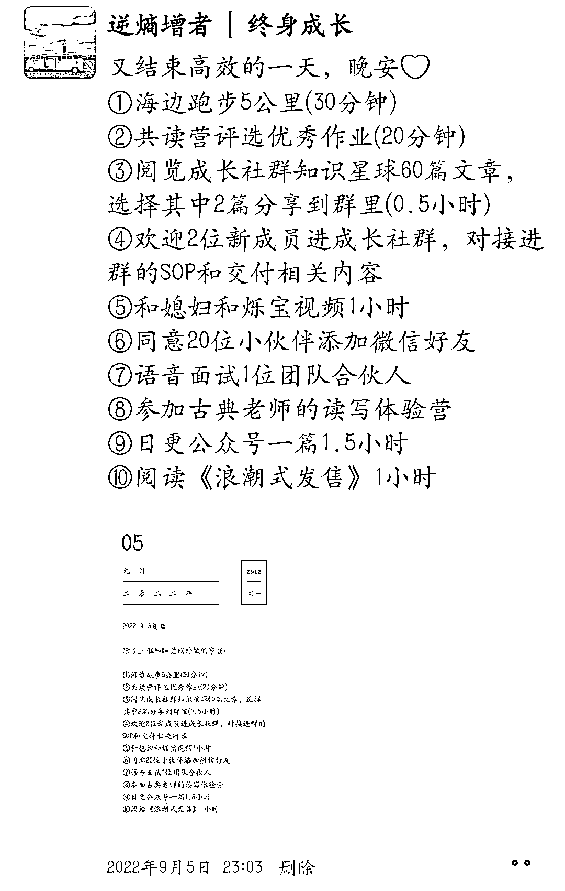

# 5.1 发朋友圈的黄金时间点 @逆熵增者

我们可以根据人的规律、生活习惯，例如每天玩手机的时间和规律，来规划我们每天的信息发布时间

根据朋友圈用户活跃的数据分析，有四个时间段是大家浏览朋友圈的高频时间段

1）第一个时间段是早上 7 点到 8 点。

这个时间段大部分人刚起床或者在上班的路上，是一个工作时间的空白点。很多用户早起第一件事就是去刷朋友圈，看看有没有新鲜的事情。

早晨更加适宜发布一些正能量话题，为好友打气，给他们一天的好心情，所以这个时间点我通常是发一张早起打卡图+一个金句，或者关于读书和学习的内容。

2）第二个时间段是 11 点到 13 点

这个时间段是大多数人的午餐时间，我们可以选择在这个时间段发布一些与个人专业、知识、技能相关的内容。

也可以展示我们已有的成绩、案例和口碑，将我们的个人 IP 与用户需求、产品价值结合起来，形成真正有用、有价值的内容。

我基本上在中午时间段转发自己前一天的公众号文章，加上一句介绍语，相当于给公众号二次触达和曝光。

3）第三个时间段是 17 点到 19 点。

这个时间段大部分人都在摸鱼或者下班通勤路上，在这个时间段，我们可以以生活化内容为主，展示有趣的段子、诱人的美食，展示我们的休闲生活。

这个时候我一般晒晒娃，或者出去玩的照片。

4）第四个时间段是 21 点到 23 点。

这个时间段是用户使用手机的高频时间，这个时间段发布的内容，要主打福利相关，比如用户互动、优惠活动、促销等。这个时间段用户最容易产生冲动消费。

然后睡前我一般会发一条今日复盘的朋友圈。

如果你是新人，可以按照这个时间点走。

但如果你发圈已经超过一个月了，就不要这么死板了。

当你想发的点，就是黄金点。

哪怕是晚上十二点，你特别想发一条价值观，这个时候你的文案是充满能量的，这个能量能冲破屏蔽，直抵读者灵魂，那就可以发。

如果你特别想发，但碍于“黄金点”的限制而憋着不发，会很可惜。

所以，每一个你想发圈的时间点，都是黄金时刻。

内容来源：《普通人如何发好朋友圈》

