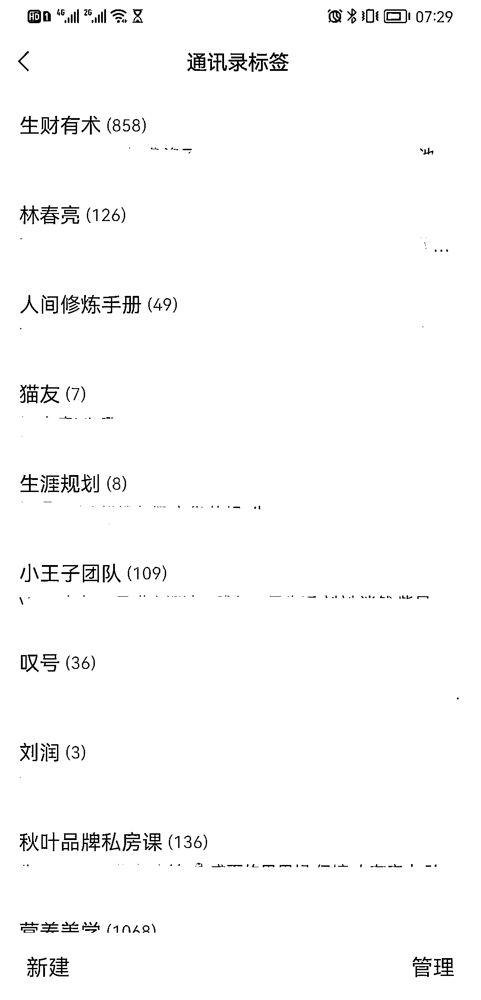
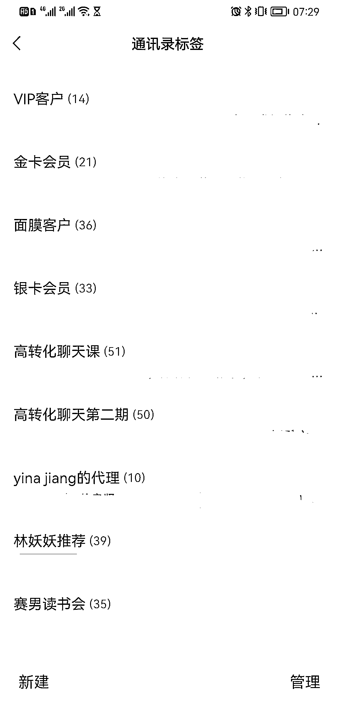
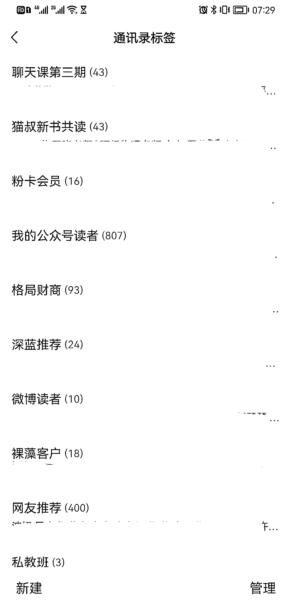

# 5.2.1 标签方式一 @王子冯

我每个微信的通讯录都有 80-100 个标签，微信通讯录里的绝大多数人，都是有标签的。

标签设定的唯一标准：人的来源。

做私域的捷径就是：

1）通过其他付费渠道加人 2）通过自己的自媒体账号加人

我基本就是这两种渠道，因为其他渠道来的人几乎毫无转化。

所以，按照来源设定标签是最清晰的。

好，看我的部分标签：

这是我其中一个号的部分标签（非全部）。

大家可以看到第 1 张图：

最上面标签：生财有术第二个叫：林春亮第三个叫：人间修炼手册最后一个叫：秋叶品牌私房课

这都是按照来源划分的，某一个共同来源的人，是有某些共同特征的。

比如「生财有术」这个标签下的人，男性居多，都酷爱搞钱，且搞钱都非常凶猛。跟这个标签的人聊亦仁、聊涛哥、聊搞钱就对了。

「林春亮」这个标签，这个标签的人都是林春亮老师给我导流来的，这个标签有个共同特征：都认同价值投资，都喜欢搞投资理财，都认识赵正宝老师。

「人间修炼手册」这个社群，创始人邀请我去做嘉宾，社群有很多人加我。这个标签的女生经济实力强，普遍学历高，都爱美。

「秋叶私房课」，这是我上秋叶老师线下课的时候加的人，我们有个共同经历是在一起上过课，都认同秋叶老师讲的个人品牌打造法。都喜欢看书，出书。

「生财有术私董会第一期」，这里面的人都是跟我同一批加入生财有术私董会的，大家的月营收在 50W-1000W，都是大大小小的创业主、企业主，线下共同参加过私董会的活动。

而且还能发现，这些标签下的人重叠的可能性非常小。即使有同时加入两个以上圈子的人，比例也极小。

每个标签的人，都有某些共同的经历。即使从没聊过天，但是一点开对话框聊起来，也不会尴尬。

需要注意的是，标签不要按认识时间来设定。

我曾经按照时间设定标签，比如「2018 年 2 月认识」，后面发现这个太坑了。

我点开那个标签，发现有的人是商场营业员，有的人是开滴滴的，有的人是在某个群里认识的。我们毫无交集，甚至忘了我跟他们都有什么过往。

