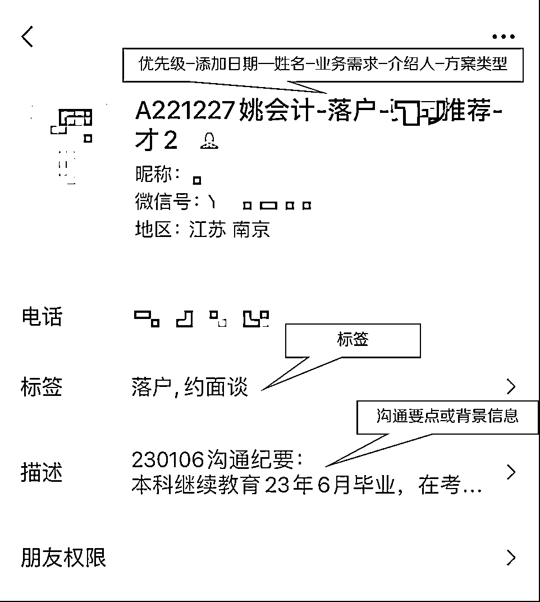

# 5.2.2 标签方式二 @邹老师

•标签+昵称组合拳

我比较推荐勾选「标签」和修改「昵称」2 招，便于后面定向发圈、高效沟通或者了解客群结构。

标签设置好之后，现在新粉丝一加过来就先打标签，再改昵称。

展示一个我的落户客户例子：

标签是分层的手段，每个人的产品服务不同，标签设置也不同，我展开讲一下如何设置标签？

标签设置建议

我比较推荐首先按「客户成交旅程」的里程碑节点来分，这背后的逻辑是「转化漏斗模型」，需要你想清楚你的客户，顺利完成某个产品的成交转化，需要哪几个关键步骤？

以我「落户上海」服务为例：

按「客户成交旅程」分：新粉丝 ——已交表 —— 已方案 —— 已面谈 —— 已签约 —— 已结案

每个节点都可以设置成一个标签

但光有「客户成交旅程」标签，感觉还是不够精确描述用户，到底应该优先服务谁？

所以最好搭配其他次要维度标签使用。那我继续按「客户重要性」分，重要性主要看客户的「潜在价值高低」和「对我的认可度」两方面，具体分为 5 个标签：

S：最高价值大客户，最高优先级跟进

A：高价值，高认可度，前 20%重点客户

B：高价值或高认可度满足其一，需跟进

C：价值度和认可度不明确，先放养

D：没价值或不认可，暂时放弃

SABCD 各个类型具体客群画像大家自己定义就好，既可以做成标签勾选，也可以直接改在备注昵称里（对话窗口页面直接可见更方便）。

如果你是做电商零售的，还可以

•按「消费价值」分：初级粉丝——金卡——银卡——黑金——钻石

•按「客户群体」分：大学生——白领——蓝领——宝妈——富二代

如果你做知识付费的，

•按「产品价值」分：商品 A（9.9 引流品）—— 商品 B（21 天训练营）——商品 C（365 会员）——商品 D（私董会）

•按「客群来源」分：生财圈友——校友——抖音/小红书——线下活动等等

客群分类注意事项

a、标签要及时更换，不宜过多过细，太细运营负担重。

b、一个人可以多个标签，但人工运营的话最好不超过 5 个。

内容来源：《针对不同客群：如何发好专业类朋友圈？》

