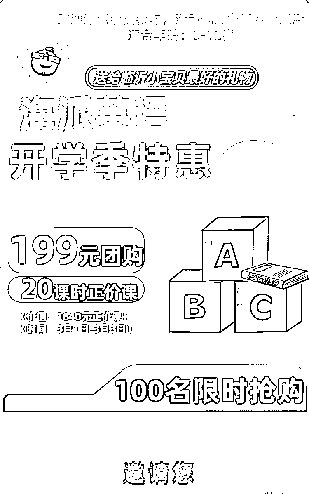
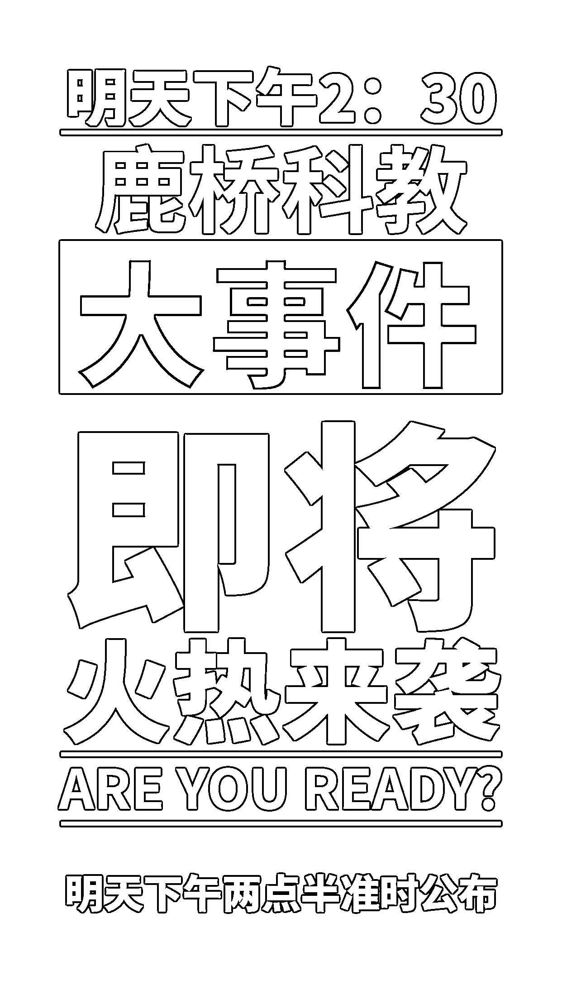
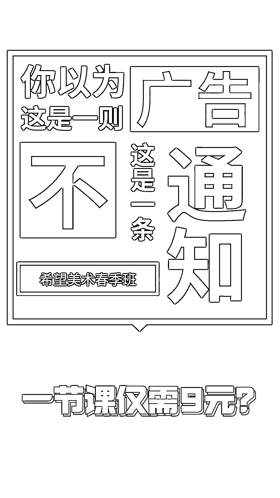
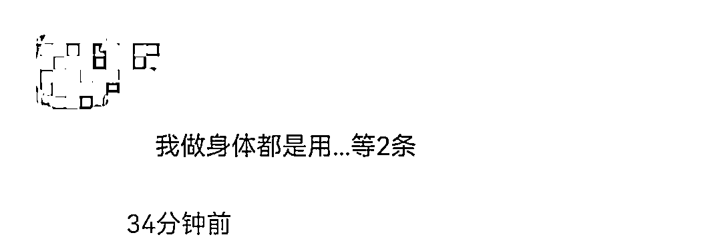
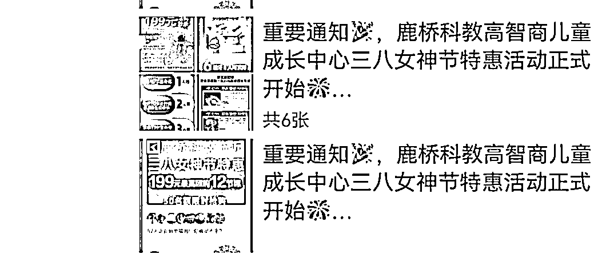
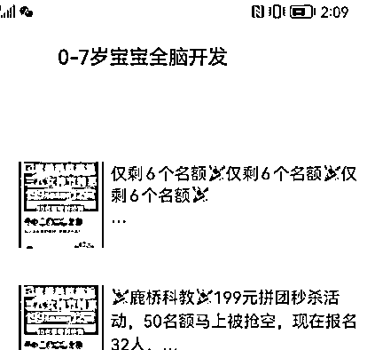
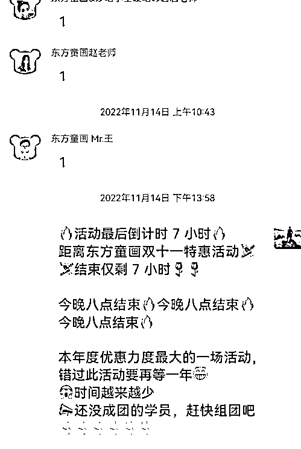
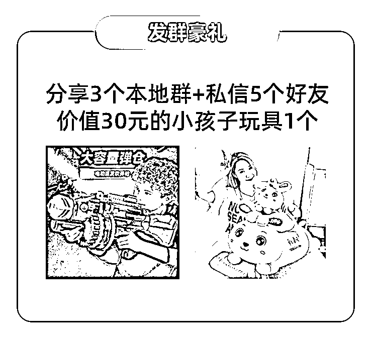
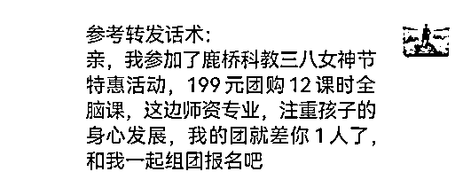

# 5.4 朋友圈裂变技巧 @今夏

简单说一下我们为客户提供的服务

服务形式：让客户拿出引流品来，我们设计一套朋友圈裂变流程，通过老客户裂变新客户，新客户再裂变新客户购买引流品的方式带来客源

收费内容：我们获得引流品的变现资金，客户获得利润品的变现资金和客源

这套朋友圈裂变获客方式很多业态都可以使用：美业，家政，艺培，银行，驾校，小吃培训包括一些互联网产品等等

下面我用我服务最多的艺培行业（教美术，书法，口才，舞蹈等的机构）做案例，拆解一下在朋友圈裂变方面的设计

艺培机构是最经常用此方案获客的业态

引流品通常设计为 5—10 节课的小课包，比如老客户花 100—300 元购买 5 节课，然后拉一个新客户购买给其增加两节课，再拉一个人再增加两节课

第一天

1）活动开始前一天发布预告海报

两种类型预告：

•告知型预告，只模糊告诉客户，我们要做一个活动

•疑问式预告，例：一节课只要 9 块钱？？？目的是引起好奇，引起他对活动的持续关注

这个预告要分两次去发布，分别发布时间是活动前一天，和活动开始前四个小时

发布渠道是朋友圈和相应的客户群，如果这个过程中有客户询问的，要先卖个关子，不要立刻告诉他，统一回复某某时间关注我朋友圈，这个势能需要积攒

2）活动开始时发送一个开场长文案

长文案介绍活动

问题：文案都会被折叠

解法：不要直接复制发布，复制后自行添加诸如烟花类的表情符号，基本会解决三分之一的折叠问题

问题：营销类信息被限制展示，仅可见一行

解法：用【重要通知】这四个字作为活动开场的第一条朋友圈

裂变活动朋友圈发布时间上的选择：

对于在朋友圈做裂变获客活动来说，就经验讲，在三个时间点发布朋友圈是最好的。

•第一个时间点是下午三点左右，这时候发布一条活动开始的开场朋友圈

•第二个时间点是下午六点钟，这是大多人工作一天下班的时间点，人会在通勤过程中和到家时候刷朋友圈

•第三个时间点是晚上 10 点钟左右，很多人都有一个习惯就是在晚上睡觉之前玩一下手机，处理一下白天的信息，另外人们也喜欢在第二天早上刷一下朋友圈，正好可以看到你晚上发的朋友圈。

活动规则部分的朋友圈需要不断重复，而且根据情况做更新

有两层意思：

其一

•活动规则需要反复强调，比如邀请一个人获得什么，每一条朋友圈文案都需要带上

•不同角度强调规则，很多人看到第一条会不理解，需要不断重复、强调，让大家知道活动是什么，可以获得什么

其二：

•活动结果发布在朋友圈，比如谁邀请到了几个人获得了什么东西，要朋友圈进行直播式的更新发布

第二天

1）逼单动作

朋友圈裂变过程要紧凑，不要把战线拉的太长，从实操的经验上来说最好用的就是“倒计时”的玩法

•根据客户裂变启动量多少预测第二天购买人数

•设置限定数量

•朋友圈开启倒计时名额

•名额在朋友圈滚动式直播，持续跟进形成紧迫感。

第三天

1）倒计时

在这个过程中有几个点要注意

第一：在启动量完成拉人这个路径上进行引导，循序小步子原理。

裂变的每一步都需要设计，先让他迈出一小步，让他自己购买完引流品之后去拉新客户再购买是一个大目标。

对完成目标的路径进行分解

他去找人可以需要去发朋友圈，那我们就设置发朋友圈有什么奖励；他完成这一小步，发了朋友圈，感兴趣的人就会通过他的朋友圈去询问他，回复别人的过程中，向目标就推进了一些

他在找人组团过程中肯定是也需要点对点的去微信找人的，所以我们要设置一个私聊好友凭截图可以领什么的奖励，吸引他往前边走，一点点鼓励他完成裂变到新客户的这个大目标

第二，我们要给老客户去发朋友圈的话术给出参考

在活动过程中有些老客户也会自己写出比提供的参考话术更好的朋友圈文案，有的真的不乏文采斐然，情感真挚

那为什么还要提供一个参考转发话术呢？我们要为这次裂变的宣传工作提供一个基准，不能保证上限多高，至少保证底线不会太低。

一些因为惰性不想写转发话术的人，这样提供一套话术也能方便他们直接复制转发

以上是如何完成一场朋友圈裂变及注意事项的主要内容，总结下来，可以归结为这几个关键点：

•活动预告：分两次发送，发送时间为活动前一天和活动前四小时，分两种形式，告知型，疑问型。目的：引起好奇，吸引关注，积攒势能

•发圈时间设计：最好的发圈时间是下午 3 点，下午 6 点（正常人下班的时间点），晚上 10 点（睡前）

•反复说明活动规则：重复即强调，核心规则，设置要反复讲

•倒计时：用两个倒计时来进行逼单，第二天活动名额倒计时，第三天活动截止时间倒计时

•注意事项：•遵循小步子原理，在目标完成的路径上设置阶段奖励•为顾客提供参考转发话术

内容来源：《三个月内实现 30W+利润，朋友圈裂变策略分享》

