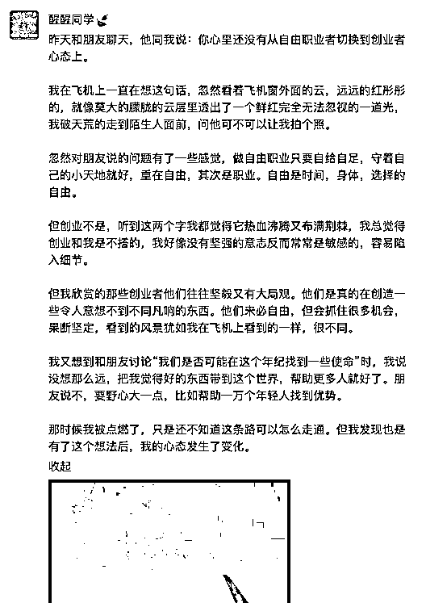

# 5.5 朋友圈内容高频且真实 @醒醒同学🍃

有句话说「如果我不能让你过目不忘，那我至少做到让你过目过目再过目然后记住我」

持续发 60-80 分的内容比单次 100 分更有持续力，如果觉得写得不好就不发，总想达到 100 分再发，其实没多少震撼力，200 分才是震撼力但难度很高。如果长期写，有几个 80-90 分，就能被人记住。持续分享有价值的内容，给对的人和更多对的人，赚钱就是大概率事件。

素材可以去知乎或有对应用户的社群里和用户交流，帮他们解决问题后写成案例，或去观察同行的文章，把有共鸣的观点提炼出来自己写，当你有灵感时，一定要立刻去写，不要想太多限制，打动人这件事真的蛮需要情感共振的。

比如前天我坐飞机时琢磨和朋友交流的话题，下飞机后写了一条朋友圈：

这条朋友圈有几十个点赞还有评论，其中有人说“看得热血沸腾”、“这是一条可以写进自传的朋友圈。随喜赞叹”，以及“股东报道”，睡醒后我收到了一个咨询转账。

我不敢说这笔转账和这个朋友圈有没有关系，但多多少少和长期的分享有关系，当你真的发自真心要做一件事，文字里体现出这股力量和真诚，就是会很多人被打动。

如果还是担心没有内容写，可以考虑用一些数据工具，比如极客增长，5118 之类的，搜和你产品有关的关键词，搜索量大的选题，就是可以写的。我最野的时候，曾试过写两版文案，问用户哪个会更心动，或者让人帮我想怎么提高转化率，都是在朋友圈讨论的。聊着聊着有人甚至会帮我去转介绍。

我想说的真实也在这，做宣传可以用一些技巧，但不要藏着掖着，有时候真实一点用户反而接受。就像那种：我现在要参加一个 7 天万元销售挑战赛，在朋友圈卖 xxx，希望大家多给我建议反馈的活动不止不让人烦，有时候还能得到支持。这就说明卖东西本身不是槽点，让人讨厌的语言才是。

内容来源：《仅靠微信+朋友圈赚七位数，我是如何长期经营朋友圈的？》

