# 商业访谈 202308

> 来源：[`remhu1p2pr.feishu.cn/docx/GNYRdLRBZoWXhrxBKYpcWxErnqg`](https://remhu1p2pr.feishu.cn/docx/GNYRdLRBZoWXhrxBKYpcWxErnqg)

出品时间：2023 年 8 月 10 日

手册使用说明：本文旨在向你展示一个项目的更多可能性，帮助你更好地理解和实操。

建议：如果需要快速定位到精确内容，可以使用快捷键 Ctrl + F/command + F 的形式，搜索「关键字/词」，查找你想要的内容

写在前面

💡

Hi,

欢迎大家来到 8 月航海 | 商业访谈 | 实战手册，相信在接下来的日子里，我们将在这里见面很多次。

商业访谈是时下热门的内容形式，在抖音、B 站等短视频平台，已经涌现出不少知名商业访谈博主。其中“程前朋友圈”更是现象级的商业案例。

大量的创作者正在涌入这个赛道，带来诸多可能，究其原因，是被商业访谈的利他本质所吸引——通过对话的形式去洞见思维、窥探逻辑，从而帮助主持人和受访者打出名声，链接更多人和机会。

当然，商业访谈这条路也不太好走。

一场访谈可能需要 3-4h 的录制时间，而剪辑时间则可能达到 6-8h，如果你没有团队辅助，你甚至需要一个人承担起拍摄、剪辑、运营等所有任务。如此一来，对人的心力耗费巨大。除此之外，它对主持人本身的要求也比较高，需要你有一定的商业认知与访谈经验。

当你拥有了访谈能力和充沛精力后，你还需要考虑将来的变现形式。在「一、为什么要做商业访谈？」，我们会告诉你，商业访谈目前的内容形式与变现模式是什么，方便你评估自己是否要开启这样一项事业。

如果你觉得头部的账号离自己太遥远，「六、圈友案例」列举有一些生财圈友正在做的访谈节目，希望能给你一些具体的想象空间。

制作一档商业访谈节目，需要经历邀请嘉宾进行访谈，将访谈内容剪成视频，发布到各个平台进行运营等各个环节。本次商业访谈手册想要告诉你，一个人如何以最小的成本，完成一场访谈。因此，手册的重点在「二、如何开展一次访谈」，大家注意认真阅读和学习操作。

「2.2 第二步：邀请访谈嘉宾」提供了几种邀请方式，希望能够帮你解决嘉宾难题。确定嘉宾是否合适的最好方法，是进行一场前采。前采相当于捋一遍问题，确认嘉宾是否能够全部回答。它帮助我们判读嘉宾是否符合我们的调性、内容定位，同时也能帮我们重新调整采访大纲。

这里需要强调采访大纲的重要性，它可以弥补我们前期访谈技巧的空白，帮助我们挖出更多东西。毕竟问出好的东西，我们才有内容去搭建我们的商业故事。

对于商业访谈来说，重要的是内容，是讲好一个故事。因此，拍摄器材反而没那么重要，「2.4.2 拍摄器材」给出的设备，按需购买即可。此外，出发前的拍摄清单非常重要，「2.6 第六步：检查拍摄清单」可以帮助我们规避一些致命的低级错误。

录制完成不等于结束，后续仍然需要与嘉宾沟通，进行内容确认，避免出现闷头将视频剪完了才知道无法发布的情况。

「2.8 第八步：后续收尾工作」也是很多人忽视的一环。

关于剪辑，在「3.1 视频成本」，我们分析了两种剪辑方案和成本，你可以选择适合自己的方式。考虑到每个人都有属于自己的剪辑方法，「3.3 剪映剪辑流程」这里提供的方法仅供参考，怎么舒服则怎么来。

关于运营，我们会在「四、内容运营」提供一些简单的办法。关键是提醒大家，要多平台去运营，如果还有余力，建议追加播客平台，这也是目前比较重要的渠道，具体如何做好播客，可以参考我们的 8 月航海 | 播客制作 | 航海手册。

在章节「五、注意事项」，我们提到了商业访谈全流程中可能会碰到的问题，希望大家多加关注。

希望大家可以在这次航行里收获成果外，结识一群战友。

以下内容由生财有术联合圈友 @Super 黄 制作而成，仅供航海船员以及生财有术星球圈友学习使用。

同时也欢迎圈友们在实践过程中持续反馈，和我们共同完善，可以联系鱼丸（yuwan387）提供修改建议-

# 一、为什么要做商业访谈？

💡

章节概要一提到商业访谈，可能很多人会想到《杨澜访谈录》《鲁豫有约》等制作精良的电视节目，但事实上，以“程前朋友圈”为代表的商业访谈短视频，正在掀起一股新的风潮。

从草根早餐店主到月入千万的企业家，商业访谈以一种更亲和的形式进入大众视野，也为更多普通人带来资源链接和流量赋能的机会。

在「1.2 商业访谈的现状及优势」我们列举了目前头部商业访谈账号，如程前朋友圈、参哥认知圈、钦文和他的朋友们等，以期告诉你商业访谈的更多可能性。不同的内容定位与 IP 形象，会让商业访谈长成不同的商业形式。

当然，一个能够持续变现的商业模式，也是跑通 0-1 闭环的最重要一步。目前来看，访谈的商业模式有三大类，分别是 To B+To C、内容合作、商业广告。这些商业模式没有优劣之分，选择适合自己的才能可持续发展。

## 1.1 什么是商业访谈

商业访谈是时下热门的内容形式，它以对话的形式来窥探行业专家、企业家、创业者们的商业洞见，从而帮助大众提升认知、打开视野。

事实上，商业访谈由来已久，从我们熟知的电视节目“锵锵三人行”、“康熙来了”，到现在大火的短视频“程前朋友圈”，其实都是商业访谈的一种。

商业访谈并非标品，只要你想，它可以长成任何样子，原因是：它的内容形式多样，可以是视频，音频，也可以是图文。尽管主要以视频来做呈现，但意味着也可以“一鱼多吃”，即：一次视频录制，我们可以产出短视频，中视频，长视频，音频，图文等若干种形态。

有很多种内容方向，比如和流量操盘手，和母婴赛道的博主，和生财有术拿到结果的圈友，和自由职业者，和职场资深人士，没有严格的限定，可以基于你的定位去选择内容方向。

嘉宾的分享也可以很广泛，聊创业经验，生活感悟，职场进阶，情感历程，也都是可以的。

可以是主持人提问嘉宾回答，也可以是主持人和嘉宾的碰撞交流。

## 1.2 商业访谈的现状及优势

近两年，B 站、抖音出现了一大批商业访谈类账号，并跑出了“程前朋友圈”这样的现象级 IP。

对于头部“程前朋友圈”而言，记录创业者故事，除了能整合资源、流量赋能外，也是筛选项目和人的一个过程。200w 粉丝的“钦文和他的朋友们”则梦想成为中国的 B.C。 福布斯，在商界拥有更多的影响力和话语权。

越来越多的人和团队意识到，商业访谈这种形式不仅可以帮助自己更快地积攒人脉、提升认知，同时也可以帮助更多人扩大他们的影响力。

接下来我们通过几个头部的账号，帮助大家看清目前的商业访谈的整体形势。

程前朋友圈、参哥认知圈、钦文和他的朋友们，这三个是比较典型的商业访谈账号，具体内容形式各有侧重，但都非常抓人。

凉子访谈录、姜 Dora 在此，这两个属于非典型商业访谈账号，在赛道定位上取巧，也打开了一片市场，取得不错的成绩。

第一个：程前朋友圈单集时长：12-16 分钟为主

曾做过投资的海归精英程前无疑是现象级博主，众多人模范的商业访谈类头部。

对于内容品质极其苛刻，访谈融合成长故事，创业曲折，走心情感为一体，可以经常看到有嘉宾泪洒当场。

参考坎贝尔的《千面英雄》，基本路线：平凡出身 — 早期经历 — 奋起创业 — 经历低谷 — 终造辉煌 — 走心感悟

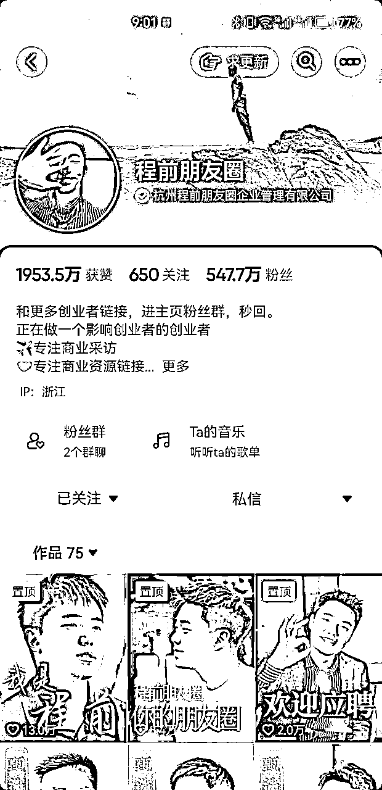

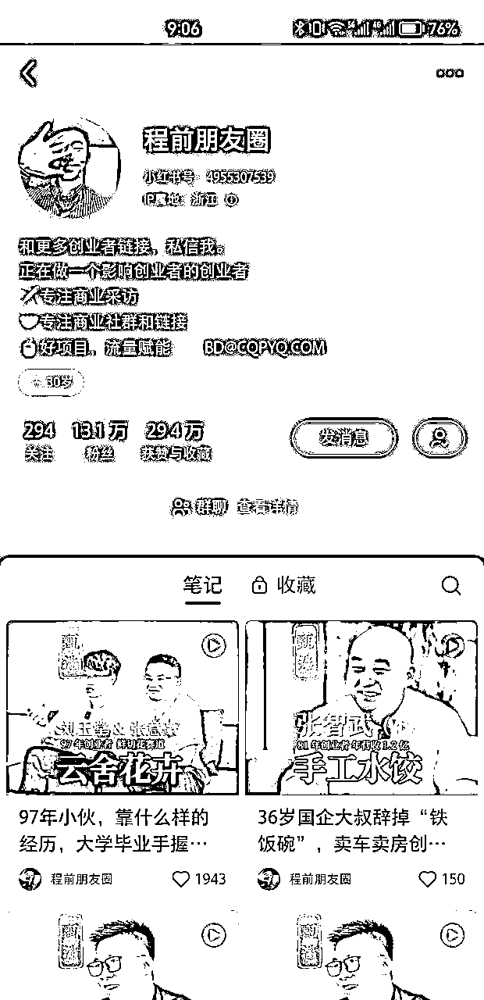

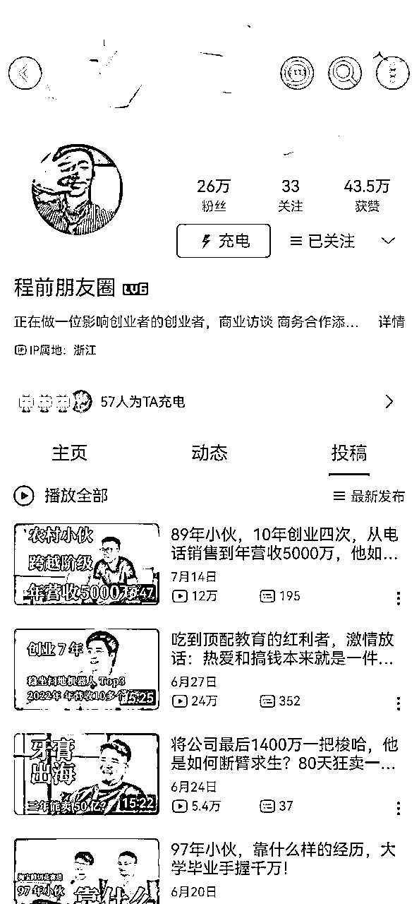

第二个：参哥认知圈单集时长：20 分钟起

参哥更“简单粗暴”，直接聊嘉宾赛道的特点，聊的更多是嘉宾如何理解赛道，如何赚到钱，这个赛道的关键点等。

他的内容偏向于与嘉宾“共舞”，节奏由自己强把控，对谈期间高密度的输出自己的思考。

比起程前朋友圈，参哥私董会成员本身都是拿到结果的，参哥也通过这样的内容，即生产了好内容，推销了嘉宾，更展现了自己。

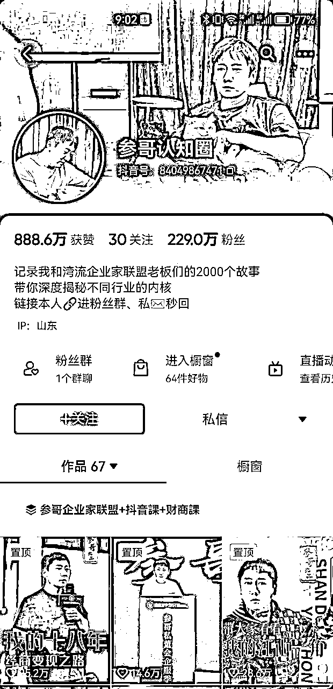

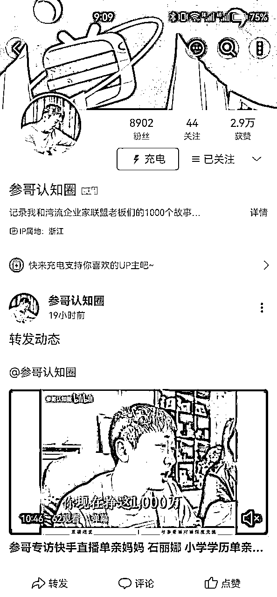

第三个：钦文和他的朋友们单集时长：7-11 分钟

典型的程前朋友圈模范+浓缩版本，有很强的模仿痕迹。去掉了嘉宾的成长史，更多专注在嘉宾如何赚到钱这一个单点上。

提问非常偏向于投资人逻辑，直接指向创业关键问题，但又会稍微兼顾一下故事性，比如对美女必须问一下情感问题，以激起观众兴趣。

更偏向于引导嘉宾说出创业本身的思考，会频繁出现金句，这也是其节目的特点之一。

在小红书和 B 站他的内容没有数据，某种程度和这样的选择有关系。

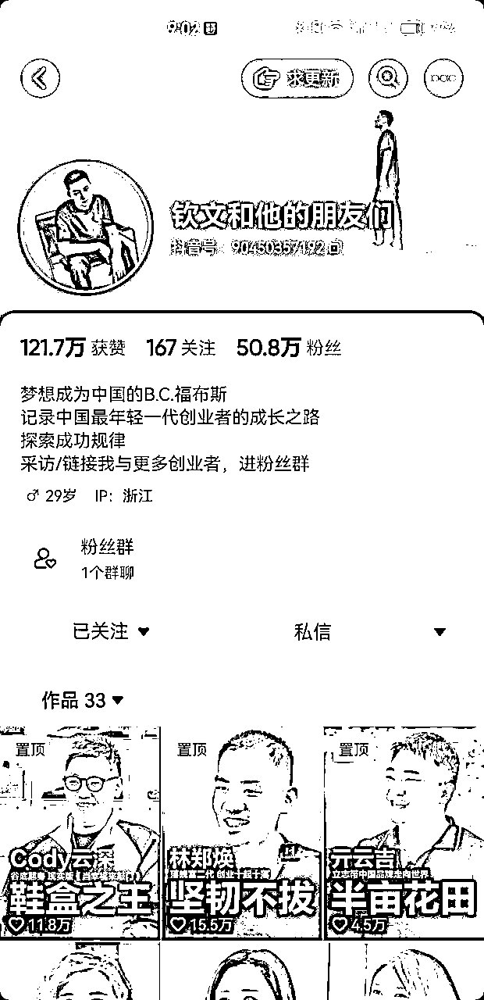

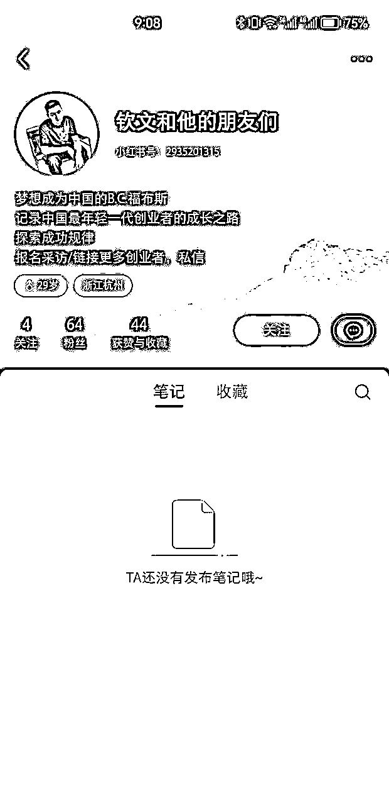

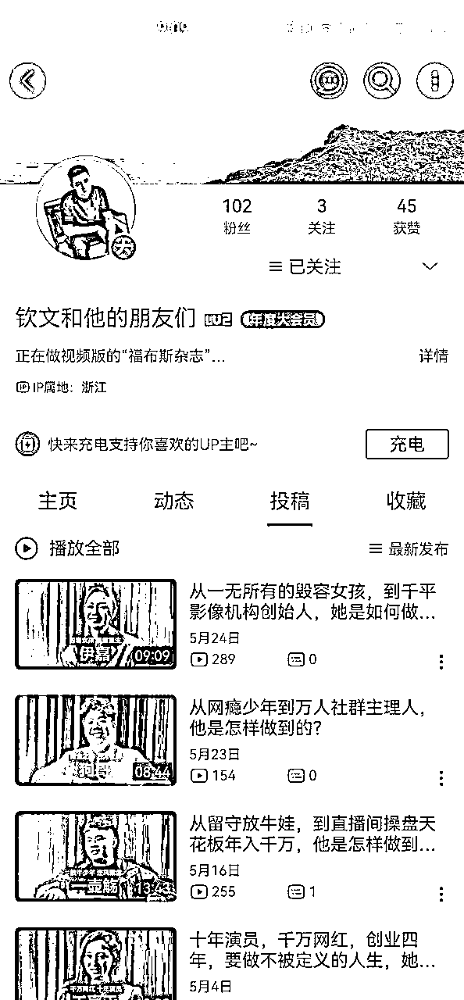

第四个：凉子访谈录

单集时长：不固定，大部分在 10-15 分钟整体定位：讲述普通人的不平凡故事

擅长于挖掘嘉宾身上的特点，在抖音上用切片的方式把爆点做成短视频

不算是商业访谈，更偏向于人生百态的记录提问者不出镜，仅有嘉宾单人露脸，是他们内容的一个特色

问题是定位不聚焦，也导致用户画像不清晰

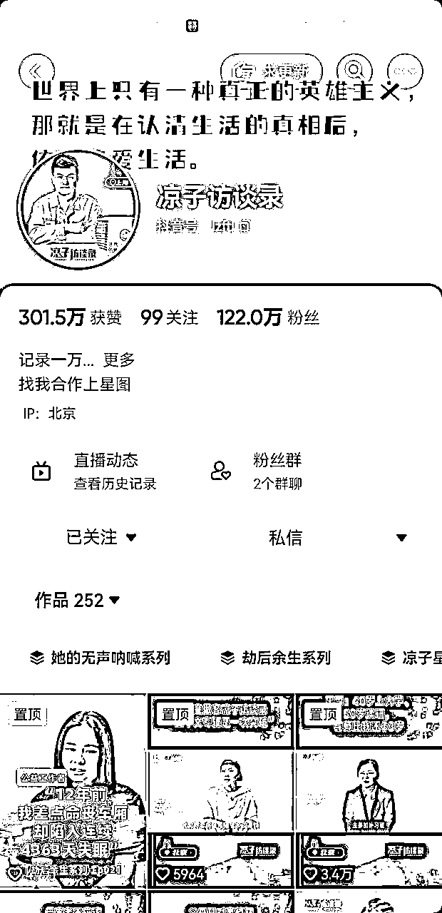

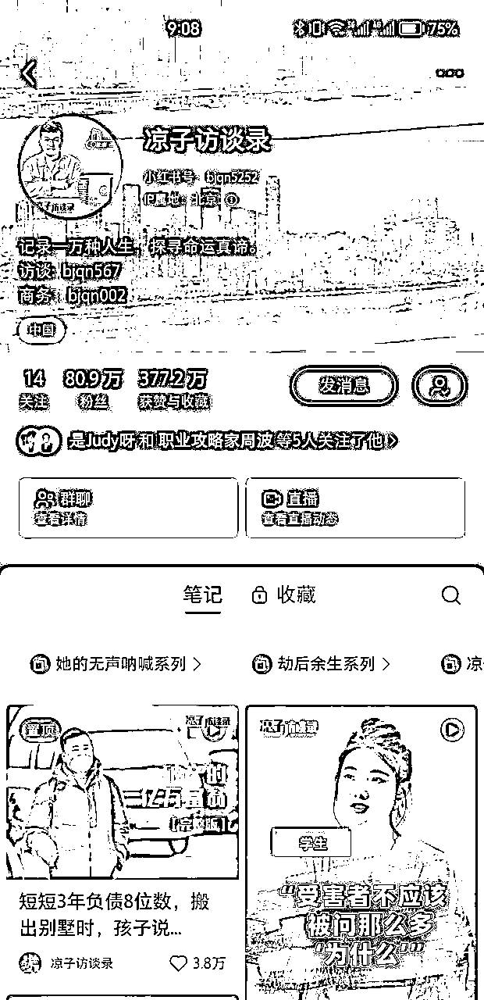

第五个：姜 Dora 在此单集时长：15-22 分钟

姜 Dora 是一个快速崛起的新锐博主，从 B 站出道，到全网分发后每个平台数据都不错，说明职场年轻人的粉丝群体普遍存在于各平台。她从早期的单人讲故事，转向职业访谈，中间也经历了内容和商业模式的转型。

内容特点是姜 Dora 本人非常的敏锐，双非二本和职场痛苦的经历是她能够同理于当年职场青年的重要抓手

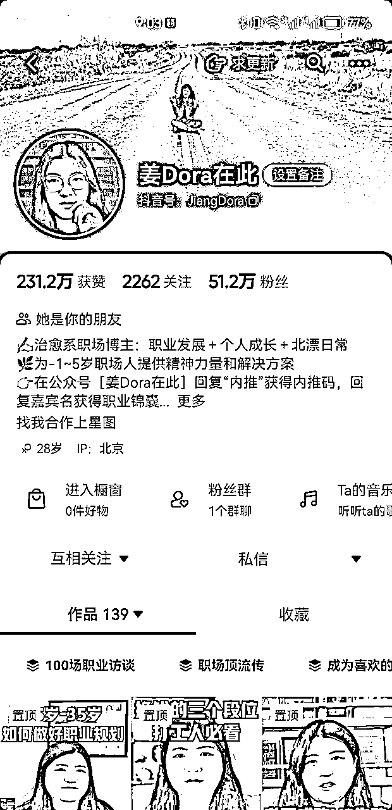

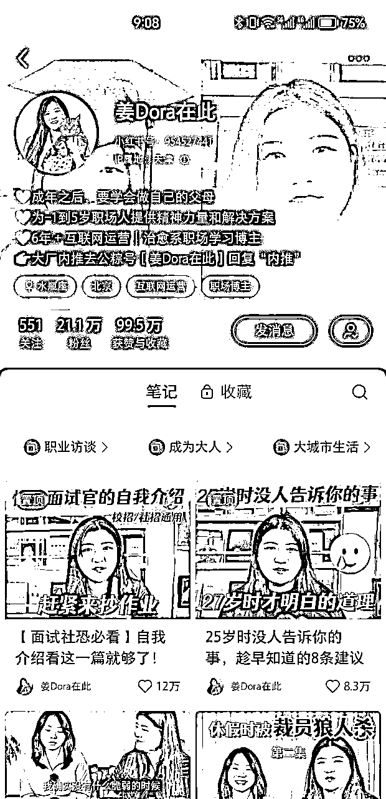

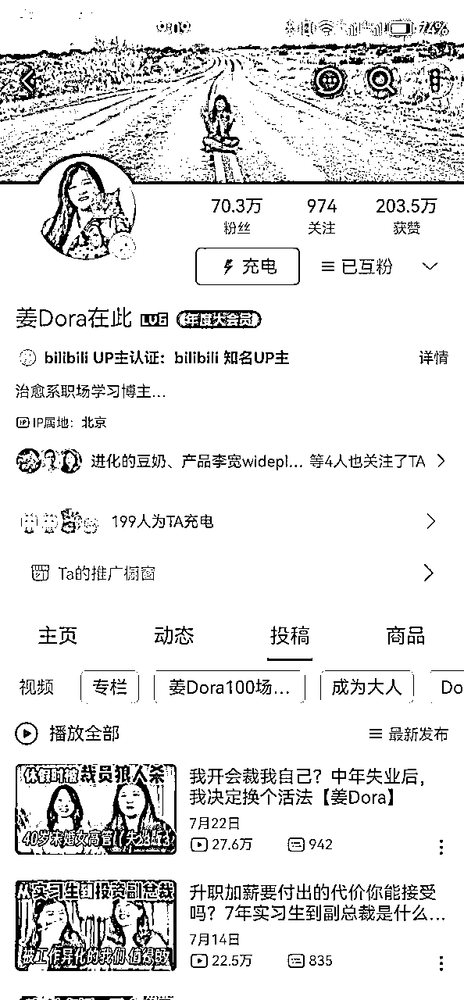

## 1.3 商业访谈的变现逻辑

商业访谈的内容形式十分多元，相应地，变现路径也不止一条。市面上常见的变现方式有三大类，分别是 ToB+ToC 结合、内容合作、商业广告。

接下来，我们结合主流的自媒体博主来看几种变现逻辑：1.3.1 To B+To C 结合

To B+To C 结合，主要是指付费访谈+社群的模式。B 指的是创始人、老板等。为了打造视频名片，扩大影响力，他们会愿意为了上节目付费。C 指的是普通的用户，或者小老板。通常会愿意为了加入圈子、学习，付费购买会员、课程、培训等产品服务。

像程前朋友圈、参哥认知圈、钦文和他的朋友们，都是这个底层逻辑，不同的是侧重点和价格差异。

程前朋友圈会员权益.pdf 参哥认知圈：更多是配合参哥本身的私董会进行售卖，8 万的费用。但背后有更深的商业运作，包括孵化，投资逻辑，目的是更深度的参与到项目里，拿到结果后可以获得更大回报。拿着孵化出来的项目又可以继续在公域里用于宣传。同时，也会有部分线下大课，比如两天一晚的抖音培训课程。

钦文和他的朋友们：以高端圈层为售卖逻辑，29800 为入门费用，权益包括圈子，商业访谈机会，和钦文见面等。最近刚开始做商业化，之前还是在建立内容影响力阶段：

### 1.3.2 内容合作

内容合作，指的是本身内容做的不错，可以将内容能力出售给有需要的客户，例如帮忙孵化账号。

凉子访谈录以广告变现为主，之前有一个合作是帮助客户做账号孵化。

我曾经作为嘉宾参加过这个孵化账号的访谈，全套内容生产都是由凉子访谈录团队完成，包括内容发布、投放等，只不过账号的所有权是客户的。

这种方式相当于初始的全流程由凉子访谈录团队执行，客户有专人跟进学习，后期待账号成熟后，移交给客户。

### 1.3.3 商业广告

商业广告，主要是指软性的广告植入，甚至整集内容都是专门为客户定制。

姜 Dora 是典型的 To 大 B 的逻辑，早先她也考虑过直接给职场新手提供产品服务，但后期意识到交付太重，她和男友两人希望轻量化运营，所以调整商业模式为服务企业，帮助企业做好 PR，这样只需要集中精力做好内容交付即可。

例如她近期的视频《对谈 40 岁未婚女高管：不婚不生，职场会更顺利吗？| 没人告诉女性的职场真相【姜 Dora】》，便是职场 APP 领英的广告。相比于直接的宣传领英有多好，姜 dora 以女性职场话题为由，用大众更容易接受的形式，侧面宣传了领英这个平台的价值观。大部分企业也会更倾向于这种软性广告。

在 B 站 30 万粉丝的时候，刊例价就能达到单期 4 万，现在 B 站达到了 70 万，抖音小红书也有 70 万粉丝之后，相信单期刊例价或许能到 10 万。

我们可以看到对于商业访谈类节目，或者说泛化一些：对谈类节目，是有多种的商业变现模式的。要想哪一种适合自己，除了参考竞品之外，也要关注自己的倾向，以及用户和客户的需求。

# 二、如何开展一次访谈？

💡

章节概要商业访谈是很经典的可以一鱼多吃的内容形式，因此，只要做好一次访谈，我们就有足够充足的原料去加工出很多故事。

在开启访谈前，我们需要找准内容定位，正所谓定位定生死，一个好的内容定位，会让我们以更加顺利的姿态打开市场。在👉第一步：找到内容定位，我们会通过 5 个问题，帮你找到答案。

有了定位以后，我们才能知道应该制定什么选题、邀请哪些嘉宾。而如何邀请嘉宾、嘉宾是否合适、是否邀请大咖、如何源源不断邀请嘉宾，都是我们必须考虑的问题。这里建议大家给嘉宾写一封邀请信，因为真诚是最大的必杀技。👉第二步：邀请访谈嘉宾接下来，我们需要基于对嘉宾的特点，来制定我们的访谈提纲。通过这些问题，我们可以挖出受访者身上更深层的、更有价值的、不为人知的部分，作为内容的闪光点。 你最好梳理出一套相对固定的、属于自己的提问框架，方便日后使用。👉第三步：制定提问提纲

在正式录制前，我们还需要准备好拍摄环境，以及进行一次前采。

对于初学者而言，拍摄器材不需要多么专业，用手机就可以。我们只需要找一个相对安静的场地，固定一个机位，就能开启录制。访谈节目重要的是内容，而非形式。👉第四步：准备拍摄环境

与此同时，前采则是必不可少的环节，它可以帮助我们判断嘉宾是否合适，减少沟通成本；也可以帮助我们调整最终的访谈提纲，规避掉嘉宾不想回答，或者回答不了的问题。👉第五步：前采沟通内容

拍摄前一晚，最好对照着拍摄清单检查一遍，可以规避很多低级错误。👉第六步：检查拍摄清单

而在正式访谈开始后，重点就要落在帮助嘉宾缓解紧张情绪，以及引导嘉宾讲述自己的故事上。👉第七步：正式录制访谈

访谈结束后，我们需要与嘉宾保持沟通，进行内容确认，直至内容顺利发布。这是被很多创作者遗漏，但是非常重要的一个环节。👉第八步：后续收尾工作

## 2.1 第一步：找到内容定位

当前是商业访谈类型内容很热，我们要清晰地知道自己的优劣势，充分发挥自己的长板，尽量避免暴露短板。

做商业访谈也是一次重新发现自己，并且放大自己最长板的过程。

作为一个合格的访谈者，自身一定要持续的有一些专业能力上的积累，对内容定位的领域要持续精进，否则你的提问就只能非常浅，无法激发嘉宾表达出足够好的内容，整个节目效果和数据也就很难理想。

比如你要做搞钱访谈，那就需要你对于各行各业如何赚钱知根知底，这样才能和嘉宾进行充分的探讨。

比如你要做产品访谈，你也得对不同的产品了如指掌。

比如你要做母婴博主访谈，肯定是你自己对母婴赛道有不错的理解。

你可以在「1.2 商业访谈的现状及优势」查看目前的头部账号，都在做什么内容赛道，方便你定位内容。

定位可以从三个维度来做考虑：

1.

市场需要

2.

竞品位置

3.你的热爱

总结来说，首先是市场上或者说用户需不需要这样的内容，其次是有没有类似的竞品正在做相关的方向，接着是你自己擅不擅长，喜不喜欢。

我们可以从几个问题来帮助你梳理清楚：

这个方向离钱近不近？

有没有资源或者资源好不好连接？

该方向市场潜力大不大，有没有超大的玩家？

我自己对这个领域有多少理解？能不能写出 5 个最感兴趣的问题，以及从问题中能不能看出有一定的深度？

对于商业访谈，我可以在没有收益的情况下坚持多久？

这里举个 Super 黄自己的例子，来给大家做个参考：

1.

这个方向离钱近不近？

生财逆袭者要想实现直接变现，需要在公域里面获得很大的流量 or 影响力。但在生财有术圈子内获得影响力，从而间接的获得变现，则有一定的机会。

有没有资源或者资源好不好连接？

暂时没有资源，不过可以通过线下活动和线上添加，来获得连接，再用诚恳的邀请信获得访谈机会。

早期内容制作出来后，如果可以获得生财内部分享的机会，就可以扩大连接了。

该方向市场潜力大不大，有没有超大的玩家？

头部大 IP 已经有了，程前朋友圈等一众大号，也让人看到了商业访谈的商业可行性。

我自己对这个领域有多少理解？能不能写出 5 个最感兴趣的问题，以及从问题中能不能看出有一定的深度？

典型的、关乎个人成长的：

这个人是如何成长成今天这个样子的？

经历的一些重大节点是什么？

拿到今天的成功是由于做对了什么？

经历过的最大失败又是什么？

怎么从失败中爬出？他收获了什么？

他这个世界是怎么理解的（比如金钱、亲密关系）

过去自己做了 40 多期播客访谈，对于 1v1 情况下做深度的访谈有一定的经验，对于嘉宾交流过程中的问题挖掘也有一些积累。

5.

对于商业访谈，我可以在没有收益的情况下坚持多久？

我自己一个人，用手机和少量设备，成本很低，自己又很喜欢与人连接，所以这里并不会有太多成本，无非是时间精力的付出。

可以考虑用减少更新频率的逻辑来降低成本，所以自己可以坚持很久~

综上所述，《生财逆袭者》完全可以做，也值得做。

## 2.2 第二步：邀请访谈嘉宾

📌

章节概要相信有很多人会觉得，邀请嘉宾是最难的。应该邀请什么样的嘉宾？邀请不到人怎么办？如果没有好的、合适的嘉宾，我的节目该如何进行？

为了解决这个难题，这一小节我们从 4 个要点来展开讲讲，如何撬动嘉宾：✅ 2.2.1 如何邀请到嘉宾？

✅ 2.2.2 怎么判断嘉宾适不适合？

✅ 2.2.3 要不要一上来就请很牛的嘉宾？

✅ 2.2.4 如何才能源源不断地邀请到嘉宾？

初始的启动嘉宾，建议大家从熟人入手，因为每个人身边多多少少会有一些厉害的朋友。熟人之间轻松的交谈氛围，也会让访谈效果更出彩。

当然，只要你足够真诚，也能邀请到重量级大咖。比如 super 黄给粥佐罗写了一封正式的邀请信，针对嘉宾的信息做了非常细致的研究，真正打动了粥佐罗，让其成为自己的第一期嘉宾。

### 2.2.1 如何邀请到嘉宾？

最简单的一点，前面几期的嘉宾，可以从自己的人脉覆盖的范围里，选出适合的邀请来做嘉宾。

或许微信上说一声，打个电话，请吃个饭，就能搞定了。

当然，我建议你做一个更加充分的准备，充分到写一封真诚的邀请信。

《生财逆袭者》第一期邀请粥左罗，就是在添加粥左罗微信后，礼貌地做了自我介绍，随后表达了节目邀请的意向，承载这一个真诚的态度是一封邀请信：

【生财逆袭者】粥左罗老师访谈邀请信这封信里包含了几个部分：

1.

表达我和粥左罗之间的关系

2.

简单的自我介绍

3.

为什么要做这一档访谈内容

4.介绍访谈的流程

5.

梳理嘉宾的履历

6.

访谈清单

7.

结束收尾大家可以直接基于这一份模版做优化，相信你的真诚会打动嘉宾。

### 2.2.2 怎么判断嘉宾适不适合？

最简单的一招，是在正式录制之前，做一次前采，相当于是一次预录制。关于如何进行前采，我们在「2.5 第五步：前采沟通内容」中展开阐述。

虽然不用严谨到模拟正式录制，但是我们可以通过前采来判断嘉宾适不适合我们的内容，有几个角度可以帮助我们来判断嘉宾是否合适：

维度一：高级外行

这位嘉宾能否让一个高级外行觉得言之有物？

所谓高级外行，就是不能糊弄的外行。这个概念来源于得到，在《得到品控手册》中对这一词有具体的描述：

高级外行是我们对用户的另一种称呼，是指具备完备的逻辑思维能力的人。他们对某个领域知识的需求属于“我不从事这个行业，但我好奇这个行业最核心的问题是什么？怎么解决？有哪些通用的知识和心法？”.那么，什么样的内容符合高级外行的标准呢？

比如粥左罗老师谈公众号 2018 年起号方法：

我每一篇文章不追求数量追求质量，打磨到极致的好，文章会被一轮一轮的转发出去，然后我还建了一个白名单群，把很多小编拉进群，写一个推广话术：这篇文章在我粉丝多少的情况下，阅读量就这么多了，你们来转载会比自己写的阅读量更高。所以爆款文章会被几百个公众号转载，起号就很快。

所以起号很简单，写最好的文章，让读者转发，阅读量提升上来之后，让其他公众号转载。

比如王子冯谈自己做微商的原因：

我从 14 年就开始关注微商，不过那会太乱了，就坚持等一个符合我价值观的微商品牌出现。

为什么坚信会出来呢？因为我看了很多历史书，历史都是这样的：乱世出英雄，战火纷飞时，总是有小头目出现，然后都归拢到大头目下面，最后一统天下。

后面这个品牌果然出现了，每天 3 条原创朋友圈，不过度打扰用户，产品高颜值，团队高素质，非常符合！我就加入了。

维度二：普适性这位嘉宾擅长的话题，是不是你的目标用户都会很感兴趣的？

比如你是做产品经理赛道的，找一位研究宇宙天文学的可能就不合适。

维度三：情绪性

这位嘉宾擅长的话题，是否迎合当下情绪？

比如高考结束，你邀请一位大学就业指导办的老师来探讨现在什么专业好就业，这就迎合了当下的情绪点。

前采结束后，根据高级外行、普适性、情绪性三个维度（每个维度 10 分），对嘉宾表现进行评估：

如果分数高于 24 分，那就是非常好的访谈嘉宾，继续推进！

如果分数低于 24 分，记得把前采扎扎实实的做好，才能保证正式录制时的质量。

如果分数太低，考虑更换嘉宾。

为了尽可能约到合适的嘉宾，我们在邀请的每一个环节都需要注意：在确定嘉宾前，要更加广泛地了解嘉宾情况，比如从社交媒体上搜索和研究他的主要经历和分享的内容，和推荐者询问嘉宾具体情况。

在邀约时，管理前采预期，以交个朋友，聊聊天的方式约，如果对方需要明确是否是专访，可以回复说我们先做个前采，也好了解是否适合做专访，前采尽量不要以直接邀请节目录制为由头，否则对方预期会很高，最后再拒绝嘉宾脸上也挂不住。

前采结束后，如果判断嘉宾不合适，那就要尽快婉转的表达出来。

比如“你比较重磅，我想往后放一放，等到和你专业相关的热点出现后，我们再专门就热点来做专访”。

或者“今天收获特别大，在 XX 领域你太专业了，不过我们的观众新手居多，我再消化消化，看用什么方式和你做访谈比较好”。

### 2.2.3 要不要一上来就请很牛的嘉宾？

很牛的嘉宾本身能够输出的内容质量很高，也自带势能，如果能用的好的话，对于节目一开始的冷启动是有很好的帮助的。

带来好处的背后也可能会带来坏处，需要我们小心：

第一，如果一开始你就请了大咖，但后面无法继续邀请到同等级的嘉宾，粉丝在一开始的时候被拉高的期待就会落空。

第二，如果你之前没有做过访谈，或者是没有比较多的知识储备，很可能会出现问的问题比较浅显，导致没法挖掘出嘉宾的精华内容。

第三，普通人见到大咖会比较紧张，导致节目内容质量的下降，如果最后内容数据不好，更导致你进入负反馈。

所以，优质的嘉宾，在你没有很充分的访谈积累前，可以先留着，先请你身边熟悉的，也能聊出料的朋友开始，这样你们聊得也轻松，也能积累自己的访谈技巧，打磨你的访谈流程 SOP，慢慢理解如何做好一场访谈。

等到万事俱备时，再去邀请很牛的嘉宾。

另一方面，如果你已经掌握了足够好的访谈技巧，好的嘉宾也能帮助你快速的把节目内容和影响力打开。

### 2.2.4 如何才能源源不断地邀请到嘉宾？

可能你会觉得自己没什么人脉，但没有谁生下来就认识很多人。以下几种方式，可以帮助大家去链接更多的嘉宾，分别是：定向寻找、加入社群、嘉宾推荐。

方式一：定向寻找

如果我们有心仪的嘉宾，可以去寻找他的联系方式。

包括但不限于：公众号、抖音、微博、小红书、小宇宙、即刻等

往往这些地方会留有他的联系方式，或者我们可以私信、邮箱连接到他

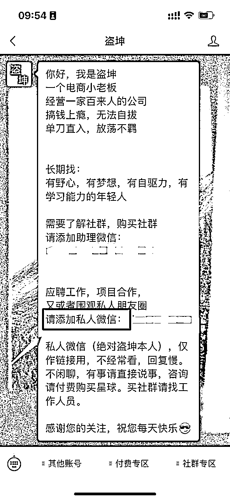

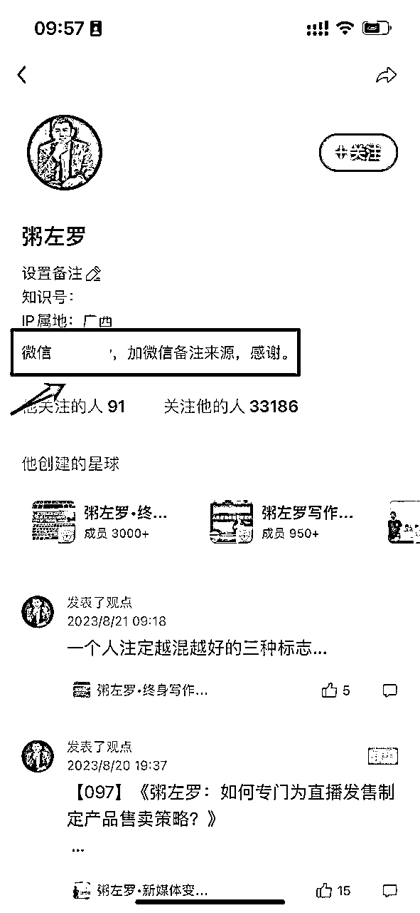

只要能链接到，前面说的邀请信就可以触达到。

除此之外，我们都说六度人脉，其实往往只需要 2-3 度就可以连接到嘉宾，这种时候也可以通过你自己的朋友圈、社群，把你的诉求表达出来，或许也会有好心人帮你牵线呢：）

方式二：加入社群

很多大佬很可能有自己的社群，或者是他在其他人的社群里。

比如粥左罗，他是生财有术的嘉宾，所以在社群内就有可能找到他，可以向他提问、也可以在他发的帖子、留言的内容里回复。

如果同在一些微信群，那就更方便了。

所以，加入社群，本身除了能够从优质的内容里吸收营养，另外就是可以关注和添加到优质的嘉宾。

方式三：嘉宾推荐

一旦开始做商业访谈节目后，我们也可以在访谈结束时，请嘉宾推荐：“你能再给我推荐一些适合我们节目的嘉宾么？”

嘉宾往往有自己的人脉圈，相同领域的一些优质嘉宾，很可能藏在他们的微信里。

这一招非常好用，一旦你开始后，嘉宾就裂变了。

## 2.3 第三步：制定采访大纲

商业访谈本质上是以内容为核心，因此在制定采访大纲时，要注意故事、走心、获得感三个要素，采访时尽量往这三个方向挖。

在「2.3.2 制定访谈提纲」，我们也以粥佐罗老师的采访为例，给出了一些具体的、可落地的提问方法以及提问框架。提问清单非常重要，可以弥补我们前期谈判技巧的不足，让访谈不至于卡壳或中断。

### 2.3.1 商业访谈的内容核心

我们做商业访谈，最终呈现出来的是内容，内容是我们和嘉宾一起共创出来的，观众也是通过内容了解到我们节目、了解到嘉宾。

那商业访谈内容的核心是什么呢？

我们先看更泛一些的中视频内容，再收拢到商业访谈上面来：影视飓风的 Tim 给出过一个 HKRR 内容法，具体视频可以参看：

https://www.bilibili.com/video/BV1Bb4y1R7WQ

说到 HKRR 的时间点是 17 分钟开始。

H（happiness）：能给人带来快乐的作品，具备天然的传播性

K（knowledge）：能让人学到新知识的内容，自然会给人留下印象

R（resonance）：打动人心，是优秀作品普遍具有的特质，只有和观众产生共鸣，才能传达你的情感给他。

一期合格的内容至少要满足 HKR 三个要素中的一个，当一个视频，同时具有了这三个特性，就会有很大的概率，成为一个受人认可的作品。（比如何同学）

基于这三个标准，内容策划时思考深度提高了，内容也更加有趣了，但共鸣感始终差一点。

直到 Tim 在看书的时候想到，HKR 一本书也能做到：R（Rhythm）：节奏

万物都有它的节奏，声音、移动、甚至情绪，节奏不是快或者慢，或者跟着音乐那么简单，是一种魂，当你感知到它的时候，抓住它的时候，你能将一切连接到一起！

我们换一个角度，使用一个四象限来理解内容：

商业访谈做的也是内容，我们不能自嗨，需要和观众共舞，结合 Tim 的 HKRR 来看，至少在做内容我们可以用这几个点来琢磨我们的访谈是否做出了以下要求：专业度：嘉宾在专业领域内是否输出了一些有价值的观点？

故事化：是不是表达出了一些故事，让人印象深刻、容易理解？

走心：走心是真情实感的流露，挣扎、彷徨、痛苦、失望，更容易让观众感同身受

竞品：竞品内容是怎么做的？为什么他们做的好？哪里我能学习借鉴？

在做提问清单、前采时，就要注意琢磨这几个要素～以《程前朋友圈》来看，大多数的内容的节奏都是从嘉宾的成长线开始，过去多么苦难、多么的努力，都为了后面的爆发做下铺垫。这是故事部分。

故事部分，也会有很多嘉宾经受的苦难，甚至不少嘉宾当场流下眼泪。视频的最后也会放一些嘉宾的生活照和金句，这些都是走心部分。

到了嘉宾的专业领域部分，程前会一起来拆解行业的关键要素，这就是专业度的部分。

那以上就是拆解竞品的部分。

故事+走心是为了让观众有沉浸感，能够感同身受代入其中。

专业度是为了保证观众看完有获得感，对节目和嘉宾更加认同。

看完这一小节，希望大家记住，一个好的商业访谈，需要有三个部分：故事+走心+获得感。

至少要保证内容包含有一个因素，如果能有多个因素，就是非常好的内容了。

### 2.3.2 制定访谈提纲

提问清单是基于你对嘉宾的理解，整理出来的访谈提纲，可以有两部分：

1.

你自己的一套相对固定的提问框架

2.

基于对嘉宾的研究，针对性的提问内容在前面的邀请信【生财逆袭者】粥左罗老师访谈邀请信 里，可以看到有粥左罗的成长线，我们会先把问题大纲根据时间轴做几个大块的划分：

Part1 粥左罗的成长史：粥老师，你们那个地方是一个什么样？

小学是怎么过来的？

你什么时候开始真正接触到外面的世界了？

对你下一步有什么样的行动上的指引呢？

你非要复读是为什么？

再复读一年，整个是不是节奏状态，成绩很快就起来？

所以你考了 620 多分，那就来到了北京。哪一年来北京的？

去到学校第一印象是啥？第一次北京

（粥左罗说感觉很自卑）为什么有这样的感觉呢？

你大概四年时间花在哪？

（自己会大器晚成）这个思考是怎么来的？

你看书看展览穷游，都给你带来了什么呢？

（觉得大城市的同学也不厉害）什么情况下你能产生出这样的信心呢？

有没有一种可能是说，因为你看了马云俞敏洪他们，你见识到了更高的人？

（和妻子可乐有关）第一次见面的时候是什么感觉啊？

粥老师什么时候产生爱情的？

Part2 工作阶段我记得粥老师文章里面写有个细节我印象特别深刻。说他觉得自己的女朋友跟他在地下室里面一起煮泡面吃，我觉得这种你会不会觉得有点对不起女朋友？

听可乐说，你在那（卖滑板）还被店长训斥了。

（不强行推销）觉得跟你后面卖你的课程也有很相像的。我记得你说录播课它就不值那么多钱！

你到现在那为止，还是没变？

所以你在那儿做八个月，我觉得接下来应该是挺重要的一个选择。就你能够加入到一个新媒体里面去做小编，那个机会是怎么出来的？

你写作的能力是不是在这里开始得到了非常强，非常系统的训练？

第一篇 10w+出来的时候，你当时什么心态？

追热点写爆款，有没有总结出什么非常明确的方法论？

您印象最深的一个热点是什么？

那你下次机会是怎么出来的？

当时可乐在干啥？17 年了

ok 所以接下来在插座这一块，就是大量的做课，线下去做讲座，企业内训？

Part3 创业阶段

再到下个阶段，没能说你开始去搞自己的公众号了？

那边做还挺好的，为什么想自己真那么好的平台不要了，自己出来干？

可乐怎么看呢？就是粥老师要出来这么单干了？

真的还是蛮夸张的对那在这种情况确实让他在 18 年三月份开做一个号。你开多号的时候有多少粉丝？

为什么觉得这个方向可以？

这么一个路径下来，大概过几个月就开始推出自己的课程？

当时你的公众号已经是一个什么量级了？

五个月就涨了快 20 万粉丝？

当时一篇广告能多少钱？

（问可乐）是什么时候出来一起做这个事儿？

那 19 年你这一块业务基本就已经比较稳定了，开始公司化，和之前有什么特别不一样的地方吗？

当时是什么契机让你觉得说我应该再多招更多的人？

加了大概什么样的人？

感觉应该没什么问题，后来是怎么着就决定稍微能少一点？

我还挺想了解你们两个之间平常是怎么交流的？

那你觉得写作这个事情对你自己以及说你把它做成一个课程教会给更多人，对大家这个价值到底是什么？

现在听起来还是不会很快退休的！

我们是草根，我们是现在过得挺不如意的人。我用什么方式能够改变我自己的命运呢？

主线的问题是灰色部分的文字，这些是根据研究粥左罗的成长经历，进行提炼总结的。但在访谈的进行中，会发现有额外的内容可以补充进来，于是出现了额外的两种颜色：

蓝字部分是从粥佐罗和妻子可乐相遇相识相知的过程延伸出来的，基于时间线的发展，适当的提一些问题。

最典型的是问粥左罗和可乐相关的问题：第一次见面的时候是什么感觉啊？因为时间线上来看，粥左罗在大学期间到云南昆明穷游，遇见了可乐，所以这里适时的插入相关问题，问完粥左罗后，可乐就可以补充说明。

红字部分，是访谈过程中，我自己产生好奇的地方，临场发挥的。

基于原有问题下粥左罗的回答，我会发现有自己很好奇，很感兴趣的点，于是直接追问，就能够获得更多丰富的细节，和意想不到的回答。这种提问是需要临场应变的，如果我们能够把自己变成新手，或者用户，带着好奇心去听嘉宾的分享，当你有了想要提问的冲动时，不要放过。

比如粥左罗说第一次来到北京后是自卑的，因为作者本人也是在北京读大学，初到北京时没有这种感觉，就很好奇为什么粥左罗会自卑，于是进行追问，粥左罗说出了自己觉得农村出身，外在条件比同学们差太多了。

基于上面的内容，这里给大家提供一个《生财逆袭者》比较适用的提问框架：

1.

基于嘉宾的成长时间线，寻找成长过程中比较重要的节点

2.基于重要节点，里面发生的故事，带给嘉宾的触动是什么？

嘉宾是如何开始启动创业的？低谷和巅峰是什么样的？

如何分配自己在家庭和事业的时间？

在专业领域，有什么心得可以对外分享？

你也可以基于自己访谈的内容定位，来调整以上提问框架，找到适合你自己的。

## 2.4 第四步：准备拍摄环境

### 2.4.1 场地布置

相信大家在早期时，并没有固定的拍摄场地，有这么几个方式可以解决：有密闭空间的茶馆包间

嘉宾工作地的会议室、嘉宾家里自己所住的房间简单布置下

对于布景，初期也不需要特别的专业，只要保证背后没有特别杂乱的内容，不过于影响视频画面内容即可，背后是书架、嘉宾喜欢的内容、还是干净的白墙、或者是窗帘，都 OK 的。

因为要实现面对面访谈的内容，至少得双机位甚至是三机位，这对于初学者成本太高。

建议采用很多 up 主的对谈画面：和嘉宾并排面对镜头，用手机前置摄像头拍摄。

这样的画面结构只需要一个机位：两个人面对着用支架加起来的横置的手机即可。

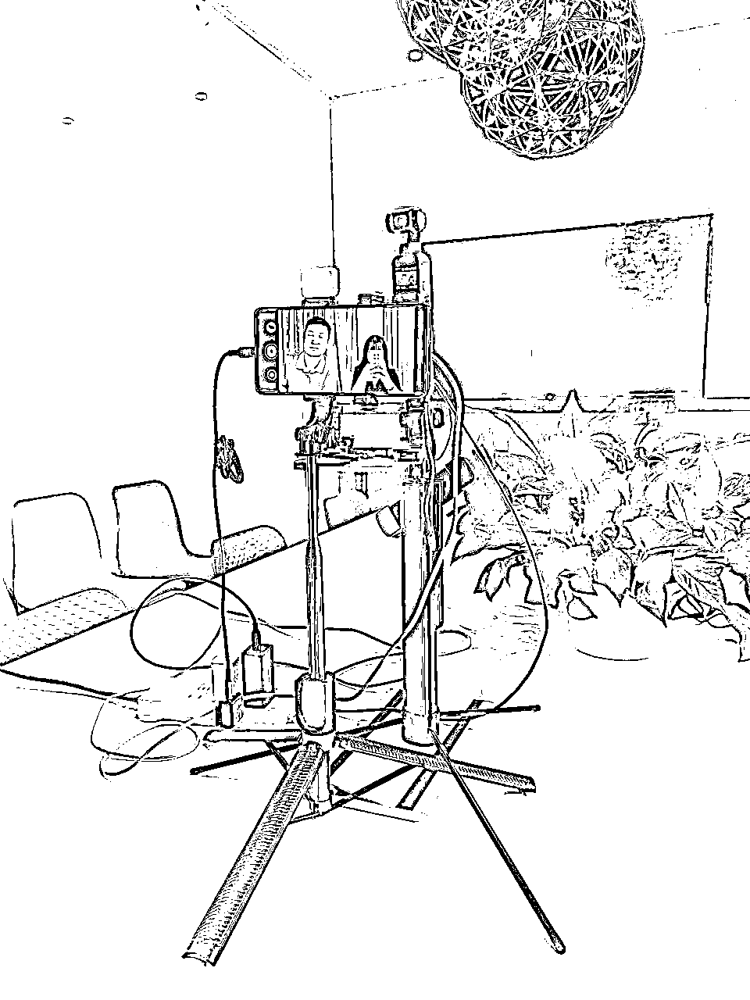

### 2.4.2 拍摄器材

以上述拍摄环境为例，我们需要准备这些设备：直播支架

收音无线麦

插线板 or 充电宝手机

补光灯以下是部分设备推荐，涵盖设备用途、价格区间、注意事项等，大家可以按需查看：

1）直播支架

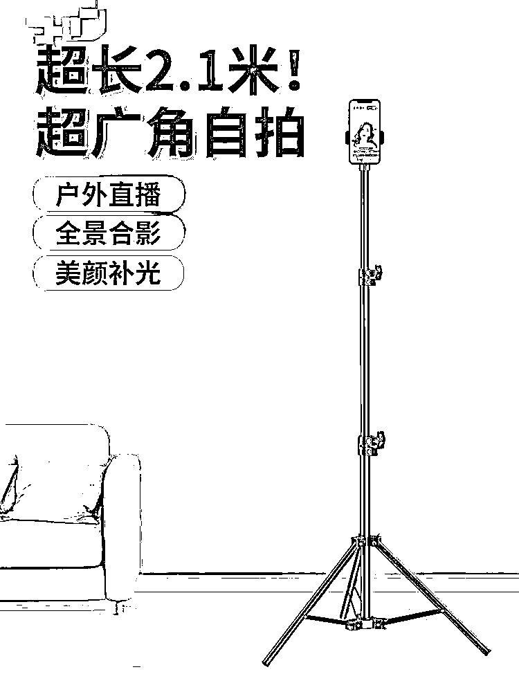

用途：解放双手、固定机位，帮你找个一个合适的拍摄角度

价格区间：拼多多、淘宝很多，价格在 40-110 元左右

注意事项：买能够正常夹住你手机的就可以，但要注意买 1.7m 以上的高支架。因为有些时候你和嘉宾前面没有桌子，需要支架立在地上，那就需要比较高的支架来保证手机可以和你们的头部同样高度。

2）收音无线麦

用途：麦克风可以帮助我们获得一个清晰的音质，尽可能减少噪音干扰。

价格区间：700-2500，闲鱼价格会更低配置推荐：愿意一次性上顶配的话，Rode、Dji 都很好

👉Rode Wireless Go 二代，京东到手价 2500+元；

👉Dji Mic 一拖二，京东在 2300 元左右。

👉低配的话建议买 Moma Lark M1，淘宝旗舰店在 700+元 3）补光灯

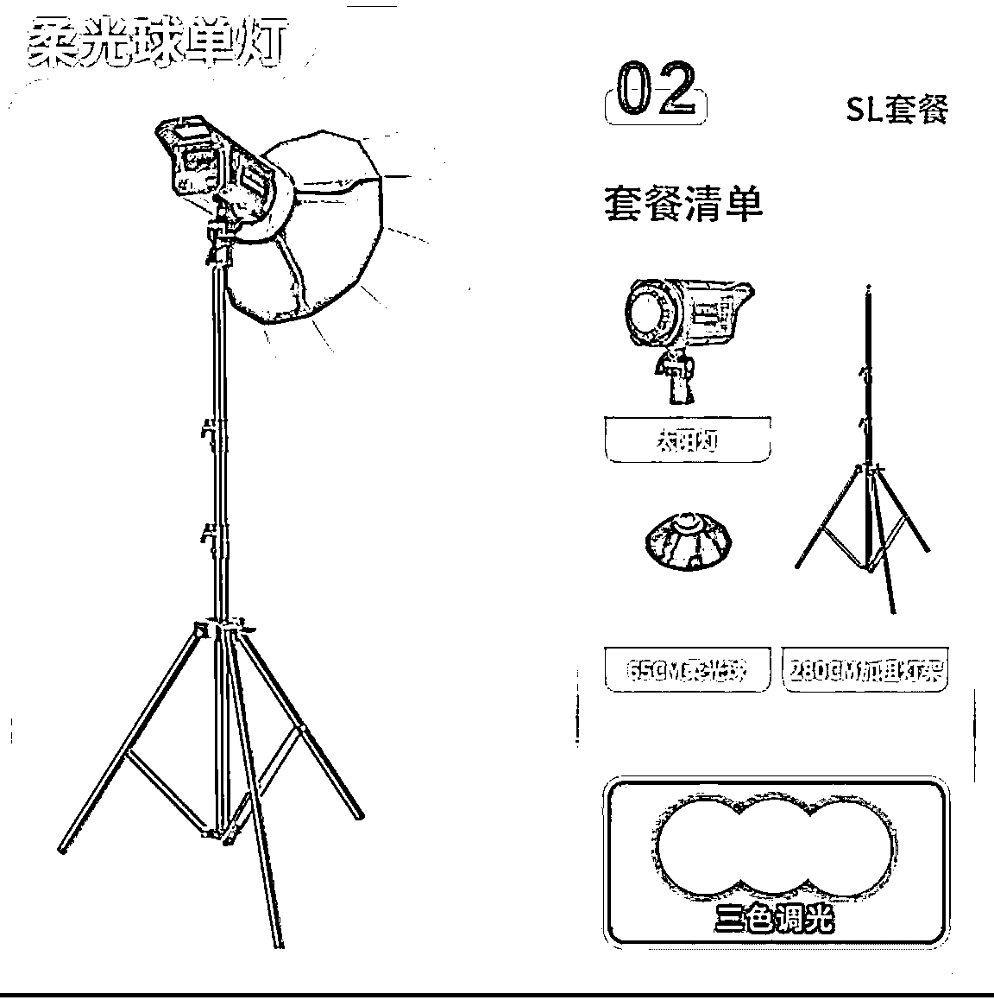

用途：经过实际的拍摄尝试，发现现场灯光往往没有那么理想。所以增加一个补光灯是非常有必要的。

价格区间：类似的产品很多，淘宝 350 左右，闲鱼 200

注意事项：如果需要经常在外拍摄，可以购买可折叠款式，方便携带，很关键

4）插线板

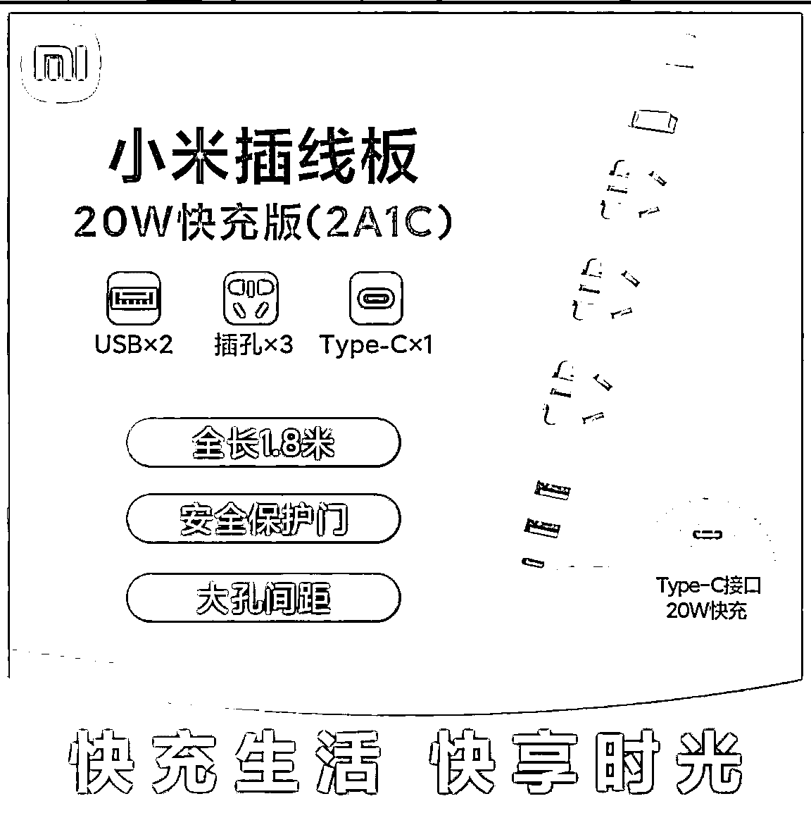

用途：如果增加补光灯，那插线板是必备的了。

价格区间：淘宝上，小米智能家居旗舰店售价是 69 元

注意事项：特别是在外面的场地，很多时候需要从插座接线到设备附近，买一个 2 米的插线板会方便很多。

## 2.5 第五步：前采沟通内容

💡

章节概要在嘉宾是否合适的环节，我们谈到了前采。

所谓前采，指的是在正式录制前，对嘉宾的一次预采访，相当于把我们之前准备的采访大纲跟嘉宾过一遍。关于如何开始前采，我们会在「2.5.2 如何开始前采」详细说明。

前采的目的之一，是判断嘉宾能否按照预计的提纲输出有趣有料的内容，从而决定是否进行邀约。如果嘉宾合适，我们就可以顺理成章开启正式采访，并延续前采的轻松氛围，效果会更好。

目的之二，则是重新调整我们的采访大纲。删去嘉宾不愿意回答的问题，或者回答不好的问题；同时在聊天过程中，也可能会出现一些惊喜内容，可以继续补充到大纲里。

所以，前采是非常重要的，建议在正式录制前，一定要进行一次前采。

### 2.5.1 前采的形式

前采有两种方式，一种是线上语音聊，另一种是线下约见面，两种方式各有优劣：

1.时间、条件合适，约线下见面。这种效果最好，一来增加了两人的熟悉和默契度，会大幅提高现场的内容录制质量，减少嘉宾的紧张感。二来可以捕捉嘉宾的语气、表情上细微的变化，从而帮助我们更好的调整访谈清单。

时间、条件不合适，线上语音视频过一遍。这样效果会差一点，不过也可以帮助我们快速的和嘉宾梳理一遍问题和流程。

值得注意的是，这里并没有严格要求前采和正式录制必须分开，如果线下见面成本比较高，并且你可以快速在前采阶段确定嘉宾确实合适，访谈清单也能快速调整到你满意的状态，现场环境也 OK，那是可以直接开始正式录制的。

### 2.5.2 如何开始前采

在前采之前，我们最好把之前准备好的采访大纲，发一份给嘉宾，让他们有一个心理预期。

前采的时候，可以在寒暄完后，走一遍提问，让嘉宾来回答。重点是，放轻松，多把注意力放在嘉宾身上，去感受嘉宾的输出，你有好奇的地方就进行追问，听不明白的地方请嘉宾再多做一些解释。

全方位的来评估嘉宾是否合适，提问清单是否需要调整。

### 2.5.3 提问清单的调整

对于一些不合适的问题，不管是嘉宾回答的不好，或者是嘉宾不愿意回答，我们都可以快速的在提问清单内去除。

在现场通过追问、嘉宾延展出来的内容，都可以补充到提问清单内。

比如在和粥左罗&可乐做前采时，我发现可乐描述粥左罗在同居时非常投入在工作上面，甚至出现有一段时间可乐见不到粥左罗的情况，立马把这个内容植入到提问清单内。

前采的最后，粥左罗说，可以和可乐一起，三个人录制内容么？这是个很有意思的建议，于是我们做了挑战，最后效果也很不错。

对于这些前采中发生的变化，记得回去后调整提问清单。

提问清单非常重要，特别是早期我们还没有很好的访谈技巧时，需要有一个清单来帮助我们保证水平的正常发挥。

至于正式录制的提问清单是否提供给嘉宾，可以分两种情况：如果嘉宾经验非常丰富，也接受过不少采访，此时就无需提前给到嘉宾，可以沟通一下，夸赞一下嘉宾，说为了保证临场的真实反应，就不给提纲了。

如果嘉宾段位不是很高，或者对镜头比较紧张，可以把正式访谈的问题清单发给对方。

## 2.6 第六步：检查拍摄清单

在拍摄前一晚，我们最好再检查一下需要准备的物料，避免遗漏：1.

直播支架：确保可以正常使用

2.

收音无线麦：把电池仓和小蜜蜂都充满电

3.

插线板：保证到时用电方便

4.

手机：需要保证充满电、存储空间留够 50 个 G 以上空间

5.补光灯：确保可以正常使用

6.

充电线：手机&收音无线麦的充电线（注意看需要安卓 or iOS 的）、补光灯的电源线

7.

背包（把上述物品装上）

提问清单：再过一遍，看看有没有什么需要修改的地方如果不希望出现第二天电池没电，无法录制的情况，请在前一晚对照清单一一检查。

## 2.7 第七步：正式录制访谈

### 2.7.1 拍摄动作检查

开拍之前记得检查我们的拍摄动作，避免拍出来的画面不能用，或者录出来的视频没有声音等情况。

具体动作如下：

1.

灯光比较重要，记得观察拍摄场地的灯光条件

2.

有顶灯的记得打开；有窗帘的记得拉开

3.

要保证屋内明亮，不要太暗，也要避免被阳光直晒

4.拍摄开始前，用干净的餐巾纸，在前置摄像头上哈口气后擦拭干净

5.

正式录制前，先做一下录制测试，和嘉宾随意聊几句话录下来，然后看一下录制效果：

a.

画面是否清晰

b.

灯光是否明亮

c.

声音是否正常

d.存储空间是否足够

e.

手机电量是否正常

6.

录制手机调至飞行模式，避免电话，其他消息的干扰

7.

嘉宾手机提醒调至静音模式

8.

桌上可以摆放抽纸（应对哭泣，鼻涕等意外情况），准备好饮用水 2.7.2 访谈节奏把控

因为要面对镜头录制内容，帮助嘉宾放下紧张感尤为重要。

在节目开始前，可以先喝喝茶，多聊聊天，帮助嘉宾放松，看到嘉宾状态松弛下来后，再开始拍摄。

可以告诉嘉宾，交流时多看主持人，镜头只需要偶尔看一下，这样可以减轻一些紧张感。

往往嘉宾聊嗨后，就会变得更加自然。

在聊天过程中，可能会碰到以下两种情况：

第一，嘉宾滔滔不绝，该不该打断？

答案是，需要及时打断。如果嘉宾分享的内容和今天的主题不符，可以及时打断：

“x 老师，刚才你说到这个事情，那后来另外一个事情是怎么样的？”

实验证明，适当的打断谈话，是防止冷场，保持良好谈话氛围的必要方式。

第二， 如果突然不知道问什么了怎么办？

可以将访谈提纲打印出来，或者提前把手机屏幕常亮，在忘记的时候拿出来看一眼也是可以的，因为视频我们可以后期剪辑，不用太紧张。

除此之外，如果还是不知道如何提问，记住三个词：“谁”“什么”“为什么”，比如：

“你对谁印象最深？”“你的偶像是谁？”

“是什么让你做了这个决定？”

“你说你决定复读，为什么？”

其实有时候你的好奇心会在这三个词的帮助下，不断挖掘出嘉宾身上的故事，甚至会比事先研究嘉宾背景还有效。

## 2.8 第八步：后续收尾工作

录制完视频，只是一个开始。

后续我们还有两个工作需要继续做：

1.和嘉宾要一些素材用于剪辑，比如视频内提及的图片、视频等

2.

剪辑完毕的视频请嘉宾确认

比如嘉宾在说到自己老家时，如果在视频内增加一张嘉宾在老家的照片，会让内容更加丰满。

所以可以在视频剪辑前，和嘉宾索要一些照片。

这里需要强调，有一环是很多创作者遗忘却很重要的：

内容确认在正式内容发布前，要和嘉宾确认，否则上线的内容一旦出现问题，只能做下架处理，这是灾难性的。

所以视频内容可以在剪辑完毕后给嘉宾检查一下，建议使用飞书妙记、百度网盘，嘉宾可以在线快速观看，无需下载。

总结，和嘉宾对内容，精简起来操作 SOP 包含 以下部分：3.

提问清单和嘉宾确认

4.

前采

5.

定最终的提问清单

6.

正式录制

7.初稿视频给嘉宾（用飞书妙记、百度网盘）

终稿视频给嘉宾（用飞书妙记、百度网盘）

嘉宾确认，正式发布，并把视频链接发给嘉宾

# 三、视频剪辑

📌

章节概要剪辑目前有两种方案，一种是自己剪辑，花费大概 6-8h 完成一个视频。另一种是找外包，一条 20 分钟的视频，价格在 300 左右。大家可以考虑相应的剪辑成本，找到合适的方案。

如果选择自己剪辑，可以参考「3.2 剪辑思路」里提供的如何把 2h 的素材，删减到 20 分钟的思路，以及在「3.3 剪映剪辑流程」提供的基础剪辑方法。

这里的剪辑思路和剪辑流程只是其中一种方式，如果采用双机位或者更复杂的方式，时间成本将会成倍上涨。

此外，视频剪辑需要特别注意字体版权，避免后期版权风险，在「3.4 版权风险」。

## 3.1 剪辑成本

强烈建议用剪映电脑版本，对于电脑配置有一定要求，具体可以访问剪映官网确认配置是否满足。

如果不能满足，也可以到支付宝按月租用主机，按月租用长期不划算，但在早期可以最低成本保证我们启动，如果确定了要长期自己剪辑，可以再花钱购买。

另外一种剪辑方案就是在闲鱼搜索“博主剪辑”找外包，正常的费用是 1 分钟 100 元，这些都可以谈价格，有同行聊的价格是长期合作 8 分钟长度的视频剪辑价格 100 元/条我找到一位提供的价格是 20 分钟价格 270 元/条

可以按照这个数字去评估自己是否能接受成本。

自己剪辑的话，大约需要 6-8 小时剪辑一条 20 分钟的视频。

大家可以根据上面的情况来评估，选择适合自己的方案。

## 3.2 剪辑思路

可能会有很多朋友疑惑：一次访谈可能要到 2 个小时，我如何才能删减到 20 分钟的中视频呢？

核心要义是，不断删减，保留精华部分：

第一次可以比较容易的删减到 1h 以内，因为快速浏览后，会发现有些内容跑题了，或者删掉也无关紧要。

第二次及之后，则困难许多，我们需要反复查看，在留下的这些问题里面，哪些更重要；在嘉宾的回答里面，是不是可以删掉一部分仍然能保持意思不变。

我会大量使用以下手段来进行辅助：

1.

把视频提取出音频（电脑版剪映即可，导出为 MP3 格式）

上传到阿里的通义听悟（https://tingwu.aliyun.com/），使用 AI 提取章节，AI 提炼关键词，配合文字阅读来反复提炼

即：我们反复进行「第五步：先进行粗剪」的操作。

## 3.3 剪映剪辑流程

第一步：下载剪映

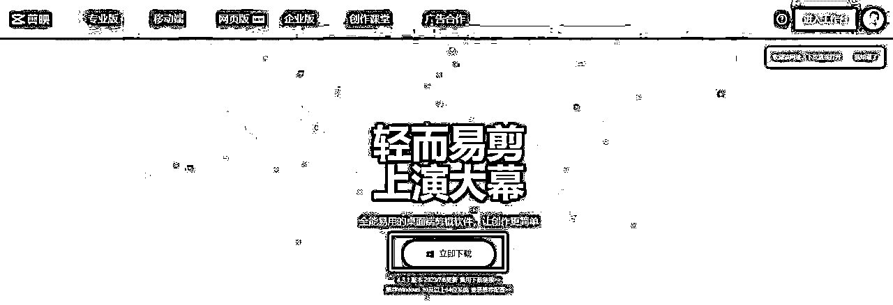

点击立即下载，下载完成后安装

第二步：打开剪映开始剪辑

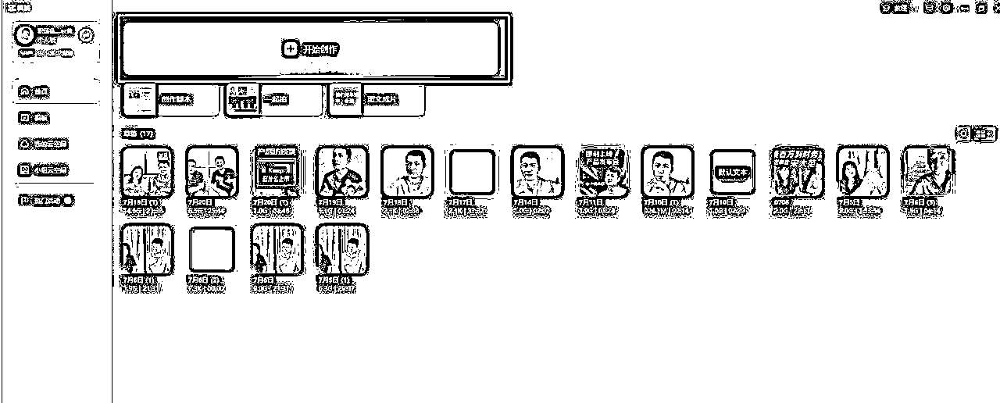

点击开始创作

第三步：导入视频素材

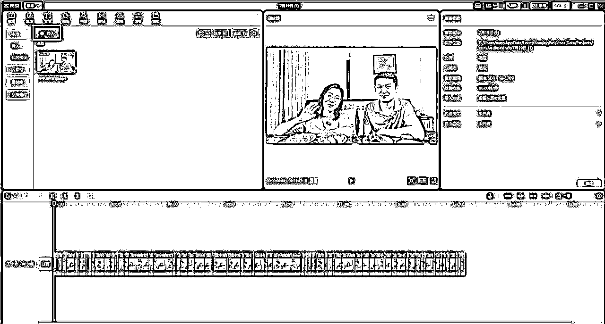

点击导入，把视频导入到剪映内，并把导入好的视频拉到桌面下方的轨道内。

第四步：学会使用快捷键

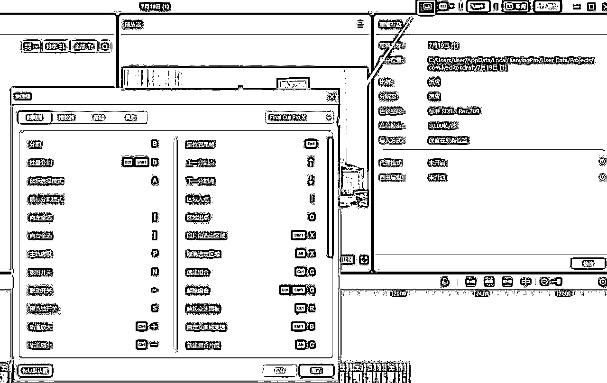

点击主界面右上角，一个小的键盘图标，可以查看到主要的快捷键，特别是分割、删除会比较常用，可以设置为你最熟悉的按键或者按键组合。

第五步：先进行粗剪

在精细的剪辑前，可以快速的把一些需要删除的大篇幅内容删减掉。

因为对谈视频可能会录制的比较长，举例：2 个小时

但最后保留的最终长度可能在 10-25 分钟左右，此时就需要先删减掉大篇幅的内容。

如何进行粗剪呢？我们可以先导出音频：

点击主界面右上角导出，在弹出的导出弹窗内，只选择音频导出

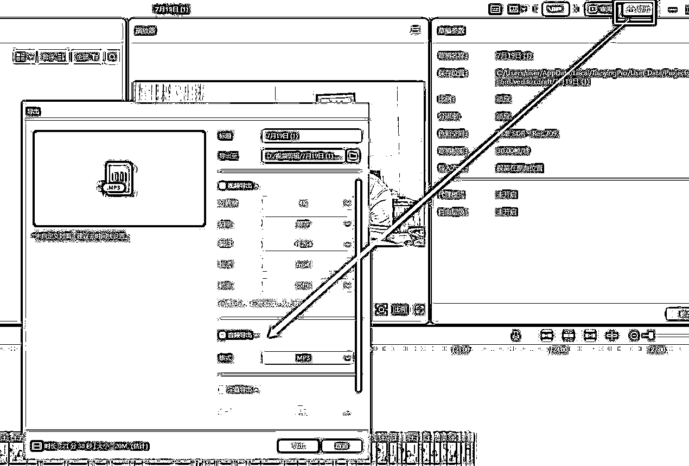

随后我们可以打开阿里的通义听悟，https://tingwu.aliyun.com/home

注册一个账号后，点击“上传音视频”

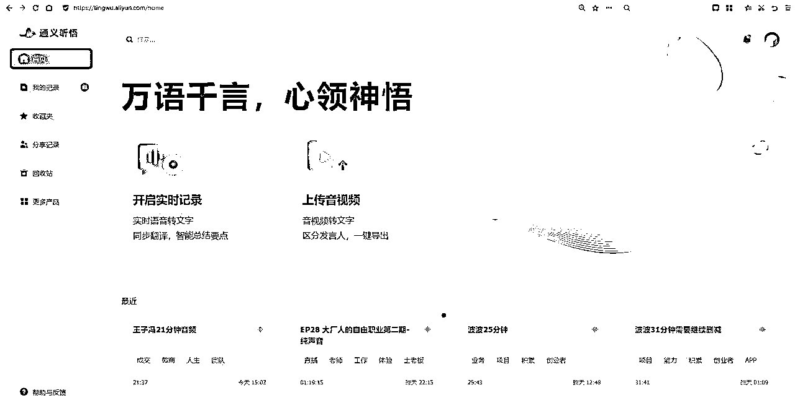

大约几分钟后，完成语音转文字。它会自动做出全文概要和章节速览，方便我们快速做全部内容的查看

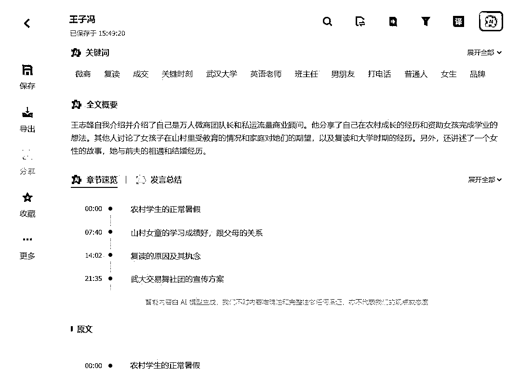

对于需要保留的文字部分，可以用鼠标选择后用一个颜色来标记

标记完之后，可以对照着需要保留下来的时间点，到剪映里面去寻找，然后分割，将不需要的段落删除掉。

第六步：继续进行精剪精剪有几个部分的工作：

如果之前已经生成了字幕，需要重新识别，这里记得勾选上“同时清空已有字幕”

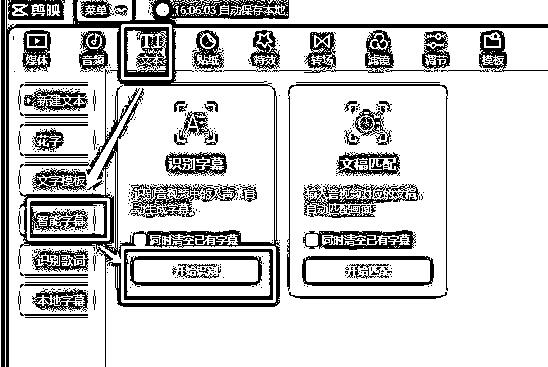

因为剪映使用语音识别的方式来生成字幕，所以很可能出现两种问题：

问题一：识别不准确。需要逐句的做修改，单击具体的字幕块，在右上方文本区域做调整

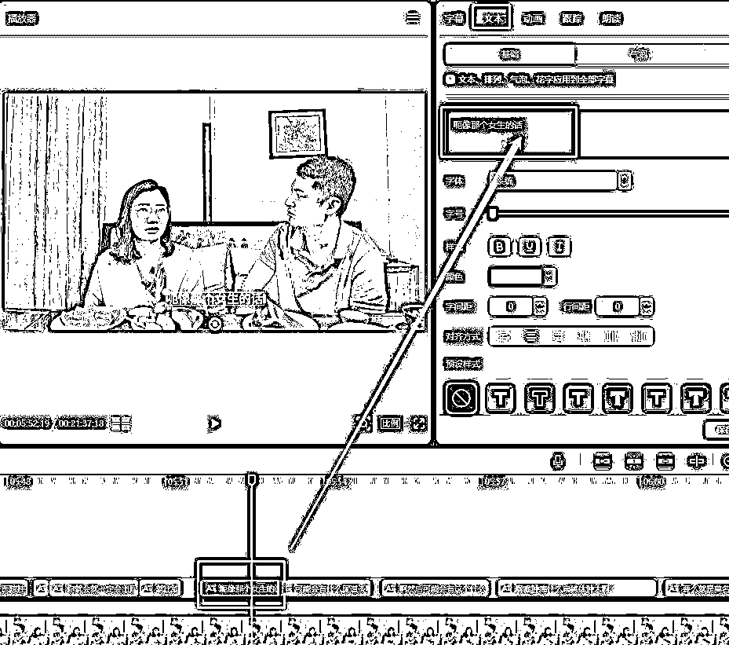

很多人会有比较强的口癖，比如“额”“然后”等等，这些口癖频繁出现也会影响观众的听感，如果方便处理，也可以把不合适的口癖删减掉。

但也要注意，口癖有可能和正文部分挨得非常近，如果不好删除，也可以不做处理。

3.增加 BGM、音效、贴纸音效和贴纸可以增加互动感，避免听众只是干巴巴的在听两个人对话

BMG 通常适用于：开头高光片段、中间有情绪起伏或者高潮片段、片尾

可以多参考一些其他的对谈视频，选择合适的 BGM 加入。

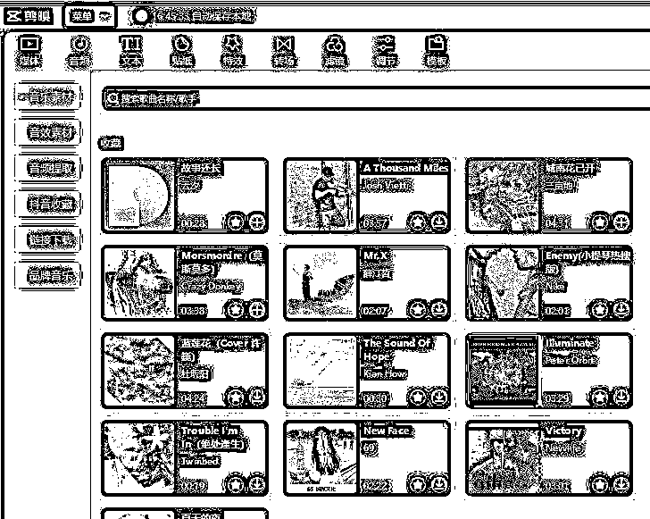

音效，剪映内自带多种音效，也可以多参考竞品，选择合适的音效插入。

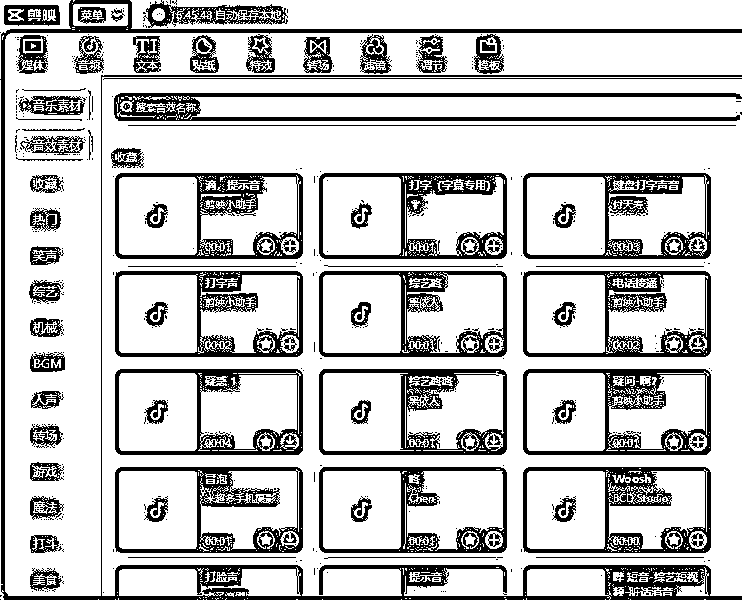

贴纸也是如此：

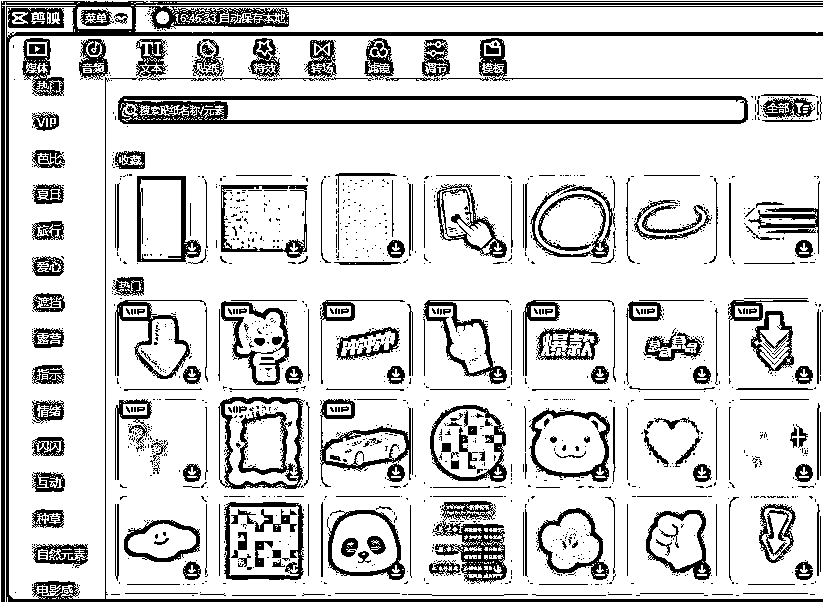

音效，剪映内自带多种音效，也可以多参考竞品，选择合适的音效插入。

贴纸也是如此：

最简单的方式就是对金句段落做分割，然后对这一段落的画面放大，只显示嘉宾的头像

这样观众就会意识到嘉宾正在说一些重要的话，因为画面和之前的不一样了。

5.高亮片段前置视频的开头，放一些内容的高潮片段，会更加的吸引观众。

我们也可以做类似处理，对于高潮的时段，分割出来

然后先复制，再用鼠标左键按住，拖拽到视频的开头

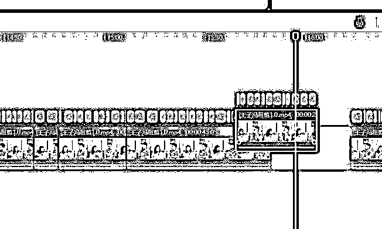

高亮片段可以单独用更显眼的花字来突出，以及可以增加特殊的 BGM

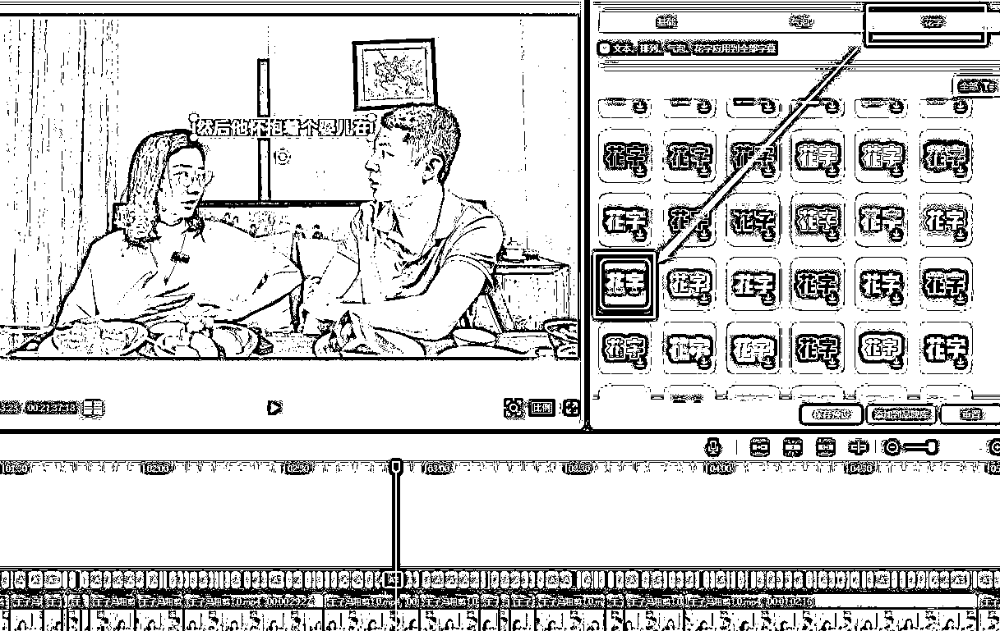

6.增加封面

封面可以使用稿定设计来进行处理可以付费购买一个会员

主要会用到两个功能：

智能抠图模版拼图

我们可以从视频中，将人物表情比较合适的画面截图，截图之后，点击稿定设计的“智能抠图”

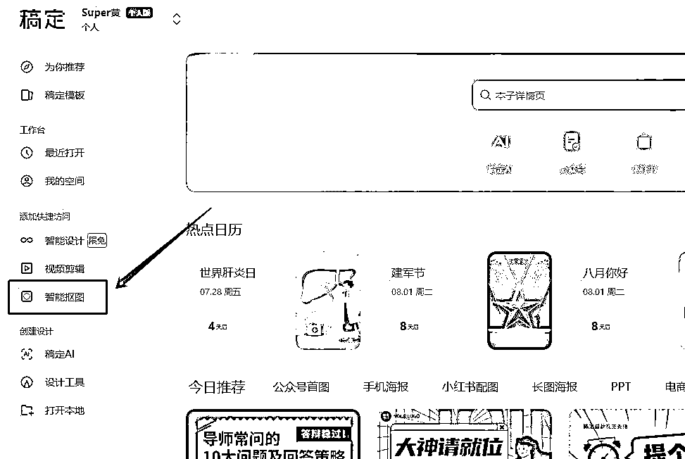

接着上传图片：

它会快速完成自动抠图，如果对生成的抠图不满意，可以点击左上角来进行修补或者擦除，完成后点击右上角下载。

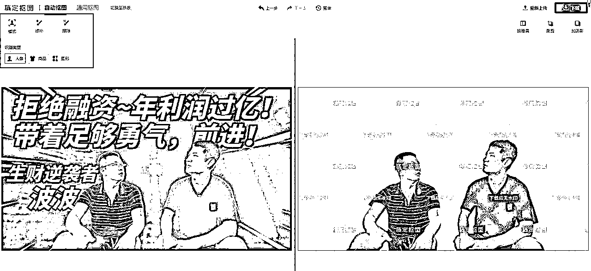

接着，我们搜索横版视频封面，选择合适自己的封面

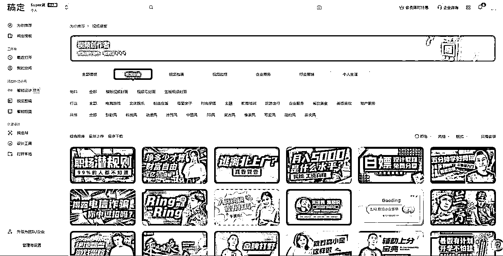

选择之后点击封面，进入到编辑页面

对图片的元素做删减后，把我们刚才下载的图片通过页面左侧的添加-本地上传，或者我的，导入到图片上。

按住 Shift+鼠标左键，可以对图片进行等比例放大，这样图片不会失真。

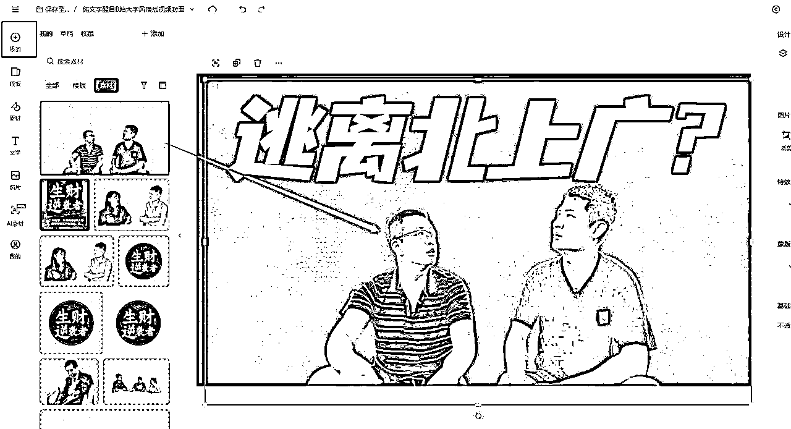

完成后点击页面右上角的“下载”按钮，封面就生成啦

7.增加片尾片尾，我们可以增加一些花絮

比如放一些嘉宾的生活照，一些金句，让整个视频的内容显得更加有层次，嘉宾的人格也更加立体：

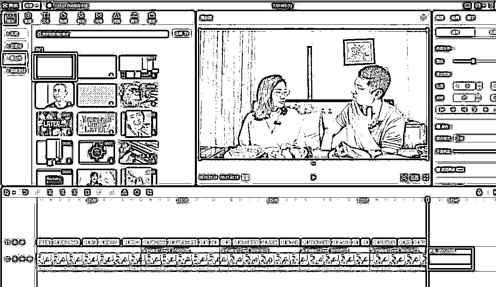

媒体 — 素材库 — 热门，选择黑色背景。

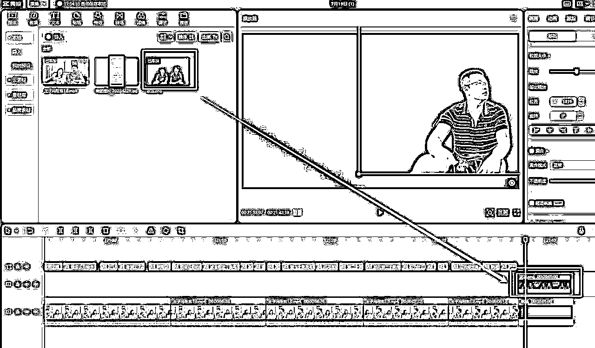

接着将合适的图片，拖入到视频时间轴上面，这样相当于在原来黑色背景上面增加了一个画中画。

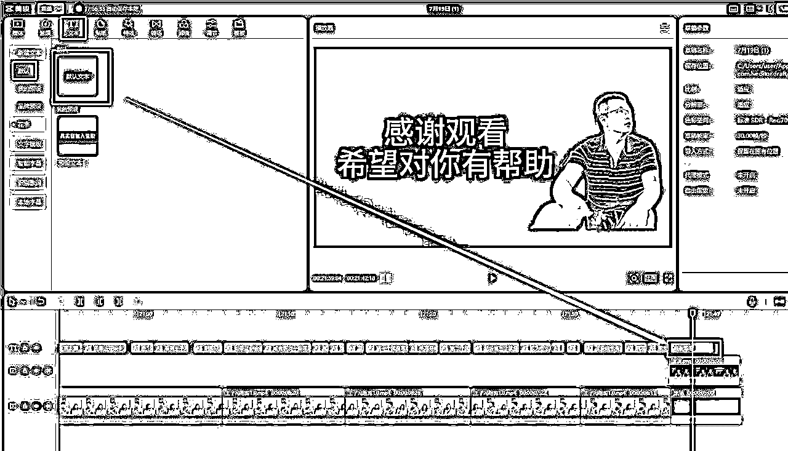

接着，我们可以增加一些文字，选择文本 — 新建文本 — 默认，把默认文本拖到视频时间轴上面的文本时间轴，然后点击，编辑成合适的文案即可

当然，片尾了，也可以加一些特别的 BGM。

第七步：导出视频

最后一步，就是把精心剪辑后的视频导出了。点击画面右上角“导出”，在弹出窗口里选中“视频导出”，分辨率选择 1080P 即可，不然视频会很大，不方便上传。

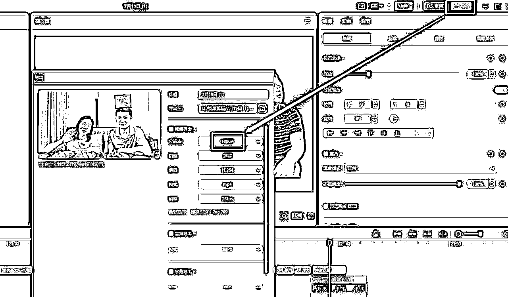

导出后，恭喜，你的成片出炉了。

## 3.4 版权风险

如果后续要做商业化，不可避免要考虑到版权问题。

视频可能涉及到的版权问题为视频素材、音频素材、字体素材三大类。访谈视频的视频素材基本都是自己录制，bgm 可以用剪映自带的音乐，这些不会有特别大的风险。

需要特别注意是字体版权，稍有不慎就会陷入版权纠纷。下面推荐一些可商用字体，其他字体建议一律不使用：

免费商用字体网站：https://www.100font.com/剪映的自带字体不能随便用，但是最新版剪映已标注出可商用字体：在【添加文字】-【字体】-【商用】页面，可以看到 19 种可商用字体，这些字体都没有版权风险。

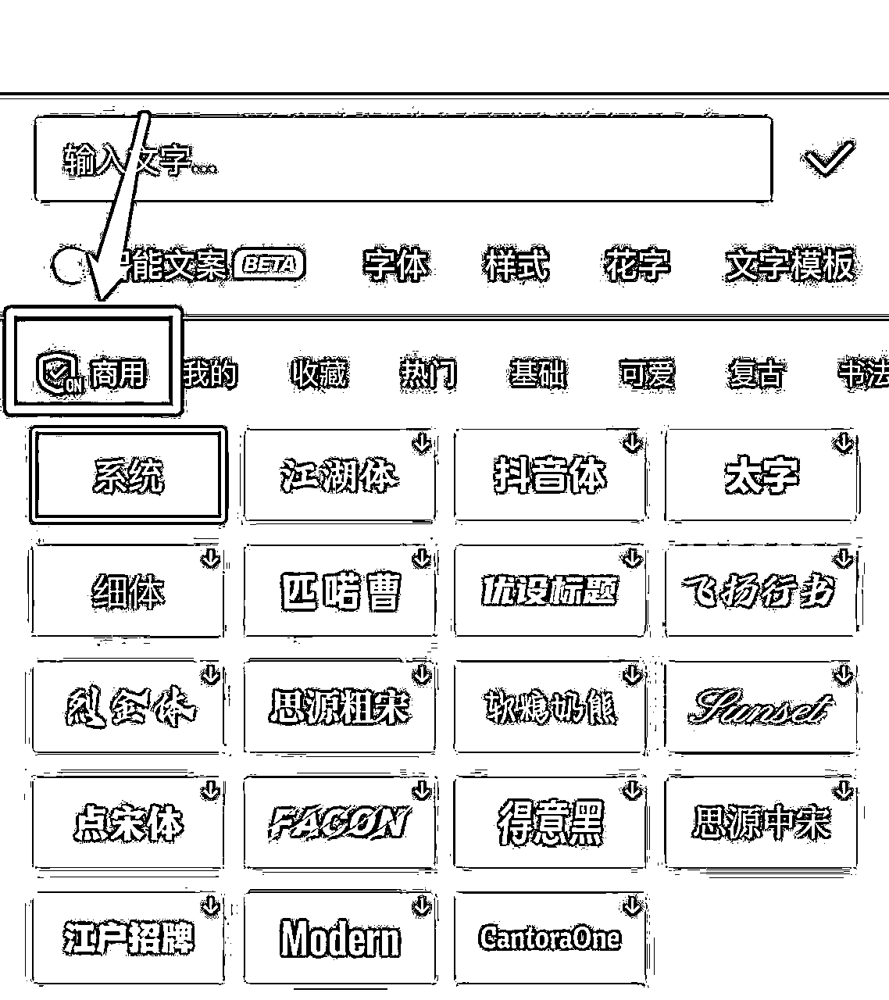

# 四、内容运营

📌

章节概要当你拥有一个成品视频后，下一步，就是内容运营。

这里建议将视频进行多平台分发，从而找到最适合自己视频风格的平台。以此为主平台，再考虑可优化的运营细节，例如合适的内容更新频率，精细化的私域运营技巧等。

需要注意的是，播客是目前势头较好的内容形式，它可以容纳更轻松随性的内容风格，也不限制创作者私域导流，值得我们布局。如果你还有余力，可以考虑小宇宙、喜马拉雅等播客平台，具体的运营方法，我们在「4.4 拓展渠道：播客」有简单阐述。当然，你也可以查看我们的 8 月航海 | 播客制作 | 航海手册，进行系统性的学习。

## 4.1 视频多平台分发

首先得说一下为什么需要多平台分发？

因为我们不太能确认自己的视频风格在哪个平台更容易火，所以将视频发到多平台，就更有可能撞上适合自己的平台，观察一段时间后，再讲数据比较好的平台作为主平台去琢磨优化。

多平台这里至少包含：抖音、小红书、B 站、视频号等我们可以注册一样的账号名称，一样的 logo，相对一致的介绍，再进行分发操作。

关于对谈视频的形式，这里再补充几点建议：第一，目前大多数视频平台都支持横屏、竖屏，建议我们做对谈类内容，以横屏内容为主。

核心的原因是对谈类视频容易出现主持人+嘉宾两人在同一个画面的情况，此时横屏比较方便呈现，在剪辑上成本也会更加低。特别是我们在一开始做商业访谈内容时，从低成本角度出发，用手机前置摄像头单机位录制，直接横屏比较方便。

第二，关于视频时长，建议初学者做 8-10 分钟。

目前主流对谈视频的长度有两种：12-20 分钟、8-10 分钟。

视频的内容长度取决于你希望内容是走深度性质，还是走爆款逻辑。深度需要更长时间来让观众更具体的理解人和事，爆款是提炼抓眼球的片段，快速获得观众信任。

目前来看，如果 8-10 分钟会更加适合初学者，一个是对访谈过程把控会更容易，我们抓住核心问题问完再增加一些围绕核心问题的辅助问题就可以了，二个是剪辑成本会更低，如果剪辑外包的话，是按照时长来收费的，即使是自己剪辑，工作量也和视频时长有强相关。

第三，关于视频封面，各平台有不同尺寸。

以下主要介绍 B 站、小红书、抖音、视频号的封面尺寸：① B 站

B 站视频为横版封面，尺寸是 4:3，建议分辨率：1280*960。

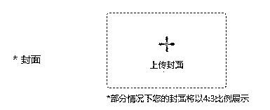

B 站的封面有个安全区的概念，建议大家把内容往中间集中一些，否则容易出现某些场景下边缘被裁切的情况：

② 小红书

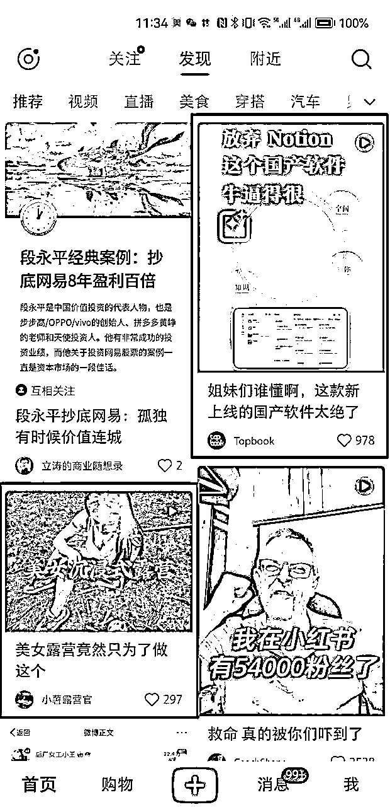

③ 抖音

竖版封面，封面会截取 9:16 的中间部分，具体为 1080*1464，和小红书非常接近，可以采用同一个竖版封面图设计。

具体看下图：

视频号：竖版封面，尺寸比例 3：4，建议分辨率：1080x1260。

整体来看，我们可以制作两个封面模版，横版用于 B 站，竖版用于抖音、小红书、视频号。

竖版封面的内容尽量往中间放，上下留出空白，保证在小红书、抖音截取的时候可以留出重要信息。

## 4.2 内容更新频率

初期不用追求稳定的更新频率，更多在追求打磨内容 SOP 上，留足时间让自己持续提高能力，这个时候更新频率不应该成为我们的压力来源。

你可以月更、双周更，等到访谈技巧成熟、嘉宾数量充足、时间精力允许的情况下，再提高到周更。

总之，以你舒服为主。

## 4.3 私域运营与宣发

等我们的账号做出一定成绩，就会积累一批粉丝。

粉丝最好能够统一引导到私域进行运营，可以适当在各平台的动态、群里用钩子引导添加你个人微信。

比如某期的内容说的是小红书变现，那可以用《小红书变现案例精选》作为钩子，这样就是个非常好的加私域的方法。

比如提到了大佬喜欢阅读的书，也可以用《大佬阅读书单》作为钩子。

导入到私域后，如何用社群的方式来对节目做运营呢？

第一点：搜集问题

可以在确定嘉宾后，在社群内搜集大家想问的问题。

因为大家添加到你的社群内，大部分都对这一话题感兴趣，自然会有不少朋友是带着一些问题来的，这样就可以用接龙的方式来搜集问题。

搜集问题之后，可以做一个整理，这些问题，可以作为你访谈的问题清单参考，因为尽管我们自己可以写问题清单，但那只是我们自己想到了，和用户真正关心的有可能出现偏差，当把权限放给用户后，就得到了用户视角。

第二点：标题投票

在内容上线前一天，可以把明天上线的标题整理出三个合适的，请听友来投票。

大家的参与度会很高，而且因为大家参与了，也会想知道最后的答案是什么，会保留有期待。甚至还会有不少同学在讨论什么标题更好，这也能帮助我们优化标题。

除此之外，3 个标题本身也涵盖了这次内容的关键词，粉丝们也能对内容有一个大概的预期，如果戳到了他的兴趣点，他就一定会去观看。

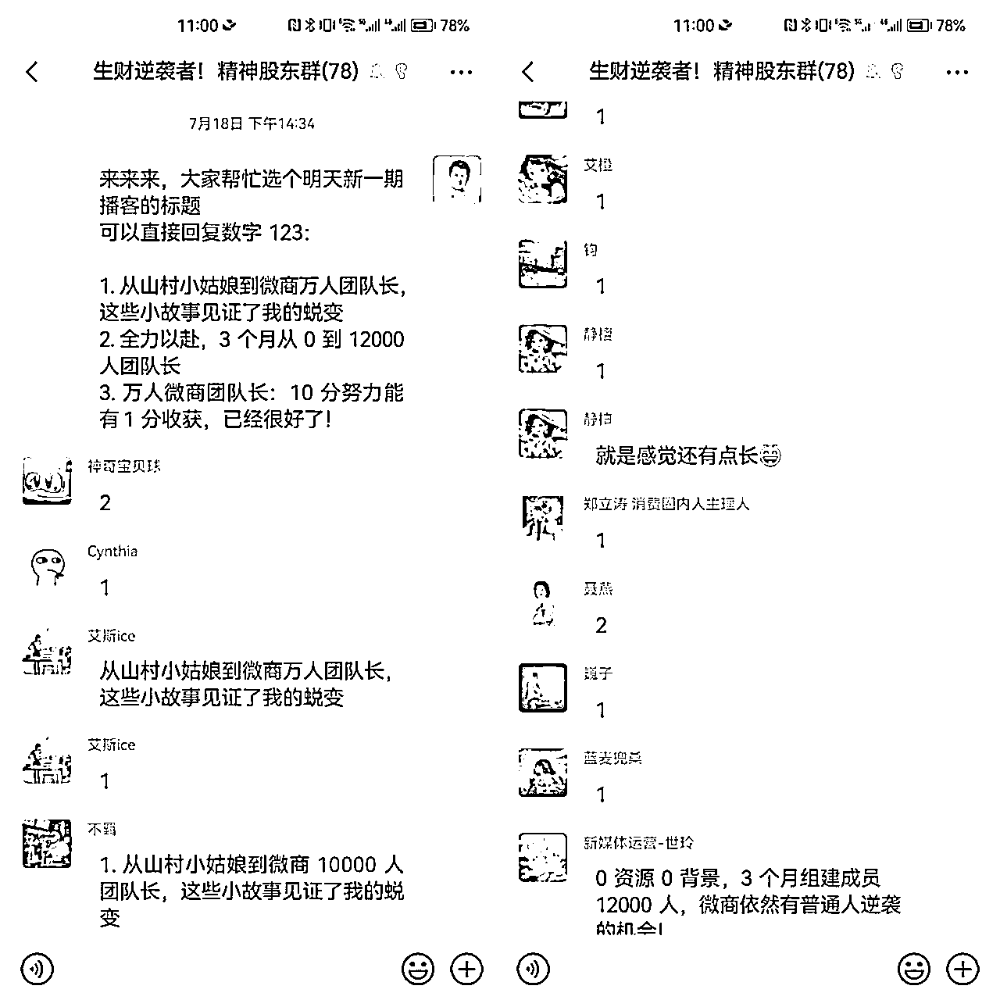

第三点：话题探讨

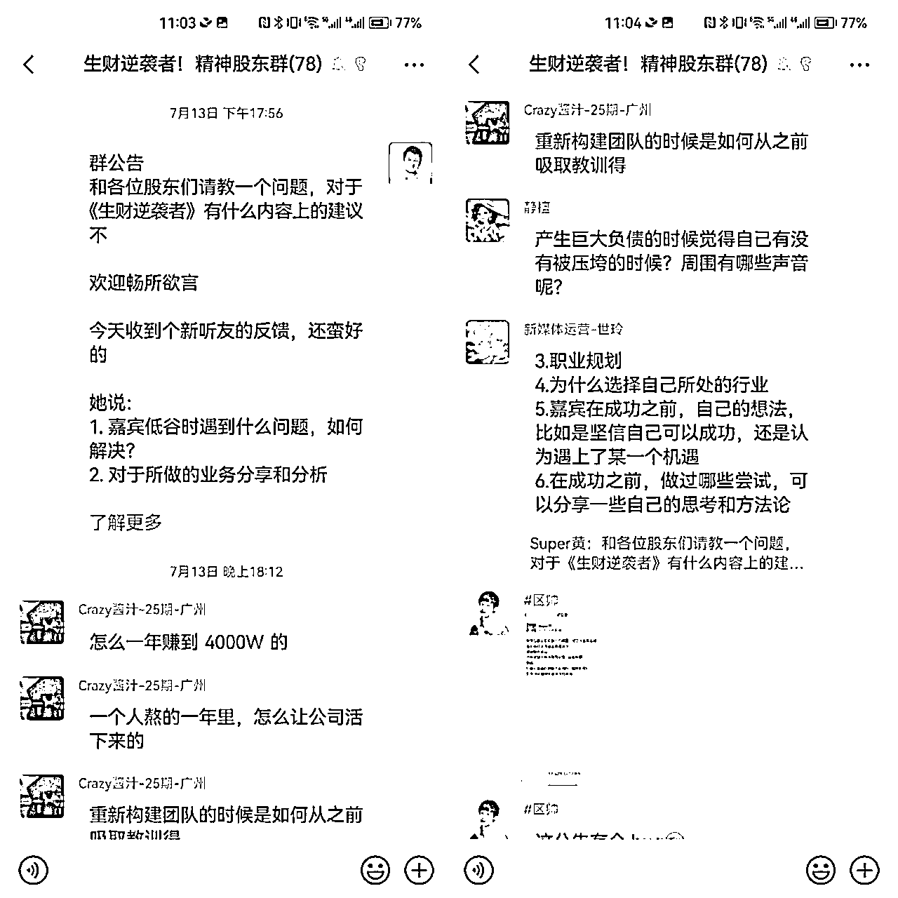

## 4.4 拓展渠道：播客

做商业对谈类节目，有一个渠道很值得铺设：播客。

播客是一个更加长期的渠道，因为上面的粉丝粘性高，打开率高，且会持续的缓慢增长。

是否要花时间做播客，取决于你的信心和时间，这一部分内容放在最后，更多是给大家提供一个方向，对于商业访谈，视频平台起量可能是更快的，带来的正反馈也会更强烈，优先还是推荐视频平台。

可以等你有时间精力了，主业务成型之后，再慢慢开拓播客渠道。

播客还有一个好处是，部分嘉宾不愿意露脸，或者露脸对他表达会有挺大影响，此时播客就是嘉宾可以自由发挥的渠道了。

### 4.4.1 播客的重要性

第一点：短视频不足以完全表达对谈内容

我们的视频内容，会在各大视频平台做分发，但是也会有一些限制，比如时常会控制在 20 分钟以内（当然这并不是硬性要求，只是更长的视频如果内容不好，用户可能会失去耐心）

每次删除或许都会逼疯你，那播客就提供了一个更加友好的环境，你可以放 40 分钟、1 小时甚至 1 个半小时的访谈音频内容。

这样听众可以更加全面地从节目中吸取到营养。

那为什么更长的内容听众会愿意听完呢？接着往下看：

第二点：用户的场景不同，多渠道占领播客的收听场景和看视频的场景不一样。

比如开车、通勤路上、在家做家务、晚上入睡前，这几个是典型的收听播客的场景，不想用眼睛，只想沉浸在耳朵里，此时播客就是很好的内容形态。

我们用精修过的中视频占据大众的心智之后，有余力的情况下，也请记得铺设好播客场景。

这样用户不仅在视频平台可以看到你的内容，也可以在音频渠道关注到你。

第三点：很多短视频平台限制导流私域我们也知道，很多短视频平台是限制导流的，我们不得不想出种种办法去对抗平台，很多办法不光是有风险，还面临着打一枪换一个方法的疲劳。

但是播客渠道就会松弛很多，喜马拉雅、小宇宙等播客渠道，并不限制在播客详情页内放入二维码。

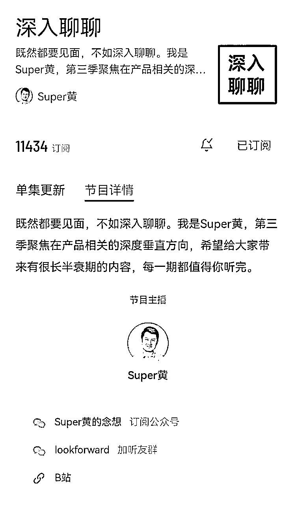

综上所述，我们视频内容全网分发的时候，其实本质目的也是希望覆盖到更多用户，以及东方不亮西方亮。

照此推理，播客渠道（小宇宙、喜马拉雅、苹果 Podcast、网易云音乐、QQ 音乐）等渠道，也是完全可以覆盖的。

并且很多渠道可以用 RSS 方式（相当于你播客节目在网络上的家）直接做自动同步，非常方便，也不需要你不同平台都重复上传内容。

所谓 RSS，相当于多平台同步，把内容上传到一个地方，就能一键同步到多个播客平台。

这里以 喜马拉雅提供播客托管服务 为例，向大家展示什么是 RSS。

点击「新建申请」，一般 1-3 个工作日完成审核，审核通过后，可以回到这一页面选择「查看申请」

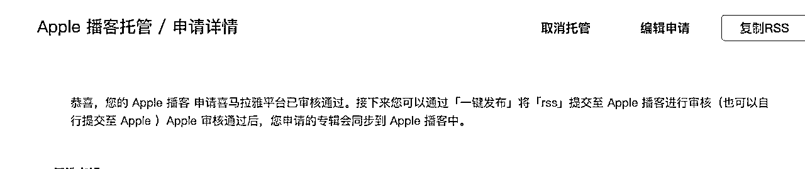

就可以复制【RSS】，到苹果，小宇宙 App，网易云音乐来提交 RSS，之后在这些平台就可以搜索到你的播客节目了。

小宇宙的管理后台可以直接申请多平台同步：

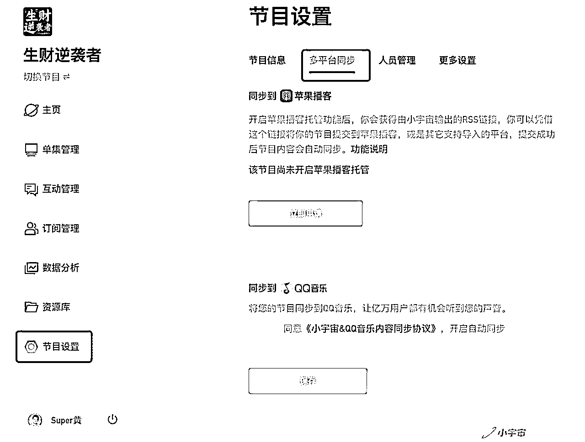

### 4.4.2 播客的剪辑方法

播客的剪辑比起视频会更加方便，推荐使用喜马拉雅在线剪辑工具进行快速剪辑：

https://www.ximalaya.com/audioedit/以下流程快速剪辑熟练后可以在 1 小时内完成！

第一步：上传音频文件

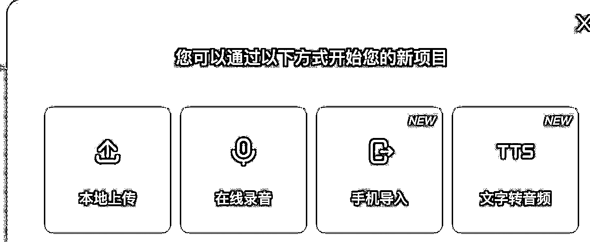

第二步：将上传的音频添加至音轨

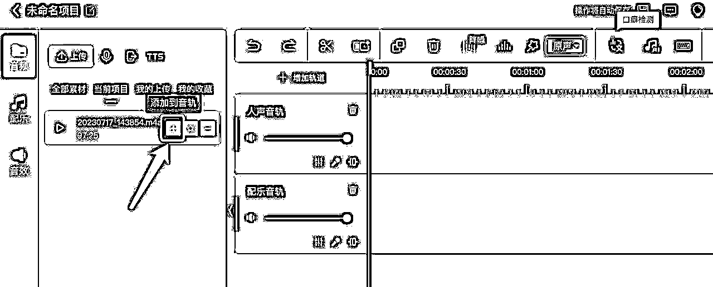

第三步：根据识别出来的文字对音轨进行分割和删除

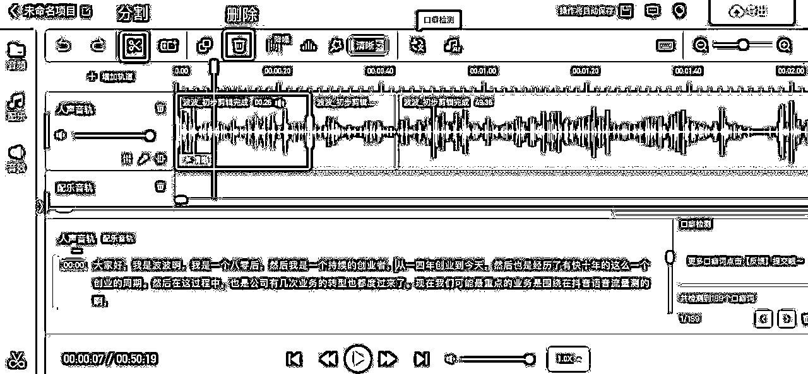

因为喜马拉雅会自动对音频转文字，所以可以很快的找到需要删除的时间节点，对应的我们可以在音轨上做分割和删除处理。

第四步：添加配乐

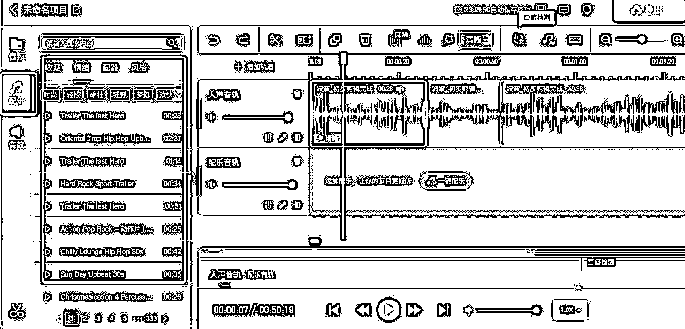

如果有需要，可以选择你需要的配乐。将鼠标移至音乐上，鼠标左键按住拖到配乐音轨上即可。

也可以用分割和删除来保留需要配乐的片段，配乐音轨文字下方的音量调节，可以调节配乐的音量。

第五步：导出

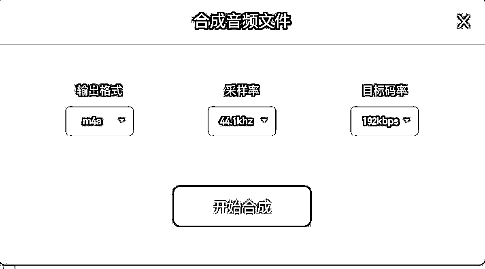

点击右上角“导出”按钮，会弹出上图，默认选项即可，点击“开始合成”

合成完毕后即可下载剪辑完的音频文件。

# 五、注意事项

从前期的采访准备到正式采访，再到视频剪辑、内容运营，还有诸多细节需要注意：

1.

最重要的是要做好检查清单，包括去往录制现场前的设备检查，以及录制开始前的检查，避免浪费时间精力的情况。基本每个做访谈的人都出现过低级事故，使用检查清单能有效避免问题的出现。

2.

因为在密闭环境，女性嘉宾可能需要注意人身安全，必要的保护措施还是要做一些准备的。

a.

可以提前了解下受访嘉宾的声誉

b.

尽量选择公共区域，避免去酒店、私人办公室等地方

c.

采访过程中保持礼貌，不要给任何暧昧或误导的信号

d.如果嘉宾有一些非法举动，立即制止并且表明自己的立场

e.

保持一定距离，不要被对方触碰

f.

遇到危险，立即离开现场，并且报警

3.

视频的剪辑，有几个工具可以考虑付费，价格不贵但能大幅提高工作效率，比如稿定设计，剪映，避免到时候工作效率受到影响。

视频发布前，一定要经过嘉宾的确认。作者曾经出现过一次视频发布后数据不错，但嘉宾反馈不能放所在公司的 logo，导致视频不得不下线。

5.不建议在公域直接放群聊二维码。会有很多广告商使用爬虫的方式批量加群，并且潜伏一段时间后再发广告，防不胜防。并且群聊二维码也会带来“虚假繁荣”，群聊人数很多但却是死群，逐一添加好友，沟通后再拉群比较合理。

# 六、圈友案例

💡

章节概要

头部的商业访谈节目，或许还是有些遥远。在本章中，我们也将分享一些圈友正在做的商业访谈节目，展示不同领域、不同定位的圈友，是如何通过商业访谈探索商机、传递价值以及启发他人的。

Super 黄通过《生财逆袭者》节目深度连接生财圈大 V，揭秘其背后不为人知的故事；亮哥致力于通过访谈挖掘项目红利，助力创业者放大机会；京城风四娘的目标是访谈 100 个母婴博主，传递她们的真实状态与商业模式。

以上，希望能给大家一些具体的想象空间。

案例一：生财逆袭者👤圈友：super 黄

✅希望通过做一档《生财逆袭者》的访谈节目，深度挖掘生财圈里拿到结果的大 V，和大 V 们产生深度连接和学习的方式，同时让更广大的 C 端用户看到他们。

✅他的访谈节目开始到现在，已经挖掘了不少生财圈里优秀人物，让大家看到每一位圈友成功背后的辛酸历程。

👉粥左罗：如何通过写作实现财务自由的？🔗链接：https://t.zsxq.com/11tK7HpMV

👉宋大范：负债百万得贵人相助，一年赚回 4000 万🔗链接：https://t.zsxq.com/11U1IxDUT

👉王子冯：万人微商团队长，如何做好私域运营

🔗链接：https://t.zsxq.com/11KjKF6rx

👉AYL 波波：投资孵化 20+项目，回首过往创业经历

🔗链接：https://t.zsxq.com/11Vt5OwtM

案例二：亮哥生财圈

👤圈友：亮哥

✅抖音 360 行创业项目挖掘者，通过挖掘优质的项目和高质量的创业者，让更多人看见项目的红利期，为创业者提供了很多的选择机会。

👉史明帅：中式轻食开创者，一年流水 300 万

🔗链接：https://t.zsxq.com/11Hdvq8wd

👉Lemon：3 年时间打造年入百万的副业系统

🔗链接：https://t.zsxq.com/11h7IdT1L

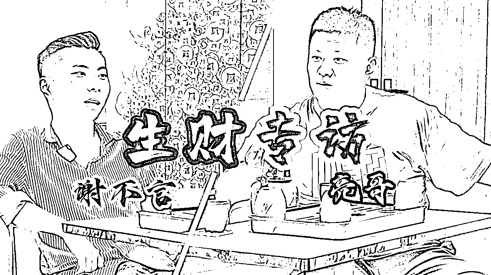

👉谢不言：做小红书电商一个月能赚好几万

🔗链接：https://t.zsxq.com/11JzSOAkb

案例三：100 个优质母婴博主的访谈系列👤圈友：京城风四娘

✅定位鲜明，主攻母婴赛道，正在做 100 个优质母婴博主的访谈系列，帮助到更多人了解母婴群体的真实状态，也从中学到很多做 IP、做博主的知识。

👉碧小仙 er：百万母婴博主，年收入 7 位数

🔗链接：https://t.zsxq.com/11e9xH8Wl

👉梓淋：近百万粉母婴博主，100W 内努力都能赚到

🔗链接：https://t.zsxq.com/115HNsl7W

👉儿科黄伊森：连续 100 场直播打通商业闭环变现 4W

🔗链接：https://t.zsxq.com/11ZzjiB1y

