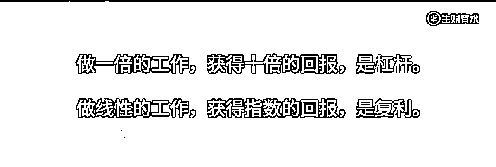
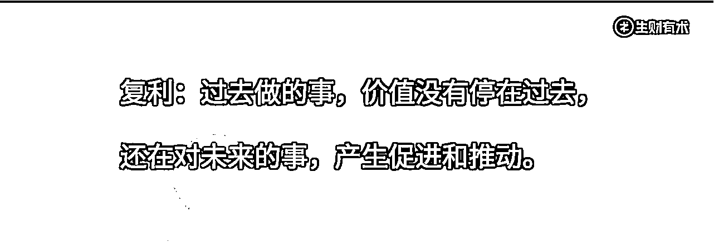

# 2.1 杠杆复利

为什么社群获得强大的变现能力，是成立的？在探讨社群产生价值的逻辑时，我认为绕不开的两个关键词：杠杆和复利。

这两个关键词，关系到未来你亲自设计社群时，模式是四两拨千斤，还是会变成千斤拨四两。因此，值得细讲讲！

做一倍的工作，获得十倍的回报，是杠杆。

做线性的工作，获得指数的回报，是复利。

有杠杆的事和有复利的事，都让我们获得了投入的倍率。

而且，这两种有价值的事，在社群的模式下，都能获得。这两者，正是我这一节的关键词。

*

社群的第一个价值是它的杠杆。在两个方面体现：时间、信任。

•一方面，社群是时间的杠杆。

这条结论是这么理解的：你只需要花和一个人说话的时间，就能把你想要表达的内容和所有在群里的人都看到。

举个例子，在古代的村落里，信息传播速度最快的地方是哪里？是井边和大树下。道理何在？因为这是原始的村落里，两个客观存在着的、且人类最容易聚集的场所。井边的洗衣劳动，锁住了她们的双手，但并恰好不会占据她们的注意力和表达。

没有电灯光（古代）、没有日照光又睡不着的夜晚，尤其是盛夏，模糊了人们表情的树下，则是大伙一块同步今日见闻的最好的会议室。不得不对话的场景被制造了出来，于是，他们可以在这里进行高频的、点对面的对话。

好的社群也像这样的场景一样，是人们得以点对面对话的所在。媒体适合点对面地发布信号，而社群则适合点对面地对话，再适合不过了。

能点对面地沟通，不正是杠杆么！

•另一方面，社群其实是信任的杠杆。

拿微信群举例：你在 500 人面前树立可信赖的形象（包括你的专业性、价值观、你的品格），和在一个人面前树立，其实付出的成本是类似的。

但是我们就可以看到，如果你有同样的成本，在社群里面你触达到的是 500 人，他们对你的印象和概念都是鲜活的。这些积累下来的印象，在未来的合作里面，能不能帮助你消弱掉难以逾越的信任成本？我想是可以的。

尤其是你接下来将会读到和理解到，积累信任的这件事情，本身就是在赚钱。你就会看重这里的 500 倍杠杆到底意味着什么。为什么说 500 倍杠杆？因为在我们举的例子中，一个微信社群的上限就是 500 人。

那么，大胆一些，如果你的社群是五万人、五十万人呢？这些信任，会是怎样的力量呢？先按下不表。

便于让我们接着讲第二个关键词：复利

*

我是这样理解复利的：过去做的事，价值没有停在过去，还在对未来的事，产生促进和推动。

为了解释这样的复利是如何在社群中发生的，我将举一个微信购物群来说明。

想象这样的一个场景：你做了一些群，01 号、02 号、03 号等等，加起来一共装了几千人。你作为一个牛 X 的买手、会选品，搞到了物美价廉的品，也打通了这些品的供应商。

由于你在推荐商品上面特别的克制，你的品控又做得特别好，你逐步积累下来了每个人群的人，以及她们对你的信赖，她们的信赖很简单。不需要信赖你所有的事，我们不需要如此贪心。我们仅仅需要用户在两个维度上、两件事上，相信你。

第一件事情，如果东西是需要的，只要她们跟着你买，就不会出错。

第二个事情是，只要她买了，她获得的价格一定就会比她付出的成本要低。用户购买一个商品。她付出的成本不仅仅是她付出的价格。还有她甄选和试错的成本。

这两件事，群里只要有一个人信、有一个人晒单，很快就会有第二个、第三个人信。

这种共识建立的过程，比逐个一对一私聊的方式来建立，更高效。而且这种共识（或者说信任）一旦建立，是有惯性的。惯到停不下来。你积累下来的社群用户对你的笃定，你能帮助你，越卖越容易。你第一次卖货跟第 10 次卖跟 100 次卖货甩货的效率一定是不一样的。

在用户她的心智中，这个群卖给她的东西，到底是让她更好地生活还是想办法赚她的钱？问问自己这个问题，这个问题决定了这个群做变现的未来，是越来越轻松还是越来越艰难。

越来越轻松，并不是说你的效率越来越高了，而是说，社群的复利在帮助你做事。

复利在社群中发挥能量的场景，并不止购物时相信什么这样的一处。之后设计和经营社群时，不妨问问自己，我的社群有复利、有杠杆吗？它有机会成为一个为你创造启发的问题。

