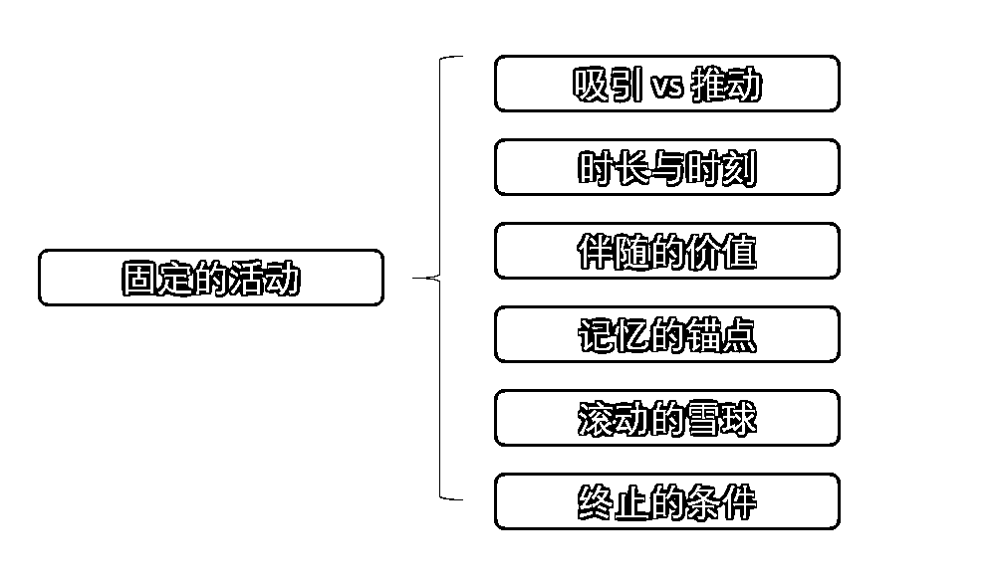
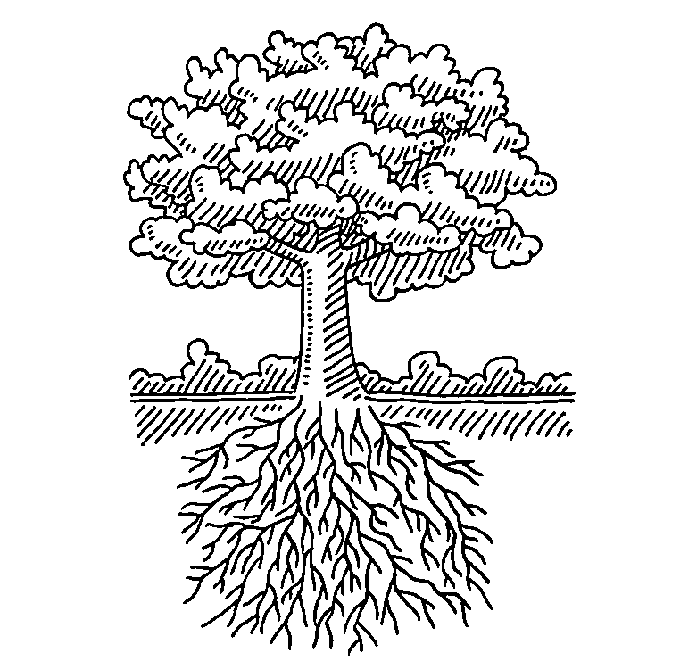

# 3.3.4 固定的活动

固定的活动，我为这个要素，做了一个简单的思维导图：

这里，咱们逐个讲讲。

① 吸引 vs 推动

其实社群里的活动，很多时候是发起人和几个核心的成员，想办法去设计出来的。但是设计出来以后，一推不响（无人响应、大家无感）是常态。原因往往特别简单：大概率是你是在推它。或者说，不推不动的活动，都是推不动的活动。

在设计活动的最初就应该知道的是：活动，是你用来吸引用户、激发用户的，而不是去给用户布置作业的、不是推销给用户来完成的。

只有这样，你对整个活动的节奏和整个活动的需求、还有整个活动供应的价值，包括它的吸引点，包括它的引诱点，你都会设计得比以前要好很多。

这个事情跟追女孩子比较像。你死缠烂打可能不是很有用，但是如果你可以吸引到女孩子就很厉害了，对不对？

那么，设计的活动，如何去吸引用户？

你必须学着换位思考，学着把“感受活动在用户眼中的样子”，变成你的本能、变成你的思维习惯，你才会找得到感觉，知道如何去吸引你的用户。

② 时长与时刻

在设计活动时，我们往往需要思考两个设计活动的重要工具：时长、时刻。

我们希望，固定的活动，它的时间点是经过考虑的，这个叫时刻。它时间的长度也是经过考虑的，叫时长。

一般来说，我们不建议错误的时间点里面做活动，也不建议错用错误的时间长度来做活动。

举个例子：一个线上活动，可能需要大家花费半天的时间，活动每周举行两次。这样的一个活动，甚至都不用仔细去想活动的细节，就会发现很明显就是反人性的，哪怕第一天没夭折，你敢期待它未来长期的参与率吗？

另外，不要在工作日的下午在群里做活动。到了周末，也记得让大家好好去放松，尽量也不要安排线上的活动。线下活动，周末非常方便，但是线上的活动，还是需要考虑一下是否值得大家牺牲周末时间的。

经验来讲，大多数用户参与活动的规律是这样的：比较黄金的时间点大概是周二、周三、周四的晚上，周末反而不高。

当然，我又要说一个事情，就是万事有反例，但核心的逻辑不变。同样的逻辑，可能反常的安排，也是合理的。

下面，我以举办行业峰会为例，向大家介绍，在思考和考虑峰会是安排在周末还是周内，可能经历了哪些考较？

先放结论，大部分是安排在周内办的。

那么，为什么线下的行业峰会，不放在周末而通常放在周内来做？

因为，一来，参会用户，他们周内参与他们自己所在行业的会议，是具有正当性的、完全可以去参加的。如果周末去参加，可能就属于他自己的事情了（不带薪）。

另外一点，在行业内如果你周内说你去做什么事情，你很容易跟同事说起来的，这样整个业务组可能一起就过去了。而且，事情如果是反过来发生。业务负责人带着核心员工去参加会议。难度不是工作的一种吗？更应该放在工作日。放在周末，大家光是一听到，积极性先都没了。还未入场，好感先减三分。

而且，作为会议主办方，把会议办在周内，还可以拒绝掉一些跟行业无关的人。

为什么？因为周末大家都比较闲，但如果说是周内，行业无关的人很难去请假，给领导一个理由他去参加一个跟他行业没有关系的事情。这个理由不正当，假请不出来，就不请了。所以，周内开这种会议也可以把一些是你定位之外的人群去给剥离开来，这个也是择时有所考虑时，显示出来的一个利好。

③ 伴随的价值

这个非常好理解，就是一个活动，哪怕是再小，它也有一个伴随的价值。

咱们小时候都有守着看电视的习惯，知道每周五一定会有个什么，或者是每天晚上九点半后有什么。甚至不管好看不好看，到那个时刻了，大家想起来，都会来看一眼。

你知道每个周期（比方说每个月、每个季节、每年）的一个事儿所在的时间点，又有做这个事儿的合理性，那么，这个事儿，它就会产生一个伴随价值。

大家一想到活动，往往会喜欢贪大，想“我要搞一个大事情、大动作”。但大活动经常搞，谁也经不住。活动不大，每周一共只占用半小时到一小时，但是周周都有，可能是更适宜的。

甚至我们来说，这样的一个伴随价值，它每天哪怕有 1 分钟到 5 分钟，准点发生，就会产生它的期待。

我给你们举一个例子，罗振宇，他在公众号每天早晨会死磕自己来个 60 秒。对这样的一个事情，时间长就非常短。但是从长远（十周年）来看，伴随的价值是非常鲜明的。

④ 记忆的锚点

固定的活动，再小都不用怕，小比没有强一百倍。大小并非最重要的，另一件事更重要：用户获得比用户投入高。

不少社群的创建者，他们来做活动，会总想憋个大招。其实完全没有必要，这样反而去局限了自己，说我们应该找一个怎么样的大事情来做。一两次后就想不出来了，反而把自己逼到死胡同里了。

持续地做小事，反而更简单。只需要保障「用户的获得比用户的投入高」，这样的小事，就永远了长期运转下去的力量。

固定的活动还有另一个好处。它能在用户的认知里创建一个记忆的锚点。这能让用户条件反射式地记住你的社群。很多社群玩着玩着就死了，因为群无特别之处，大家对群也没有任何独特的认知。但如果一个社群有固定的活动，在发生有意义的小事，这个群至少无论死活，是被人记住的。

记忆的锚点，我再给大家举两个例子：

1\. 一个是十点读书，这个名字其实包含了一个非常确定性的时刻，对非常容易养成的用户习惯，我们 22:00 点钟有事情要做。

2\. 另外一个就可能是罗振宇，坚持了 10 周年，每天早晨 6 点必发一个 60s 的语音。用户甚至会不定期好奇去看看他是不是还在坚持？这样，就记住了他，也记住了时间赋予他的力量。

⑤ 滚动的雪球

而固定的活动，其实也是一个滚动的雪球。

你可以将它想象为社群内部的一个一直在旋转的齿轮。它有它的周期，每周运转一次，或者每天运转一次，或每个月运转一次。只要它在运转，就可以源源不断地为社群带来新的事件、新的社交契机、新的价值。

因为活动一旦运转起来，就会有人参与。每个人的参与都会留下他自己的贡献、获得他的体验，还有他的记忆。这些，都是很有价值的。对社群这样的共同体来说，稳定的活动，它会像一个雪球一样，将整个社群的共同记忆越滚越大。这也是一个非常厉害的，有复利的点。

这种滚动，还能起到另外一种作用：它可以帮助你把真正的铁杆粉丝去筛选出来，也可以帮助你的社群给用户留下更多的记忆。无论是在两个中的哪一点，这个过程其实都是在让树生根的一个过程。

我们很难想象，没有扎根的大树，如何在各种风雨动荡中挺立身姿。

而如果把整个社群的成员和外部潜在的目标用户，当做土壤。那么，社群里有局部影响力的铁杆粉丝，就是你的整棵大树的树根。因为是他们在抓牢土壤，他们在更方便地帮助整个社群把人们聚集起来，而不是你自己独自完成这一切。

所以大家也可以看得到大规模的社群，它会分一些小组长，或者是行业里不同方向的高手。特别大的社群，它会有各个城市的分舵，每个舵都会有一个小舵主。

⑥ 终止的条件

哪怕固定的活动，有诸多的好处。也有一点，是需要提醒诸位的。创建这个活动时，记得一并想一想它终止的条件。

事情的发展，是充满意外的。而创建一个固定的活动，不等于永远去背负它。所以，最好最初就给出它结束的条件是什么。

这和「丑话说在前面」的道理是一样的。当事情的价值增量不达预期，或者开始起变化时，给自己一个机会，让自己合理地停下来，是重要的。

