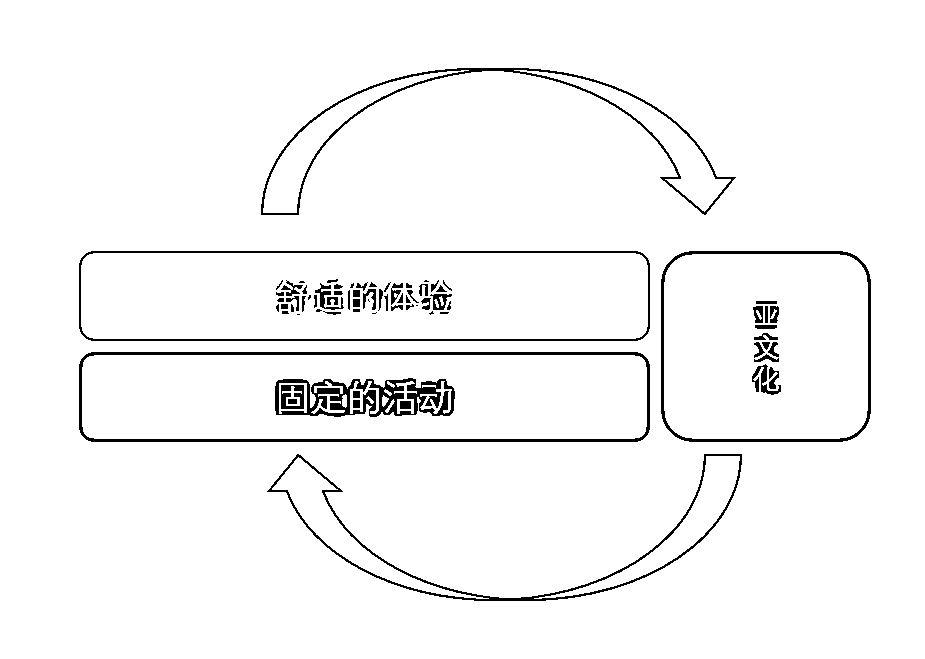

# 3.3.5 亚文化

框架边角的亚文化，是什么，价值何在呢？

这一节，来讲这个话题。

亚文化，这个概念不直观，我来举一些实例。

比如，弹幕之于哔哩哔哩。弹幕在国内，是 Bilibili 的首创。其他平台的也放弹幕，但最有弹幕文化的，依旧是哔哩哔哩。这种一个平台的特色行为、特点功能，容易形成该平台的文化。比如 “空降”、“前方高能” 这样的梗，都是衍生于弹幕这样的功能之上的。

再比如表情包。你知道吗，颜文字表情 →_→ 之于「最右」App。这样的一个颜文字，居然可以催生出一个叫最右的段子 APP。而数字 233333 为何表示大笑，则是从猫扑社区走出来的一个文化符号。猫扑论坛的论坛留言功能，可以输入表情包编号，直接在回帖中显示表情包。而第 233 号表情包，就是大笑并捶地。当年所有在其他地方看见 233333 并好奇且费解的人，都会被这样的一个符号引流，带回到猫扑社区里。

再说到 Bilibili，它是真懂自己的亚文化（社区文化）的，Bilibili 用自己的社区热梗持续不断地做官方表情包并实时更新出来。它是我见过唯一这么做的平台。

再比如说梗，好的社群，一定出梗。梗就是社群的共同语言。梗也能帮助社群成员在另一个场合相互识别出对方来。刚刚 B 站的例子，就是巧妙结合了梗和表情包两大亚文化杀器的。

一个充满了自己的亚文化，与主流文化迥异的社群，一定是生机勃勃的。而亚文化的出现与壮大，也意味着一个社群的共同体的出现与壮大。由亚文化所形成的共同话语体系，也天然地在团结这个共同体，在塑造群体里的亲近感与认同感。

远在他乡时听到乡音莫名升起了信任的人，一定明白共同话语体系的力量。你不免问，共同话语体系如此有力，它从哪里来？

为了回答这个问题，我做了一张图。

之所以亚文化的位置，和固定的活动、舒适的体验一起，正是因为，它们是相伴相生的关系。在全图上，亚文化立在正反馈之上，也说明，它同样是以正反馈为基础的。

答案显而易见，从固定的活动和舒适的体验里，诞生了共同的经历、共同的记忆，逐步一小块一小块地形成绰号、共识、段子、表情包、梗。而这些，都是文化的符号。

脱口秀演员李诞经常说 “不提倡在脱口秀大会说内部梗”，就是因为脱口秀演员本身，不可避免地形成了一个共同体。这个共同体里的梗，被认可度超级高，而且共同体之外的人是理解不了的。如果内部梗过多，共同体会面临难以破圈的难题。所以，看节目看到这里，我会心一笑，“李诞果然是懂群体、圈子和话语体系的。”

有关亚文化，我想说的最后一个结论是，亚文化有能力反哺社群、凝结共识，但亚文化至于社群来说，是加分项，而非决定项。

