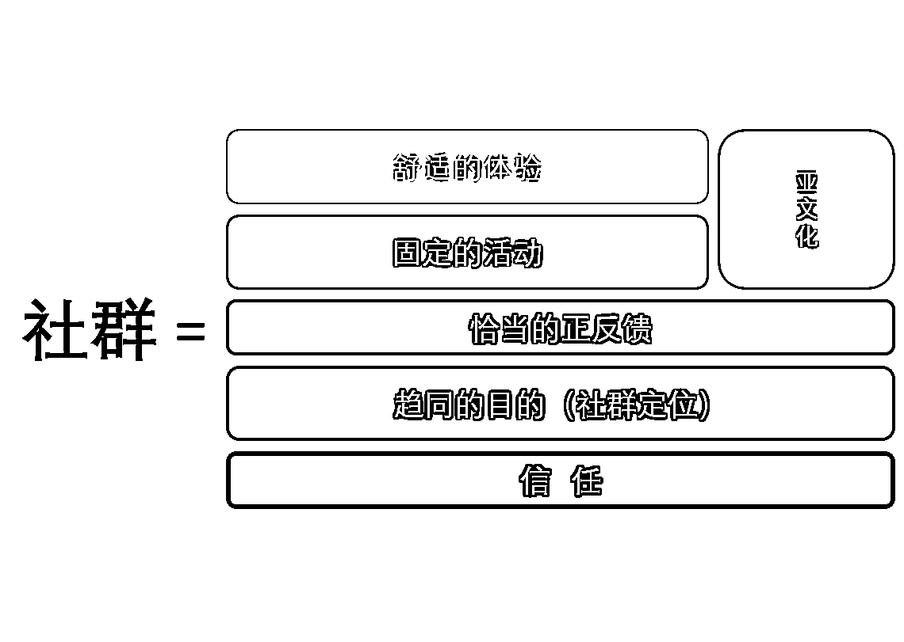

# 3.4 创建社群

于是，在我的视角下，创建社群并没有「一定之法」。但大体上的顺序，最好不要逆着社群要素的依赖关系来。

经典的误区，是社群从零开始，上来啥也没有，只是人到齐了，到齐后各有意见，于是社群的创建者先想到的是逐个倾听、逐个安抚搞定。社群的创建者，照顾社群每个人的体验。这样往下走，却发现社群越往下走，问题越多。根本的价值归依点没有找到，光是给体验，是解决不了问题的。

2016 年各个公司纷纷下场做 APP 的时代，最大的教训就是初出茅庐的小团队们，光解决界面的流畅度问题、体验问题，不解决真正有价值的问题。最后程序员、业务组、投资人一块抱团团灭。

经历过那时候的用户，估计还能记得一批很美好、体验很不错，但就是不知道能拿来干啥用的产品。

从体验切入（社群框架的顶部）而不从社群的地基切入，就是典型的创建社群的误区了。

那么，能不能基于这个框架，大致给一种创建社群的流程上的参考呢？

我想，是可以的。只是在阅读这种参考之前，我希望大家能明白，参考只是参考，并非固定不变的 SOP，不要反而被这种参考锁住了手脚。

Q：如果我来做技能成长型社群，哪怕是我不会的技能，我会怎么起步，如何一步一步做呢？

A:

① 首先，我不会先着急建群。

我想先去看，在没有我的社群时，希望学习这些技能的人都散落在什么地方。我要扎入这个群体之中去培养自己的兴趣，理解这个群体的兴趣。

我会尽可能地列出大家在提问或讨论这种技能时用到的专有名词，无论这种名词是一个按钮的名字、一个错误提示的文案、一种学习这个技能的软件的名字、一个此领域的 KOL 还是这种技能里的分支概念。

我会在一切有搜索框的网站和社交 APP 里搜索我找到的专有名词（或者称为指纹名词、标识符）。看看大家在什么情况下说这些话，为什么说，是想讨论什么，是哪里遇到了困难。如果我搜索朋友圈，发现我有不联系的好友常常聊起这个技能，我会单独和他聊天、约电话，了解这个群体从 0 到 1 的路径是如何走过的。

我会尽可能地关注在这一技能方向上做内容创作的人或商品，最好是通过有推荐系统的平台。这样，我关注的足够多以后，推荐系统会源源不断地给我推荐相关的内容创作者或相关的商品。在今天，我会选视频号、抖音、Bilibili、快手、淘宝、小红书。

直到我开始明白，一个技能的新人，踏进这个技能领域，容易踩哪些坑、容易犯哪些错、最经常冒出哪些疑问，怎么才能真正入门，哪些书是这个技能的好书，哪些文章是这个技能的好文章，哪些人是这一行里得到推崇的高手。

直到我掌握清楚，这个行业里重要的事在哪里发生、新闻在哪里发生、机会在哪里发生？

直到我如果接触到一个新人，和他在线上聊天或线下喝咖啡，他惊讶我为什么如此懂他？他会觉得我怎么和他有这么多的共同经历？

如果我做不到这一点，我会亲自扎进去当一个小白，从零学这个技能。我会带着两种视角去学。一种是该怎样就怎样的白纸状态。另一种是退一步、高一尺的俯视视角，关注自己卡在哪里、困惑哪里、如何找到突破。我会为两种视角都做笔记，这样，我将更懂我的用户。

由于以上的事情，我如此投入地去做，在这个过程中， 我认识了 100-200 左右的潜在种子用户，也是合理的。

② 接着，我会想定义一件对刚入行的新人，有意义的小事。

这件事是需要探索的，但我没有那么着急。

或者是为这个行业建一个导航站，并拿这个站寻找愿意一起维护它的人。或者是我不停地拿重要的行业情报去请教高手，并把他们的观点整理消化、输出成文章。或者是我去逐字逐句地翻译（汉化）这行里非常重要但还没有被翻译成中文的资料，免费地放在网上，一章一章地公开。或者是雷打不动地每周想出一个练习技能的案例，为这个案例找愿意练手的人，为练手的人找愿意点评作业的人，为点评作业的人众筹练习的人的红包作为感谢。等等。

有意义的小事是具有召回力，而且能精准筛选出目标用户的事。它很难找，但我会多想一想。

不过如果我建站，我会先用飞书导航去建站，而不是写代码、搭网站、注册域名、申请 ICP 备案。敏捷地验证比章法更重要。

如果我逐字逐句地汉化重要资料，我会先用 ChatGPT 和 Google 翻译帮助我，而不是自己哼哧哼哧逐词查过去，懂得借力很重要。

③ 然后，我会带着我找到的这件小事，和我的目标用户聊。聊他的兴趣，聊他听到这件事的好奇心，聊他的参与意愿。以打量这件事本身的吸引力。

④ 我也会从我的种子用户做起，内测群。

能用微信群做的，先用微信群做。测试固定的活动，是否每多做一次，社群的凝结力会更强了。我会和种子用户讨论参与这件事的成本，讨论从这件事里获得的体验、反馈和成就，讨论如果这样的一件事需要付费才能运转下去，他们愿意付出怎样的成本。

我也会观察，有没有人私聊我，告诉我他准备邀请什么样的人加入这件事。

我会着手整理一个零基础的技能新人，晋级的路线图应该是什么样，知识图谱应该是什么样，检查清单应该是什么样。每个月应该学习什么，练习什么。并测试它的反响。

如果我的内测群，一切运转良好。它慢以凝核，它积累了信任，它的所指是清晰不混乱的，我会试着扩大一步。我将先从一部分我自己的影响力覆盖所在，为它招募成员。并继续保持观察。

⑤ 再之后，如果这样也没问题。我会尝试为这件事构建增长的渠道（我将使用的方法，会在 4.3.2 节详细介绍），并衡量哪条渠道效果好，尝试着去维护它、强化它和深化它。

同时，我会开始正式地筹备加入社群该知道的事的物料，像小册子一样，让每一个人都知道加入社群后最值得做的事是什么，哪里找得到社群的知识沉淀。

⑥ 我会直接为社群起一个好名字，为社群定价，宣布内测结束，开始收费。在价格上，我会效仿亦仁做一些涨价策略，创造一些紧迫感。

⑦ 我的朋友圈会不编撰地分享我社群里发生的故事。谁拿到了什么成果。谁付出了什么代价。我因为社群里的发生的事，有了哪些新的思考。

我会讲社群里高手的故事、新手的故事、特别的故事。如果故事不多，说明我和社群成员一起做事情还不够久、不够近。

我的公众号也会这样做。如果我会拍短视频的话，这也会是其中的内容。我会鼓励社群里的其他成员也这样做。将社群里的事，当做生活的一部分。

如果我没想明白可以给社群里做贡献的人什么回报，我会先发红包。

⑧ 我会找到一件社群里的成员只要想参与就可以参与进来的事。

比如和社群成员共创一本在线的《技能入门实战手册》。我们探讨和梳理重要的问题，邀约社群里有能力完成它的人一起来完成。对某一节有独立贡献的人，我会写到第一页，写他的名字，写进共同的作者里。对细节处有推敲贡献的人，我也一并在手册末尾感谢。

哪怕没有手册，我也希望社群里大家的认知、知识，有所沉淀，不致消散。

这本手册有雏形，路线没问题，我就会带着这个手册去交朋友。我会告诉别人，这里发生了一件这样的事。一伙人在共创一份手册。如果这份手册可以放在小报童上做付费阅读，我会和手册的作者一块分享这里的收益。

我会思考社群如何帮助一个敢于实践的新人从零到一，如何从授课型的社群转向前期授课后期陪伴型的社群，我希望社群收到的不是课程的钱，而是身处其中不愿离开的钱。这两者不同，因为社群是一个共同体。

这样的社群，算是走上了轨道。这之后，我会不停地思考社群的原点、社群的增长、社群的价值、社群当下最重要的事是什么、有没有在做对的事。我也会一直思考，如何更好地传递社群的价值观、凝结共识、激励付出、修剪枝叶。

我想我说清楚了创建一个社群，想办法使之结实、成立的路上，大概发生了什么。同时我也说清楚创建一个社群，和做一份社群运营的工作的区别。

但读到这里的你，我希望你没有忘记，以上只是一种参考，而不是标准的做法。它大致反映了创建社群的面貌，希望对你有裨益。

