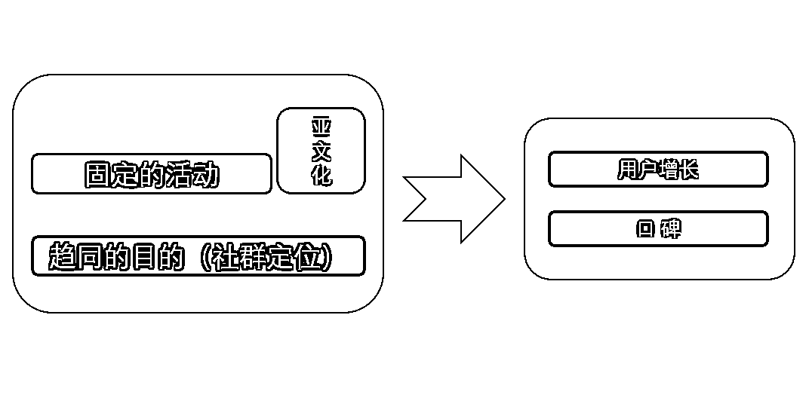

# 4.5 增长与自增长

理想的社群增长路径，一定是先主动后被动的。

这里的主动指的是什么？

这里的主动增长，指的是社群创建人自己的人肉推广，包括你人肉去自己给自己写内容，包括你自己给自己投广告。包括你自己去拉人进来，这些都是主动的。

被动增长的核心秘密在于复利，在于你自己留下来的内容、或是机制、或是口碑，它不需要你个人再为它的传播付出等量的努力，它自己出去带路、把人给你带回来。

形成这样的局面，才是我定义的被动增长。

健康的增长模式，或者是理想的增长模式，一定是一开始是主动为主，后来慢慢让渡到被动增长为主。

或者我们这么说，如果想做长期的万人付费社群但无法解决被动增长问题，相当于业务模式选了 Hard 模式，但是如果能有意地锻炼和触发被动增长模式的出现，则相当于选择了 Easy 模式。

那么，如何创造被动增长的局面呢？

我认为有必要学些方法了。这些方法，如果用关键词列出来，就是口碑、内容、问题、软件、机制、（品牌）。

P.S. 其中的品牌，实话说，我不懂，没有实操过。这里，只是列出来备忘而已。

它们将如何有效？

我们逐个简要地聊一聊。

