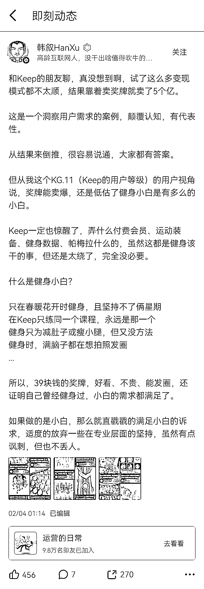

# 4.5.1 口碑

众口铄金四个字，其实是一条被动增长的秘诀。

大家觉得小米有情怀，将硬件的毛利控制在 5% 以下，呼喊为发烧而生。大家不知道的是，小米一开始就不做用户增长，只做口碑。他们早已经想明白 ，口碑的建设，是最好的被动增长。（见小米内部营销手册《参与感》一书）。

真诚，公开地真诚。回应，公开地回应。传播，努力地传播因社群而获益的人而不是传播社群。

这些都是坚持下来，能形成口碑的方法。

建设口碑，也是社群里，经典的难而正确的事之一。

如果你问到，如果我希望从零开始建设口碑，应该关注哪些要素，掌握哪些原则呢？

我会答：

两个要素，一个是群众体验；一个是群众推动群众。

1）群众的体验

在阻碍「体验」酝酿成口碑传播这件事上，容易犯错的地方有，社群本身的名字、社群内活动的名字。

符合下方这些描述的，均不是好名字：

•拿社群的名字做听写。100 个人听到，有一半人写不对的名字，不是好名字。•典型常见的，是让人意想不到的谐音替换字。

•中英混合的，大概率不是好名字。

•如是英语，单词过难的，大概率不是好名字。•在国内做，尽量规避英语单词。

•如是 KFC、ETC 这样的字母缩写型的，字母不要超过 3 个。三个最多了。

•长度超过 5 个汉字的，大概率不是好名字。

•读不顺的，不是好名字。

•朗朗上口又不耽误注册商标的，是好名字。•比如，阿里巴巴（四字三声词）、小鸡叫叫、4399、农夫山泉，好名字。

•看到名字后，难以脑中浮现出画面的，大概率不是好名字。•比如，苹果、小米，就比讯飞好；风向标就比商业线索好。

所以，以上这些描述，可以作为工具和方法，来检验我们起的名字，是不是好名字。

背后的原理不赘述了。体会，重要的是体会。 :D

*

活动的记忆点，高光时刻，也能将丰富的体验浓缩成能传播的要素。

参加同样的活动，不同人的记忆点是不同的。活动的总结和事后传播物料的过程中，让传播的物料本身鲜活、有画面、能讲成一句话或梗，更重要。

在酒桌上，“现在的 00 后一口闷小一斤白酒，分酒器直接吹，不带换气的”，比 “年轻人真能喝” 更好传播。

在微信群里，“他分享完，十几个群友发专属红包，直接刷屏”比“老师的分享干货满满，线上气氛很好”更能传播。

“那时虽然大家都在线上用文字交流，但奇了怪了，能感觉到全场鸦雀无声，所有人都在屏住呼吸等下一条消息冒出来”比“他分享时没有人插话”更能传播。

这些体验，不仅要讲，还要往社群之外讲，还要持续地、有方法地往外讲。

*

而如果群友能在被问及呆在社群的收获时，都能清楚地讲上几句，也是口碑正在酝酿中的绝佳状态。

因为社群的事，会变成他和朋友们喝茶、聚会、饭桌上的谈资，会成为他给别人讲写新东西时的社交货币。

*

而所有的体验中，能激发情绪的体验，最能让人持久地记忆。

概念、信息和知识，都不能让人持久的记忆，并拥有一致的印象，但情绪可以。

2）群众推动群众

•传播的战场

•递子弹

•有激励

如果大家没有特别强的技术技巧，光是想通过人与人的关系的这样的一个方式去增长自己的社群。首先要思考的一个点就是如何让你的群友去发动更多的群友。

如果你的小活动都会或多或少带一点让一个人去发动另外一个人这样的基因，整个活动去推广起来可能会比你自己单独作为一个节点，向不同的多点去覆盖，效果要好很多。

群众发动群众最典型的例子是拼多多，他的推广成本特别低，因为他每推广一个人就可以获得 3 - 4 个人的用户的触达效果。这个也是他设计在基因里的，让群众去发动群众。

例如有些行动类或者成长类的社群，会给用户发一些荣誉的勋章、荣誉的纪念品或者荣誉的称号。

一方面用户自己有成果可以秀出来；

另一方面，如果用户觉得这样的称号或者是你的品牌有价值的时候，他会在未来的自我介绍里面去提及到这部分。其他看到他自我介绍的人会好奇，“诶，这个称号是什么” 或者是 “诶，奖章又是什么” ，这样又会造成一部分社群用户的回流，从社群的角度来看，这也是用户增长了。

再比如一个叫 Keep 的产品，下面这个帖子，也说明了本节的一切。

