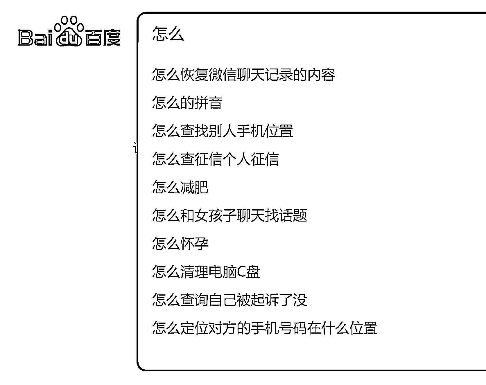
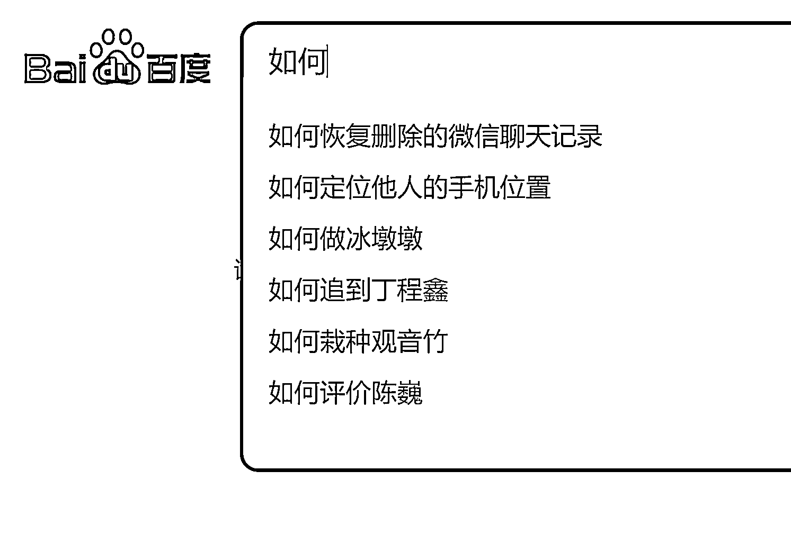
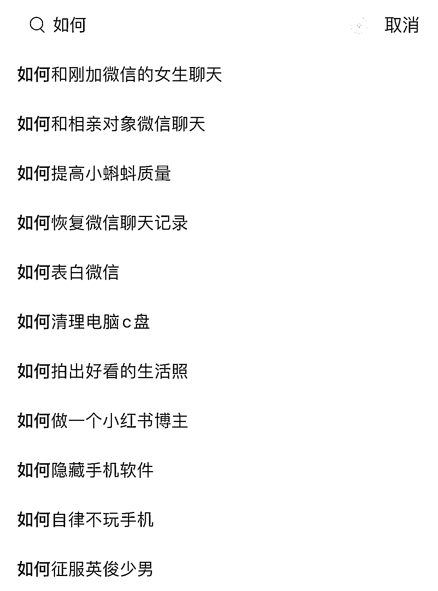
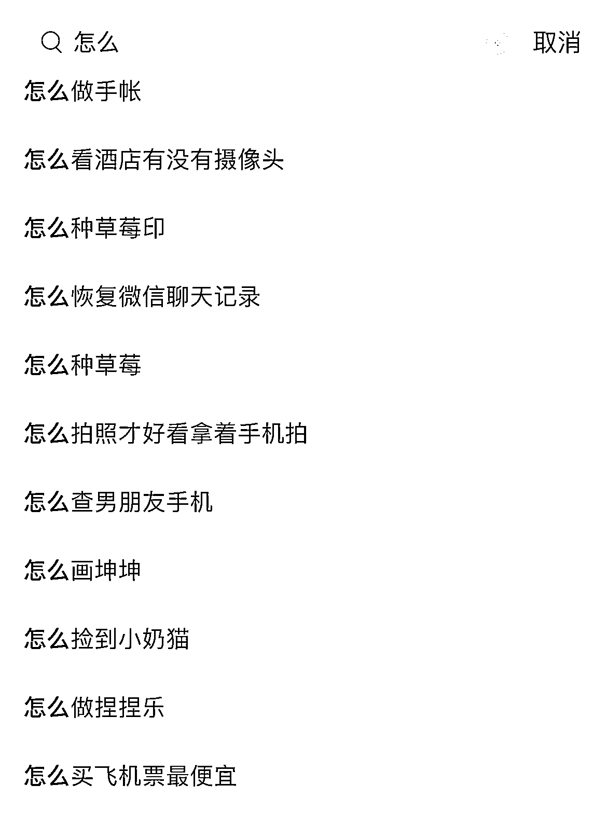

# 4.5.3 问题

「问题」其实可理解为「内容」的子集，但是有它独到的作用。

因为互联网中，被搜索最多且和需求紧密相关的，就是「问题」。

我有一个职业习惯，看到能自动联想的搜索框，我都会去搜搜 “如何”、“怎么” 这样的词，看看会联想出来什么给我。

比如百度（2023 年 2 月 24 日）的联想是：

比如小红书（2023 年 2 月 24 日）的联想是：

这些哪怕不是相关的从业者，定期去搜搜，也会有很有启发。

我们在 4.3.2 节中介绍的建立外部渠道的方法，就是我使用问题这一自增长工具的示范。大家读到这里，可以点回去回顾下。

不过可以说，这种自增长的驱动力根源在于，你一直在回答用户关心的问题。而用户，一直在关心他们记挂的问题。你和用户，内容相遇，一拍即合。

那么，我们找准了问题，要把问题放在哪些平台呢？

好问题。我的解法是拿数据支持。哪些平台养成了用户搜索习惯，且内容的半衰期长，我们就去哪些平台放置问题。

让我来推荐，我会推荐小红书、知乎、微信公众号、抖音和 Bilibili 。它们都是当下（2023 年 2 月 24 日）值得尝试的平台。

而其他小一些的站点如果你想尝试，我也建议两个点：

① 你自己就是你的目标用户，你常逛的地方就是好地方；

② 小站点在百度、微信等，有较高的内容排名权重。

附一个让人意外的小红书的搜索频次的数据情况。

2022 年 2 月 24 日消息。昨日，小红书 COO 柯南透露，平台日均笔记发布量超过 300 万篇，60% 的用户每天都会在小红书高频搜索，日均搜索查询量近 3 亿次，“小红书已经成为了普通人的生活搜索入口”。Ref: [小红书 COO 柯南：平台日均搜索查询量近 3 亿次](http://www.techweb.com.cn/it/2023-02-24/2920797.shtml)

其他平台的搜索，官方也有公开，这里不占篇幅了。

关切问题、关切搜索、关切需求，这三种要素是紧密相连的。

