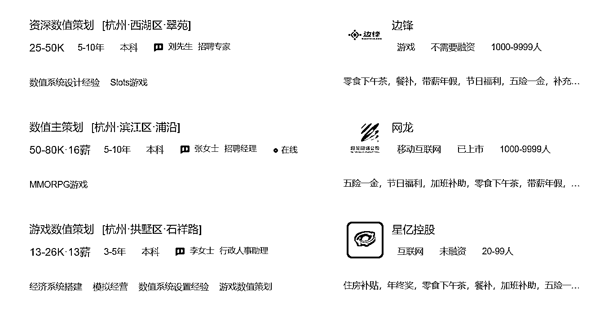

# 4.5.4 软件与机制

1）软件

长期的自增长，尤其是非运营活动驱动的自增长，往往需要软件的配合。

一般下面这些需求旺盛时，就需要寻求软件、SaaS 工具的支持了：

•给加过来的新成员，自动打标签，以统计和区分渠道；

•需要通过推荐海报（二维码）来实现自动化的指引；

•需要 SCRM 系统来为每一位社群成员建立简单的归档，以便于精细化服务；

•需要独立的会员荣誉系统，或者清晰地打卡记录工具。

如果用户活跃或社群自增长的每一步，都需要人来完成其中的环节，那么，这种增长注定不是全天候的。这时，思考如何用软件、SaaS、SCRM、RPA、浏览器插件等让其中的某些环节自动化，就至关重要了。

甚至如今 AIGC 热乎起来之后，未来社群内长期有类似 ChatGPT 来提供服务，也可能是一种趋势。

你在运营社群中，有过哪些用过就离不开的工具，可以在此处评论分享。

2）机制

而机制，则是社群中，更复杂、有难度的命题。虽然机制本身的具体内容，往往是简单的。

机制总是解决社群中动态的问题。好的机制，能支撑起社群的价值观，甚至能不停地巩固社群的价值观。

甚至有时，由机制所反映出的价值观，威力要领先于社群（和一切组织）中所倡导的价值观。

其中，可以猛烈地改造社群面貌的，当数机制中的激励机制。

这里，我决定暂时放下冲动，不从理论的角度来诠释机制，而是试着举一些例子，帮助大家理解。

一些游戏数值策划的招聘需求（2023 年 2 月 25 日）

*

在游戏（可以理解为大型社区）设计领域，游戏的数值经济设计师（有时叫数值策划）就是为游戏中的机制而工作的。

这是一份重要的岗位。他们通过在数值上定义游戏玩家的付出能得到什么，定义稀缺，定义所得到的资源如何消耗，以及不同的消耗和转换之间如何平衡，来保障游戏系统本身的持续运转不崩塌。

没有好的机制保障，一个多人游戏很容易导致类似通货膨胀般的灾难。手里的神级装备突然不值钱了，或者新手达到同样的阶段比当年的老手要快个十倍，都会导致游戏的体验彻底失衡崩塌。

*

而在社群中，通过定义大家在哪里的付出才能获得回报，是能够决定社群的资产基本盘的。或者说，是能够体现社群的创建者是如何理解社群的基本盘的。

社群（组织）所提倡的事物，是否有次序？次序是怎样的？社群（组织）所反对的事物，是否有次序？次序是怎样的？

这一系列的问题，无法以宣传固定下来，只能以机制固定下来。

比如说，长内容和短内容哪个更重要？帮助群友和撮合群友相互认识，哪个更重要？直播分享与文字发帖，哪个更重要？学习和实践哪个更重要？

这些问题，在社群的初期能想清楚最好。在社群的高速成长期里如果想不清楚，对社群来说，一定是某种意义上的灾难。

想清楚的标志，也是通过机制固定下来。

比如说，如果社群里有货币，那么，它将以何凭据产生、为何而支付？回答这样的问题，就是在回答社群的激励机制如何建设。

以及，如果社群中所倡导的努力方向，是没有任何回报的。而另一个不倡导的方向，反而拥有不菲的回报。那么，社群最终的演化价值观，反而是这个不倡导的方向。

那么，社群所不提倡的、禁止的事物，社群为此付出了什么样的努力呢？如果仅仅是说说，当然是无法起到禁止目的的。

比如，付费社群里，哪些行为会让你宁愿全额退费也要把一个成员移除社群，这样的行为，才是真正的社群红线。而并非群公告里所写的禁止的那些。

而定义社群内「什么行为触发移除和退款」，就是在定义社群的一种机制。

宣发上和行动上，保持一种一致，是困难的，但是，是正确的。

*

比如说，在城市和在县城，在契约社会和在熟人社会，所运转的机制是不同的。

不同的机制下，同样的结果，会产生不同的回报。有的制造成果，有的却制造摩擦与冲突。

*

你看，4.5 的篇幅，并不短。读到这里时，你还记得本节的主题是「增长与自增长」吗？

不妨回顾一下这一节的结论。

构建自增长的五种有力的方法是：口碑、内容、问题、软件与机制。

:D

