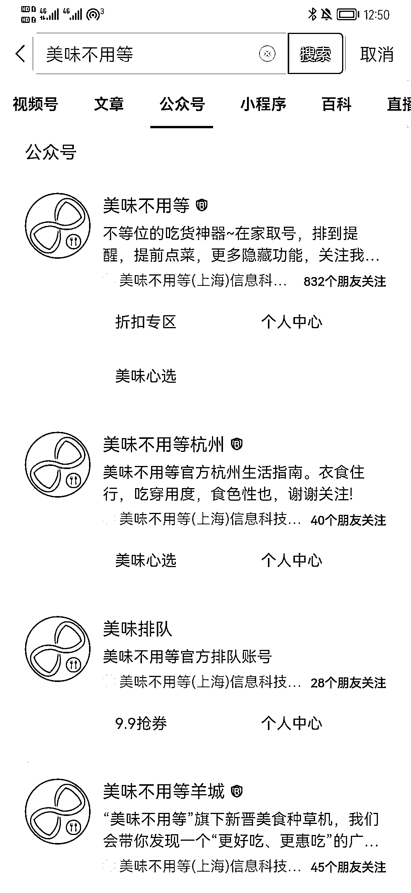
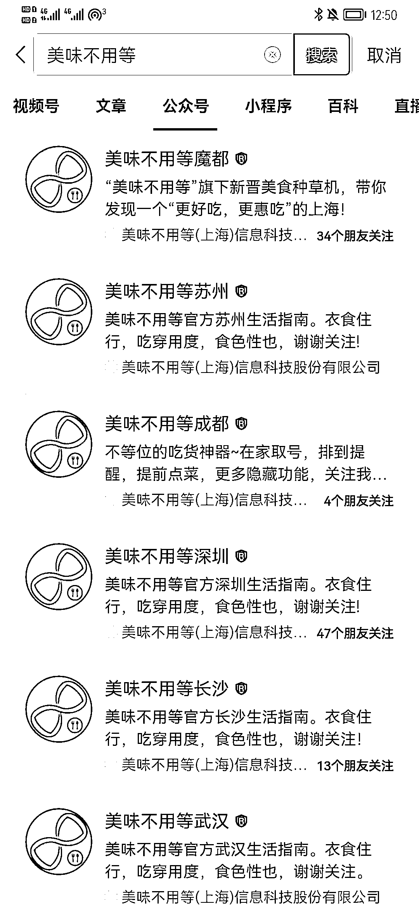
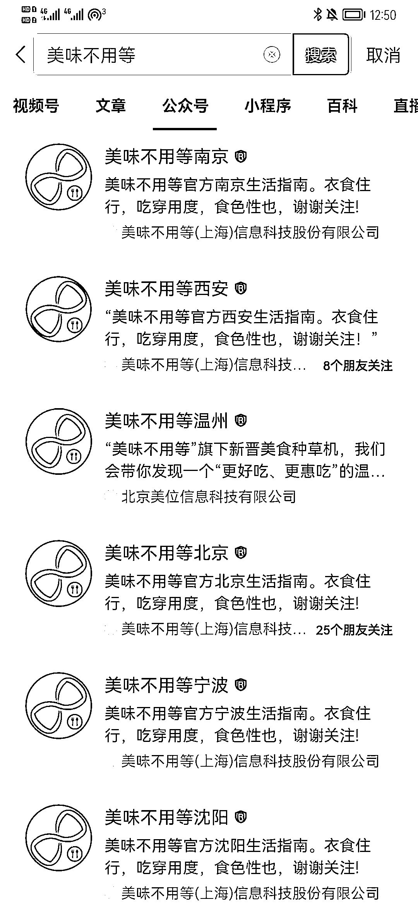
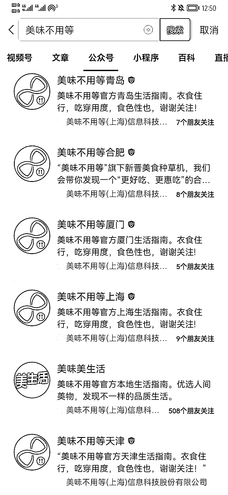

# 6.1.3 线下门店做社群

线下门店，拉群并不难。顾客进群的入口，也可以多样化。

这里提供一些思路。

可以店员导购或结账时，喊入群。品牌连锁的，也可以微信、支付宝支付后页入群，通过付款完成后的页面提供入群入口。还可以门店门口竖个易拉宝、立牌，通过物料上的二维码，直接就入群了。

如果是交易后，东西带着包装拿到家，还可以通过包装上的卡片，邀人入群。

甚至餐饮门店，排队区号的时候，排号也有群。

讲个好玩的事，这一领域，除了各自的小门店自己，最大的垄断级别的团队，是一家叫美味不用等的公司。你们都用过，却不一定记得它。

截至 2020 年 6 月时，美味不用等覆盖了全国 352 座城市，为超过 30 万家餐厅提供智慧餐饮一体化解决方案。每年服务近 10 亿人次的消费者。

有多壮观，看看我手机微信的截图吧，提醒注意绿色的 xx 个朋友关注

早年这家团队规模做得很快，持续拿得到融资，不过商业化探索一直没有找到方向。目前我观察到的是，这个团队，将排号群和同城美食营销（群内发放优惠券等）结合起来，以巨大的群规模在前进。

说到这里，不得不提瑞幸和蜜雪冰城的社群营销。

生财圈友加过这两个品牌方的消费者社群的，一定不在少数。好奇它们群运营思路的大部分消费者，估计也一脸懵逼，“所以，就是不停地发优惠券吗？再没有别的套路了吗？”

说实话，没有了。

可，毫无社群氛围哇？

是的。

这类门店众多的品牌社群，其实还是为业务服务。它们能把「线上领券、线下核销」这一件事做好，依赖足够的规模，实现薄利多销，就已经非常有价值了。

在这个体量下，往群里加太多环节，为了氛围感而氛围感，反而增加直接运营社群的门店或城市运营中心的负担。也又犯了我们上面提及过的“从舒适的体验入手优化社群”的错误。

当然，这么大的规模，如果能做加法、加准地方，也会对社群在意的业绩和体验带来提升。也是很考验社群直觉和社群理解的。这里可以作为一道开放的问题，供诸位一起航海探讨。

