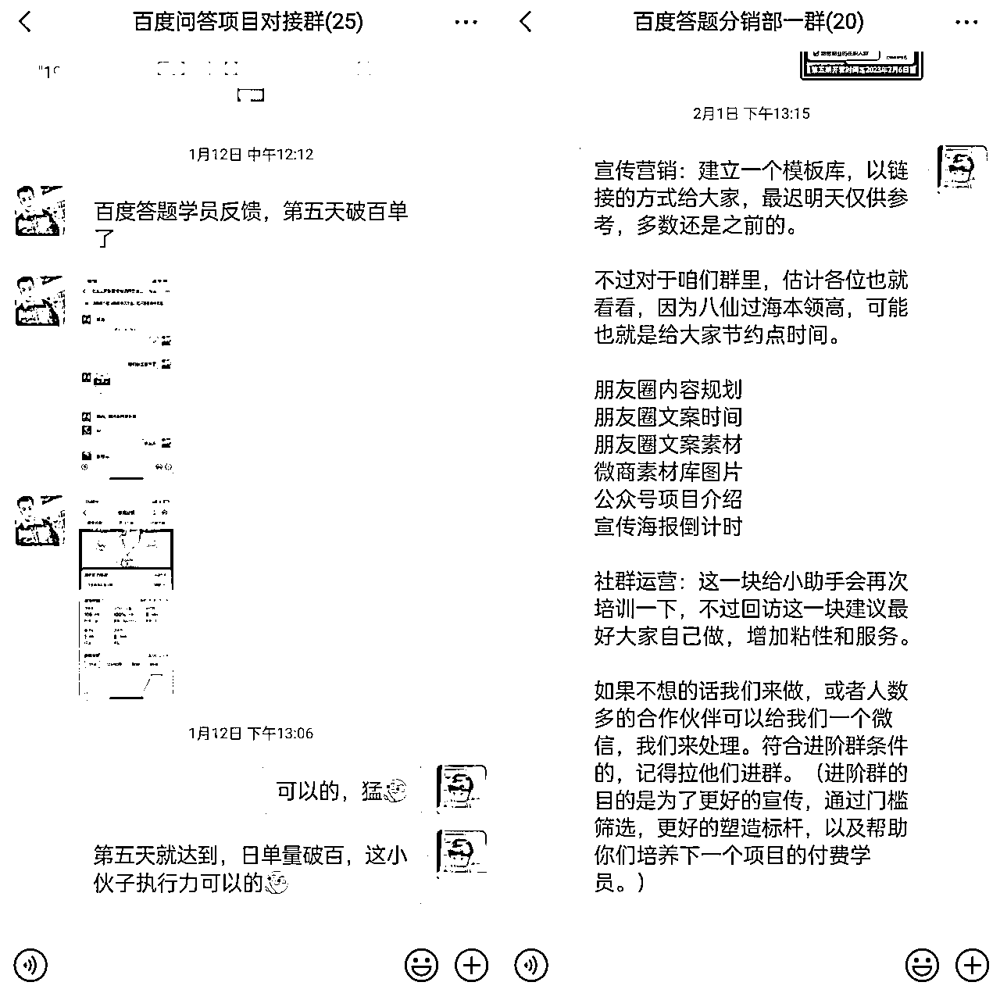
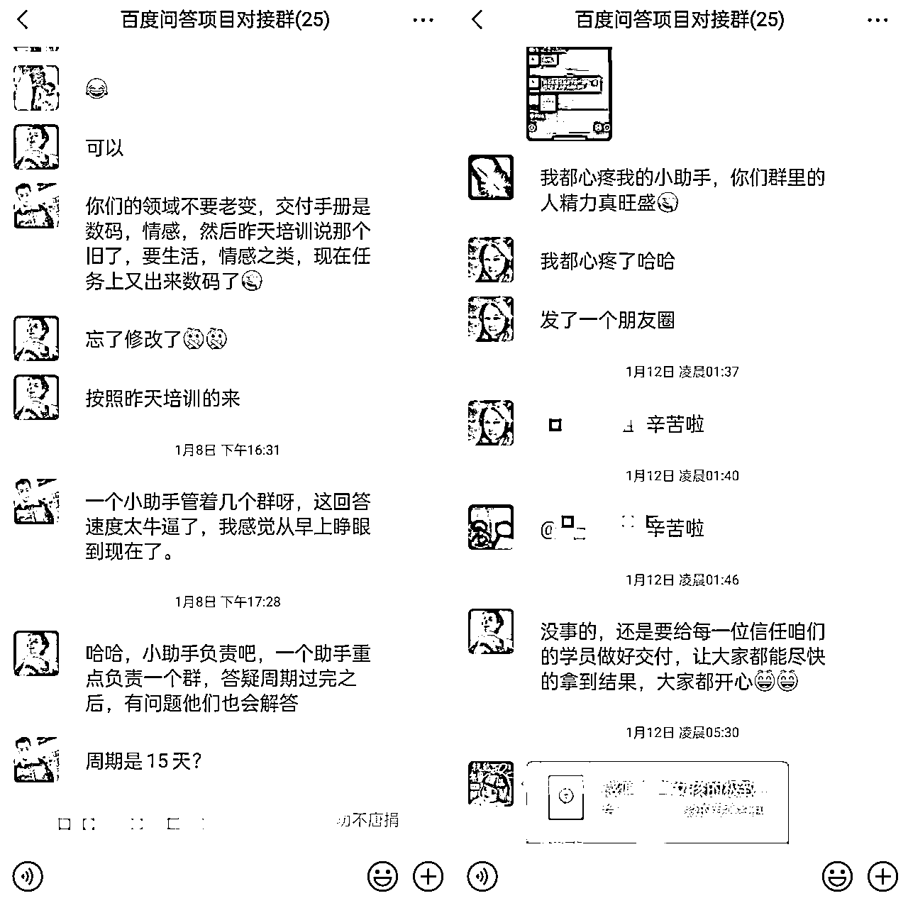
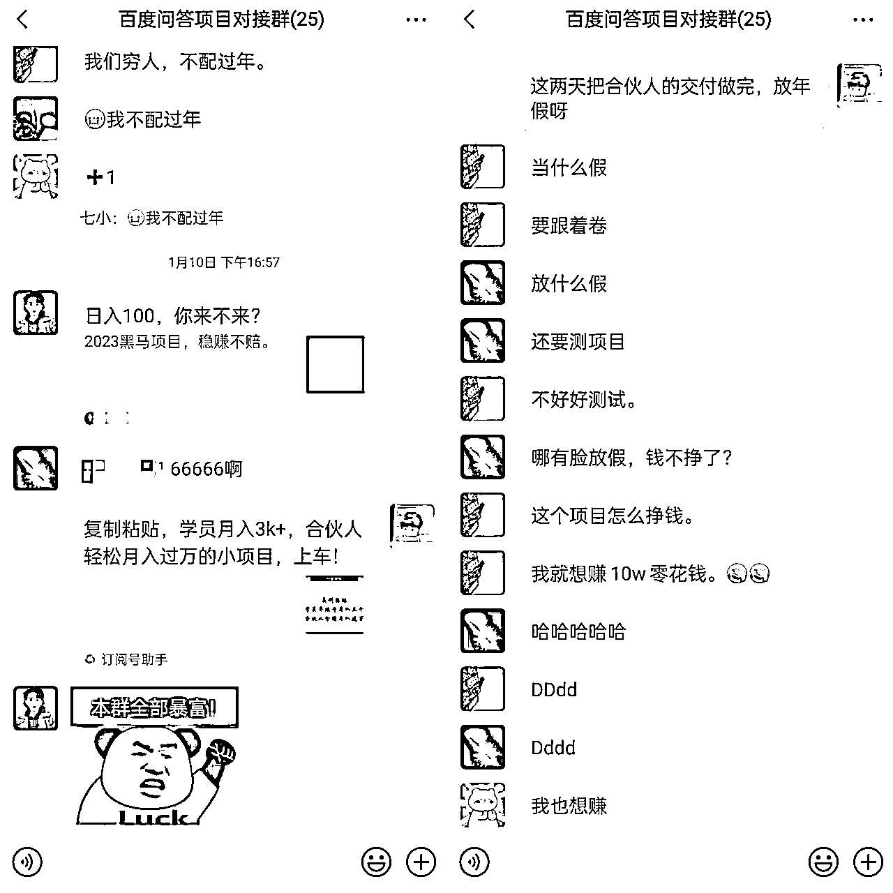

# 6.2.1 【案例一】合伙人社群：百度问答分销模式打造与实践 @一尘学长

项目案例：百度答题分销模式项目的社群经验分享

项目模式：

•分销模式引流获客

•创建百度答题社群，以训练营模式进行交付

盈利模式：培训费用

项目背景：

•主做大学生假期工，大学生因疫情无法线下工作，在寻找线上机会

•22 年 9 月初步尝试百度答题，但由于答案需要自主寻找，效率低且无法放大，项目暂时搁浅

•22 年 12 月生财有术 ChatGPT 风向标，尝试与百度答题结合，项目再次启动

第一期人数较少，只想着把交付做好，我们学员的上岸率能达到百分之百

原因：

1）项目符合对应的群体

2）项目简单只需要执行就能拿到结果

3）交付内容足够支撑执行

基于上述原因，第二期人数增长速度快，因为市场足够大，所以校园代理也开始让他们分销。那么同理，线上也可以如此，于是就联系一些朋友问他们是否感兴趣。这个过程中会有一些问题重复出现，我们的解决方法是开始组建分销群，这样信息能够在群内更好地同步

分销群的建立一开始是为了同步信息，但是慢慢的就多样化，因为大家都有各自的影响力，群内也会有分销的氛围，毕竟多数都是创业者，在搞钱这一部分非常积极

接下来说一下百度答题项目的复盘和建议

1\. 如何建立一个充满活力和合作精神的分销合伙人社群

首先需要确定社群的目标，我们建立的群一共有两种，第一种是【学员群】，第二种是分【分销群】。做学员群的目的是为了更好地交付，做分销群的目的是为了更好地宣传和裂变。

所以我们在开始运营社群之前，需要明确社群的目标和价值主张，以便于清晰自己要做哪些事。

我们就以分销群为例，主要的目的就是为了更好地曝光和分销，因此我们的这些目标和价值主张应该是明确的、易于理解的，并且能够与合伙人的利益相关联。

我们用的微信作为载体，分销群用的名字也比较简单好记。原因是能更好地检索，用简单易记的方式来命名社群，并确保分销者对加入社群的步骤和要求有清晰的理解。

要吸引合适的合伙人，就需要在社群中分享有关项目的内容和优势，并通过各种途径广泛宣传社群。也可以主动邀请适合的人员加入社群，我们一开始的分销合伙人就是自己邀请进群的。

为了让合伙人保持活跃并参与到社群中来，需要提供有价值的内容，例如项目的培训资料、案例分析、专业知识分享

此外，我们还可以安排一些分销活动等形式，与合伙人建立起更好的互动和沟通。

社群内的趣事可以激发合伙人的参与热情，增强社群的凝聚力。也可以发一些有关于项目分销过程中的问题，帮助大家解决一些关于项目的疑问。

为了帮助合伙人更好地推广产品，对于相应的问题我们需要提供及时的回复和支持，并鼓励合伙人提供反馈和建议，还可以搜集一些数据从而用于更好地宣传。

同时在社群中建立良好的关系可以增强社群的凝聚力和合作精神，我们分销群的大部分人都认识，所以平时在群内交流和互助比较多。这样一来，社群的合作精神就提高了。

大家也可以建立一个充满活力和合作精神的分销合伙人社群，从而为产品及课程提供更好的宣传和分销。

2\. 合伙人社群运营中的一些建议

在社群运营过程中需要注意几个点：

1\. 首先社群需要有一些基本的规则和准则。这些规则和准则应该清晰明确，让合伙人知道如何在社群中表现和参与。同时也需要进行一些引导，比如分销的政策和分销的方式，以及群内的公告等。

2.交付分销层构建

学员交付层：

•做好交付，拿到结果

•项目流程不断迭代

•每日答疑汇总问题

•答疑助手即时回复

•每日任务目标计划

•学员激励营造氛围

3.合伙人分销层：

•让其放心，一条龙服务

•营销转化朋友圈文案素材

•专属的交付手册以及答疑

•引导学员裂变获取新流量

•做好后端交付并利润分成

4.日常也需要鼓励合伙人积极参与社群，不要让他们做旁观者，要让他们做参与者。多发一些正反馈去刺激他们，比如今日分销的数据，今日学员的收入反馈等，同时我们也可以评选优秀的贡献者并发相应的红包，以激励更多的人参与到社群中来。

5.我们还需要定期跟进合伙人的情况，了解他们在推广过程中的需求和反馈，以不断优化课程及产品。同时还需要有专门的人及时关注各位分销合伙人的公众号、朋友圈等，把这些内容更新到社群的内容和信息，以保持合伙人的兴趣和参与度。

6.不仅要维护社群内的合伙人，还应该去破圈拓展新的合伙人，积极寻找和建立合作关系，例如与私域 KOL 或其他社群合作，共同推广课程或项目，从而扩大项目的影响力和覆盖范围。

7.为了激励部分合伙人的参与和努力，我们可以提供一些奖励和福利，例如过节时发的红包或者一些礼品等其他形式的奖励，从而增强合伙人的关系动力和推广积极性。

总之，要成功地运营一个分销合伙人社群，需要负责人在社群的建立、吸引、提供内容、支持和反馈、活动组织、关系建立等方面付出努力，不断优化和改进社群运营策略。

3\. 合伙人社群的分销比例构成

在这一块可以给大家分享一下分销比例的构成，因为近期有很多朋友看到我们百度问答项目做的很成功，就想找我们学习，但是这一块很难去以我们的标准给大家分享，因此总结几块内容供大家参考。

项目成本：分销比例应该考虑到项目的成本，确保分销比例不会影响产品的盈利能力。如果分销比例过高，可能会降低产品的利润空间，不利于产品的长期发展。

市场竞争：分销比例也应该考虑到市场竞争的情况，如果市场上其他同类产品的分销比例较高，那么合理的分销比例应该更高才能吸引更多的合伙人加入推广。

合伙人贡献：分销比例也应该考虑到合伙人的贡献，合伙人的贡献不同，分销比例也应该有所不同。例如，某些合伙人可能会为产品带来更多的销售额和利润，他们应该获得更高的分销比例，一般这一块我们会设置相应的阶梯。

一般来说，分销比例可以在 30%到 70%之间进行，具体比例需要根据以上因素和具体情况进行调整。另外，分销比例也可以根据合伙人的推广效果和销售额进行动态调整，这可以激励合伙人更加努力地推广产品，提高产品的销售和市场份额。

4\. 如何激发合伙人的主动性

经过我们的实战经验和分析，明白了好的分销合伙人是不断地筛选出来的。对于一个产品和项目的推广而言，教育的成本太高，我们可以培训使分销合伙人价值最大化，但是如果连如何分销都要指导或者督促，还不如我们自己培养人来的轻松。

但是并不代表着我们就不在这上面花费功夫，毕竟我们是第一负责人，要为自己的事情负责。为了把我们对于分销合伙人的影响降到最低，我们需要在以下方面进行优化和迭代。

1.激发合伙人的动力，可以设置丰厚的奖励机制。例如：推广成功后给予一定的提成或奖励，这可以激发合伙人更加积极地参与推广，并为产品带来更多的销售额。

2.一定要提供多样化的推广文案：合伙人在推广产品时，需要有合适的推广文案来吸引潜在客户，因此可以提供多样化的推广文案。例如：海报、倒计时、项目介绍等，让合伙人可以根据不同的推广场景和客户需求来选择适合的推广文案。

3.为提高合伙人的推广效果和自由度，可以提供培训和指导，帮助合伙人了解产品的特点和优势，掌握推广技巧和方法，提高推广效率和效果。

4.提高合伙人的自由度，可以提供更多的选择和自主权。例如：合伙人可以自由选择推广的时间、方式、渠道等，或者可以自由制定推广方案和策略。这可以激发合伙人的创造力和热情，让他们更有动力地推广产品。

5.为了让合伙人更加清楚自己的推广效果，可以设置监测和反馈机制。例如：合伙人可以实时了解自己的推广效果和销售情况，我们也可以定期对合伙人的推广效果进行评估和反馈，帮助他们及时调整策略和方法，提高推广效果和自由度。

通过以上措施，不仅可以激发分销合伙人的动力和提高他们的自由度，还可以让他们更加积极地参与推广，并为产品带来更多的销售额和市场份额。

内容来源：《从 0 到 500w+：百度问答项目社群分销模式的打造与实践》

