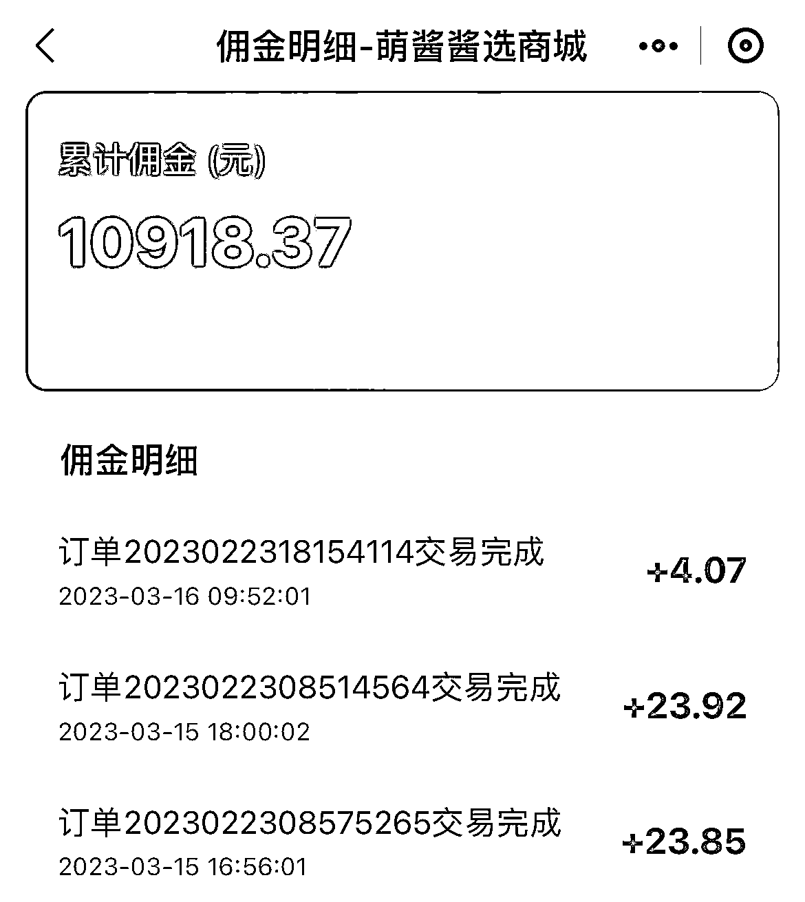
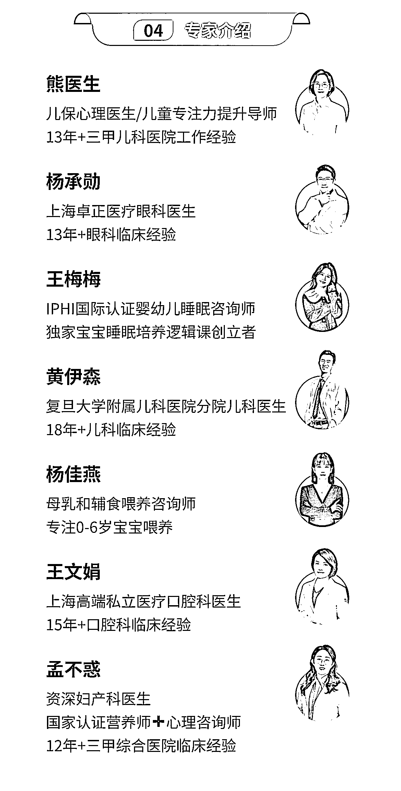
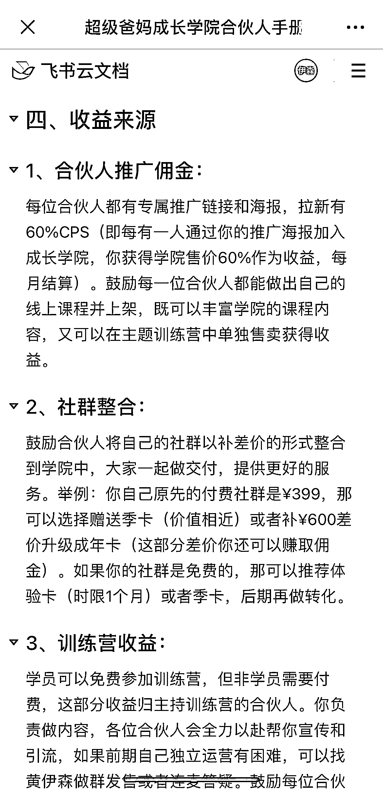
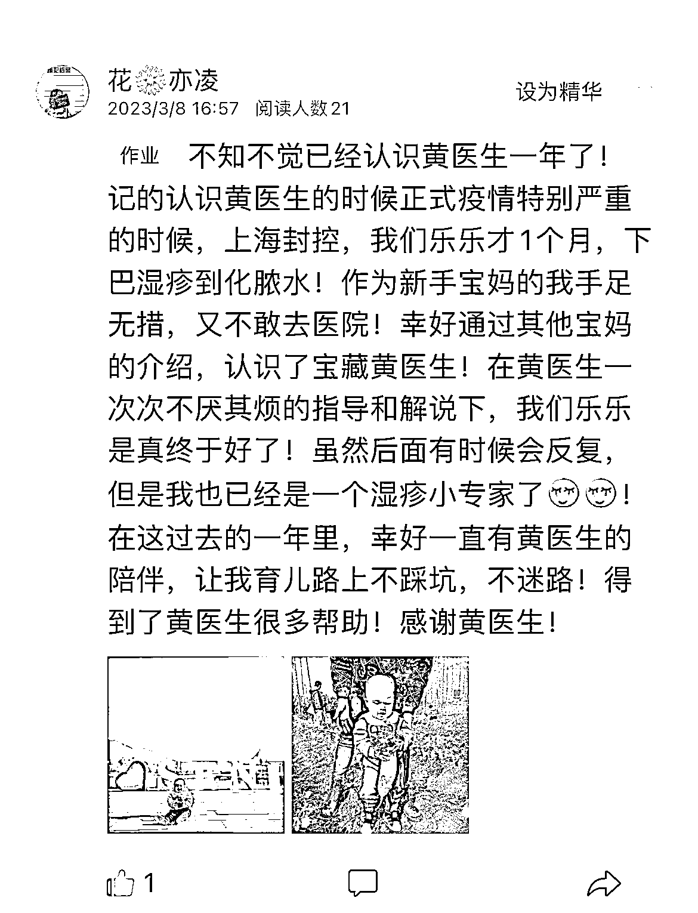
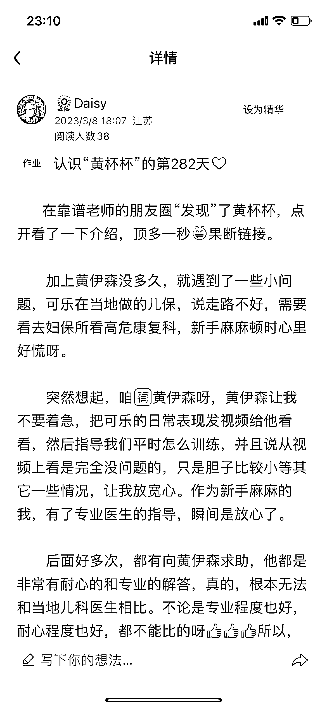

# 6.2.2 【案例二】付费社群：从 0 到 1 盈利十万的育儿社群 @黄伊森

项目案例：从育儿知识科普到孵化母婴好物群的经验分享

项目模式：

•通过育儿知识科普，逐渐提高个人影响力，随之挖掘受众人群痛点，搭建购物群

盈利模式：知识付费、产品利润

项目背景：

•有留学医生的行业经验为背景，尝试做短视频和图文，开始接触自媒体

•市场环境趋势所致，推进社群的建立

•生财有术日历共读群提供社群主营方向思路

•通过运营育儿知识付费社群挖掘的需求和痛点，孵化母婴好物群

1\. 我的社群背景和冷启动

我的主业是儿科医生，所以第一个想到创建的社群自然是宝妈育儿群。在建群之前也没有任何的运营经验，我就先去听了咱们生财圈友@北大苏姐 的一堂社群运营踩坑课，这堂课我至今记忆犹新，我从她的分享里面，学到了社群运营的几个坑。这边也先分享给大家。

•第 1 个教训：不要做免费社群！不要做免费社群！不要做免费社群！

•第 2 个教训，不要只是群主单方面一头热的去分享和输出，而群内没有回应和互动！

•第 3 个教训，一定要有明确的群规并严格执行，这些群规的目的是为了创造一个舒服的社群环境，让你的同频的人可以走到一起并留下来！

大家都知道那个著名的消费能力链条：孩子＞女人＞宠物＞男人，由此可知，育儿 + 宝妈群消费能力强，变现空间大，宝妈群永远是各种社群中最活跃的，但如果运营不当，很容易会变成日常聊天 + 吐槽群。

我认为一个好的社群应该把大家集合起来去做一个共同的事情，让大家喜欢待在这里面，每天有收获和成长，而不是每天无意义的“活跃”。

加入生财之后，看到很多圈友在卖生财的日历，并运营生财日历共读群，可以把同频的人集合在一起，分享自己的见识并共同成长。由此，我确定了私域社群的主题和方向：育儿日历共读群，群规就是“抱团取暖，互惠利他，保持同频，鼓励链接”。把育儿日历做成一个类似于生财日历那样一个形式的共读群，每天分享一个育儿知识，这样群里的宝妈们每一天都有新的内容可以学习并围绕这个主题展开讨论。

铁粉初代：

社群虽然是付费社群，但最初的一部分成员其实是免费的，是我门诊的一些铁杆粉丝，我把这些小朋友的家长们邀请进来，作为第一批的友军和基础支持者。

他们在群舆论的把控方面给了我很大的支持，同时我隔三四天就会询问一下她们，关于社群分享的内容和社群运营给我一些反馈，因为之前累积的良好的信任基础，所以她们给了我非常中肯和非常坦率的反馈，我听取并非常及时的做了相应的调整，事实证明这些调整对于社群整个的运营是非常有效的，让内容的分享更加的高效及时。

2.增加曝光率：连续 100 场直播，大力出奇迹

在这之前，我没有任何的互联网产品销售经验，可以说我是一个互联网素人。记得有一次我的自媒体合伙人@梁靠谱医生，在她的生财日历共读群里分享过：对于一个互联网素人来说，要闯出名堂，一要靠持续的内容输出能力，其次要有属于自己的互联网标签。

加入生财之后，看到了视频号直播风头正劲，也看到粥左罗老师的连续直播 100 天挑战，当时我就在想，我是不是也可以发起一个自己社群的连续 100 天直播挑战。好处如下：

•首先，连续直播可以作为一个刚创立的内容社群的持续输出，有利于保持社群的活跃度和保障优质的内容，也让更多的人看到我们，从而提高社群的影响力，扩大社群规模。

•其次，连续直播可以锻炼和提高自己的直播能力，包括直播间的运营和互动，以及带货能力，后期有新的产品上线之后，可以通过直播间促进成交。

•最后，连续直播 100 天挑战达成后，可以获得一个属于自己的互联网标签，从今以后，可以跟人吹牛：我是第一个完成了连续 100 天直播挑战的儿科医生，哈哈哈

所以从打败自己的惰性，到学习怎么直播，到确保交付的内容，再到邀请其他领域大咖帮助交付，通过连续 100 场直播，社群从最初的 63 人，增加到 401 人，门票从最初的每人¥36.5 涨到了￥76.5（每增加 100 人涨价 10 块钱），社群影响力在不断增加，我的个人 IP 也在不断被强化

3.变现：及时孵化新社群，但要注意保持社群相对稳定的功能

众所周知，宝妈群是属于消费能力最旺盛的群体，其中，婴儿用品占了很大一部分。但是市面上的产品琳琅满目，而且有不少是智商税，那么从儿科医生的专业角度出发，帮宝妈看成分表，筛选合格靠谱实用的育儿产品，让社群里的宝妈少踩坑，少交智商税，这个是很大的一个吸睛点。

在我直播过程中，有不少育儿电商平台找到我想要合作，后来通过沟通和筛选，选定了一个我认为靠谱的母婴用品平台进行合作，我们新建了一个“伊森严选母婴好物群”，主推靠谱实用，有专业背书的母婴用品。

目前我的销售已经超过了 10w+，我的个人佣金也达到了 10000 多块钱，这还是在疫情期间上海的物流受到很大限制的情况下。虽然这个销售额并没有很高，但是我相信，任何一个 100 万都是从第 1 块钱开始的。而且随着口碑和影响力的不断增加，这个增长肯定不会是线性的。

4.突破瓶颈：由低转高，这些操作让社群客单价涨了 15 倍

社群运营到一定阶段，就需要在适当的时机迭代更新，由低转高。以下是我做的几个事情：

第 1 点是，挖掘社群成员需求。

随着社群的增长，社群成员的需求是在增长的，所以，我们要去敏锐的观察到社群需求的变化，甚至去挖掘社群成员潜在的需求，根据这些需求升级产品，这样才有可能把客单价由低转高。

在我刚开始运营这个育儿社群的时候，只是一个低客单价的引流产品，跟很多其他的育儿社群一样的，我也是一个人包打天下，所有的群里的问题分享都是我一个人在做。本身我在临床干的时间也很长了，所以基本上 90%的问题都可以搞定。

但是随着社群的成长，你会逐渐发现一个儿科医生，他的专业知识再丰富再全面，他也没办法覆盖儿童健康的所有领域。现在的宝妈们对孩子的健康关注，越来越多了，不光是看病，还包括喂养，睡眠，儿保，视力，口腔等等。另外还要去挖掘宝妈本身的需求，比如说产后康复，女性成长，宝妈副业等等都是可以作为社群的潜在增长点。

第 2 点，打造“小而全”的团队。

当发现或者挖掘出新的需求的时候，而你又没有办法去满足这个需求的时候，怎么办？我的策略是，放弃创始人 IP，找同行当医疗合伙人，打造一个“小而全”的团队。

医生这个行业比较特殊，因为除了要求医生本身的专业过硬，而且同时要有他们一定的互联网思维和商业思维，他们有这个能力并且乐意去在互联网上去输出专业的知识，同时，他们能够跟上节奏，一起去运营社群，去做产品的打造和升级。

比如说当小朋友后面有眼科，口腔，睡眠，喂养，身高这方面的需求的时候，我就会留心在各个社群里面，去寻找这样的优秀的同行。当有合适的候选人的时候，我会邀请他们做个直播连麦分享，或者是一个社群的图文分享，在这个分享过程中，去观察他的专业能力，以及他的互联网输出能力。

经过筛选之后，我终于找到了 6 个医疗合伙人，可以同时覆盖儿童心理，喂养，睡眠，口腔，眼睛，以及宝妈产后妇科问题的健康需求。把我们的社群的护城河进一步的挖深挖宽，提高专业能力。

第 3 个，明确分工，同时舍得分钱。

当合伙人团队确定之后，我写了一份合伙人手册，在里面明确的跟大家详细说明了，作为合伙人，你需要在社群里面，输出哪些内容？什么时候需要你去做什么事情，做到分工明确。

手册里还明确说明了你可以通过哪些渠道赚到钱，这个社群所有的利润，我的原则是，进四出六，把利润的大头给到各位合伙人，这样子大家才有充分的动力，去拉新，去做好社群服务，去成长，这个团队，才能会是一个有凝聚力的团队。

第 4 个，设立体验卡制度。

做知识付费的人大多数最讨厌的都是那种双手朝上的白嫖党，但是，在社群升级的时候，我设置了一个体验卡制度，就是说，如果是对我们的社群不是很了解的新用户，可以免费体验 28 天，在我们社区里面，无限次提问，同时可以参加在这个期间举办的实操训练营。28 天是免费的，同时 28 天到了之后，你可以选择退出，如果你觉得我们社群的服务达不到你的预期值的话，我们分文不取。

之所以会设立这个体验卡，是因为我们是一个育儿社群，我们是做一个长期服务的陪伴型的社群，那么 28 天对于一个宝宝来说，其实是一个非常短的一个时间，而我们只是提供了一个机会让宝妈了解这样一个与众不同的，具有很专业的服务团队的社群。

我们不担心她会白嫖 28 天，因为她一旦体验过我们的专业服务之后，我们很相信，她在 28 天之后会选择成交，而不是选择退出社群，因为她在别的地方找不到这样的育儿社群，这点我对我们的产品非常有信心。

而且付费用户是一个双向筛选的一个过程，如果我们觉得这个宝妈的育儿理念实在跟我们不符合，那我们就会劝退。28 天之后就可以退出我们的社群，因为你跟我们不是一个育儿理念的，那大家还是好聚好散吧。

第 5 个，借社群周年庆造共同回忆。

3.8 正好是我们社群运营一周年的纪念日，我在我们的育儿星球，开了一个会员日抽奖，然后参与方式是让大家写一段，在这一年中跟黄医生的社群，发生的故事，同时晒一张宝宝的照片，然后可以参加抽奖。

这个活动的目的，是为了造共同回忆，同时，可以让宝妈们给我们提供，正反馈和社群宣传资料，效果还是不错的，我们收获了，挺多的好评，而且是真情实感，真实发生的故事。这些宣传资料都可以反复用在朋友圈及社群升级的过程中。

内容来源：《从 0 到 1，我是如何打造出盈利十万的育儿社群的？》

