# 6.2.3 【案例三】电商社群：从 0 到 1 打造高复购率的小社群 @徐欣

项目案例：高复购率的快团团电商社群经验分享

项目模式：社群冷启动，通过运营策略不断增加客户粘性和信任，提高个人影响力，提高销售额和复购率

盈利模式：产品利润

项目背景：

•线下实体生意经营多年，对选品和选供货商经验丰富，链接源头厂家和卖家也很有经验，确定开始做快团团

•通过冷启动后初期运营，收到反馈后总结经验，从而确定做生鲜品类

•根据社群定位：健康，报考公共营养师为社群做专业赋能

快团团 23 个人的小社群，从 2 月正式开始运营，一周只投入周一到周五早上 5 分钟晒早餐，群里除了不定期分享一些养生知识和推品基本不闲聊

2 月份一共推了 46 个商品链接，平均每天不到 2 个，而且只卖生鲜。在这样的情况下，我的 2 月业绩是 11562.3 元，提成是 1996.87 元。

在很多讲快团团社群实现这个销售数据需要有 150 人左右，而我当时的社群人数不到 30 人，现在是 47

所以今天我来分享一下，我是如何冷启动一个小社群并进行变现的。

1.正式启动

2022 年我发了一条朋友圈，正式启动了我的小群，希望可以吸引一些有宝妈、妻子等相关角色的用户。这个时候我只确定了要做快团团，但是还没有具体确定要卖什么，甚至连供货商品质深浅都不知。

当时发朋友圈的时候，正好看到@芷蓝 说的一个个人使用说明书，于是我就做了一份，其实完全都没想好，要买什么，但是把自己有什么先亮出来。

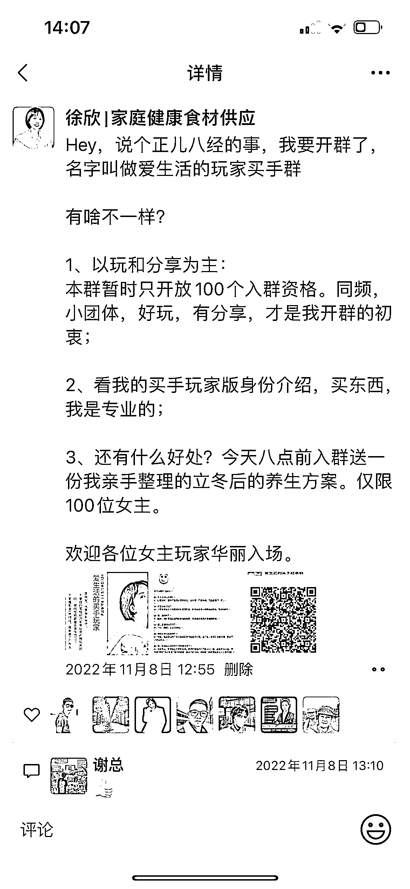

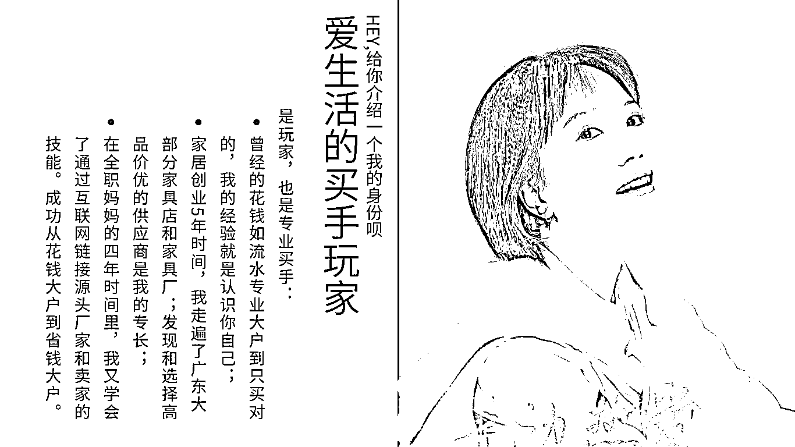

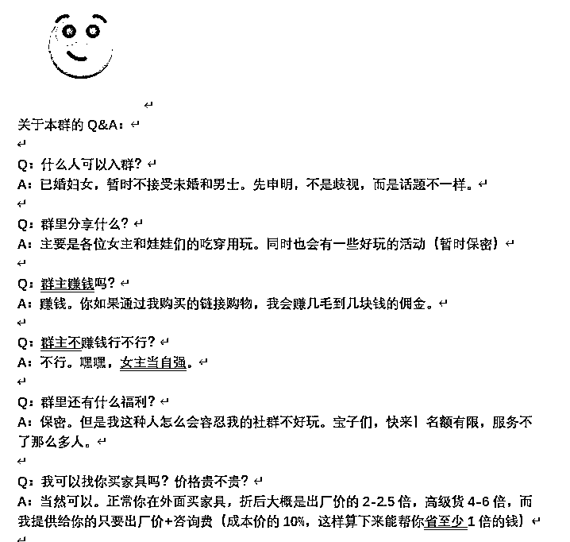

2\. 从泛品到确定生鲜品类

当时进群有 10 多个人，大家聊天还算是非常热闹，但是当我真正推品的时候，却很少有人下单。我就去我快团团看数据，像童鞋、童衣这些浏览数量确实还不错。但是没有下单。

后来我又试着推了推吃的东西，这时候有人开始下单了。于是我就在想为什么？

我就试着以用户的视角进去看了看衣服和鞋子的链接，发现我自己也很难下单去买，页面提供的信息很多，却没有什么打动人的关键，而且衣服款式选择还特别少。

我想想我自己给娃娃或者自己买衣服的场景，就发现，衣服这个东西和个人审美关系太大了，这个你很难踩到其他的审美的点，大社群可能靠人数可以，但是小社群不行。

到了 11 月 23 日的时候，我就意识到两个问题：

1）品类太泛了不行，因为我很难短时间去了解清楚，如果你只是轻描淡写丢链接，别人就会认为你在割韭菜；

2）生鲜食品的打开率虽然没有日化服装高，但是转化率高，而且我自己其实买衣服这些不太会从快团团这个渠道买，但是买生鲜是我自己经常要做的事情，但是我从电商平台上买生鲜几乎没有让自己满意过，所以不如先来解决自己的需求。

于是我就开始留意食品生鲜，自己找了很多食品包括生鲜的大团长来测品，前期自己测品，测品大概花了将近 1 万块，最后让我找到了两三家品质非常稳定，售后也靠谱的大团长，提供的食材也符合我想打家庭健康食材的特点。

但是第一波有销售业绩，群里买的人很少，两三个人。于是我开始发朋友圈，发朋友圈都配图的是我自己家吃的照片，真实分享。

第一次我选品卖的是苹果，没想到一个朋友圈帮我出了几单，而且我等大家收到货以后，就回访，了解购买者对苹果的评价。没想到，评价出奇地高。甚至还有人当场就回购了 5 箱发公司给员工吃。

于是我就朋友圈，晒单发圈，晒单发群。渐渐地群里也出了一些单，但是还是不多。后来疫情放开加上过年，我们全家病倒，加上这个时候全国快递瘫痪，我就把卖货停了，因为生鲜最怕路上耽搁，这个时候丢客户最容易。

3\. 通过群抽奖的方式保持社群活跃，侧面推广产品

2 月过完年回来，当时马上要到元宵节，我想着这是个重新启动的好时机。我准备了十份团品用来抽奖，全部都是当季可以用来复购而且在其他团口碑特别好的产品，而且几乎所有的团品我都自己买来吃过，自己也觉得非常棒。

当时群里就 20 多个人，于是我一一私下邀请来参加抽奖，顺势也加了几个之前在朋友圈买过东西的朋友进来。

元宵节的整个流程我都提前设计了，包括提前告知活动时间，加人，到了 1 对 1 通知参加活动，晒过去的成绩与好评，以及我做团的初心，往后的承诺等等，甚至准备了对应的文稿。

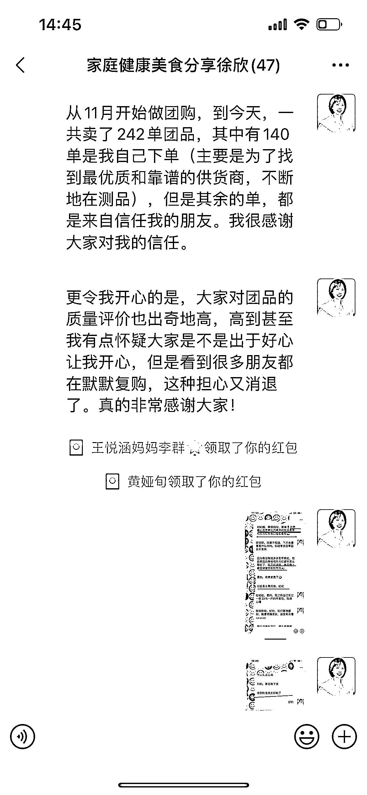

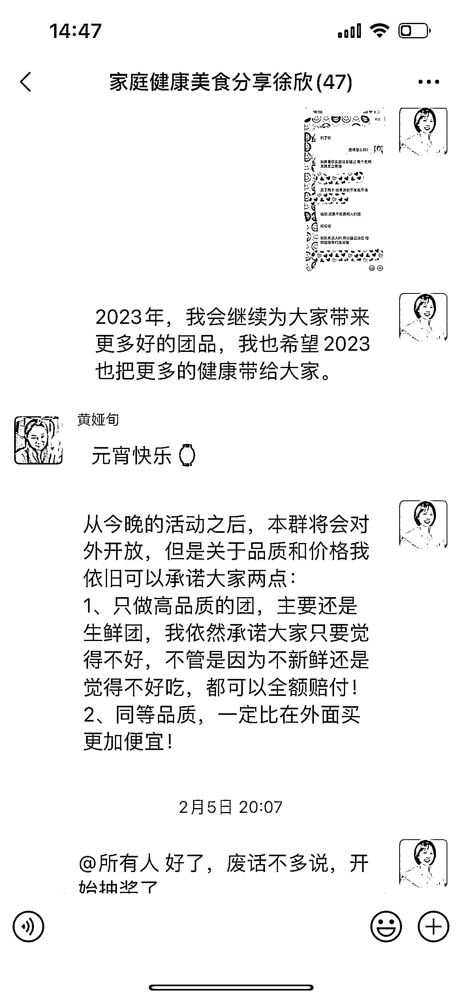

然后我就开始逐个介绍我为大家准备的奖品，这个环节特别重要，因为 20、30 的东西，也一定要把价值先说出来。

当然所有产品的特点也是我提前准备好的，因为那么短的时间又要把点说到位，又不能让别人觉得太啰嗦。

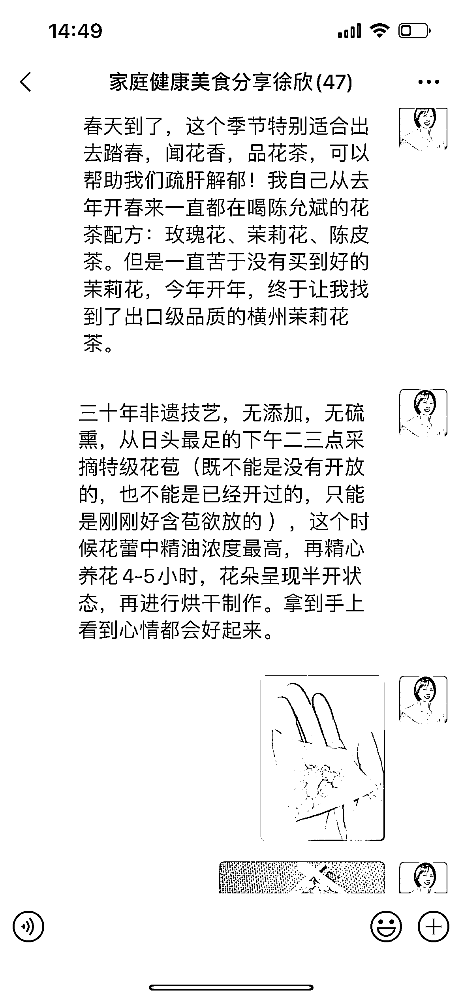

然后就是这样逐一下来，当场的氛围特别好。当天还宣布了 1 个群规则：新增成员增加一次抽奖机会；（这个也是跟生财的朋友学的，效果好不好，我最后总结）

当天我的销售业绩是 1200 多，提成是 240 多，费用加上红包是 610 元，可能很多朋友一看，我亏钱了。这个事情不值得做。但是从后面来看还是非常值得的。

值得做的地方有两点：

1）我卖的是高端生鲜，这个东西是怎么宣传都没用，一定要吃才知道对比在哪里，直接送给别人试吃别人压力会很大，这样抽奖抽到别人觉得心安理得；

2）让别人觉得这个群好玩，事后我回访了几个好朋友，她们都觉得特别好玩，很过瘾。

4\. 每天分享早餐增强人设，增加群成员之间信任和链接

有一次我看到小红书上有个大团长说一定要问候早晚安，每天要固定时间做固定的事情，这个是不是很耳熟，在条形马老师的手册中就有。所以我看条形马老师的手册特别有感觉，因为很多事情我都经历过，很多坑我也都踩过了。

早安红包这个事情，我并没有按照那个大团长说的做，因为一来是红包成本太高，二来群里的人不一定能看上。于是我就想，什么事情，我可以坚持在早上做，同时同群里紧密结合？

早餐，我自己坚持给家人做早餐已经有两年了，虽然也不可能天天，但是一周五六天没啥问题。于是我就开始在群里晒早餐。

因为我自己吃早餐的时候也会喜欢有音乐，所以在群里有时候也会分享我早餐用的音乐。

5\. 利用会员日推动群成员晒单，促进销售

晒早餐这个事情我觉得对了之后，我就开始做当时另外一个大团长的建议，就是会员日。每周都固定一天会员日，会员日有两个作用：

1）用来奖励上一周晒单的客户；

2）把群活跃起来

奖励上一周晒单的客户。大家都知道团购群晒单特别重要哈，如果没有晒单，群主一个人吆喝也不行，在活动之前我想了很多种奖励晒单用户的设置，最后终于让我找到一个我觉得最适合的，具体设置看下图。

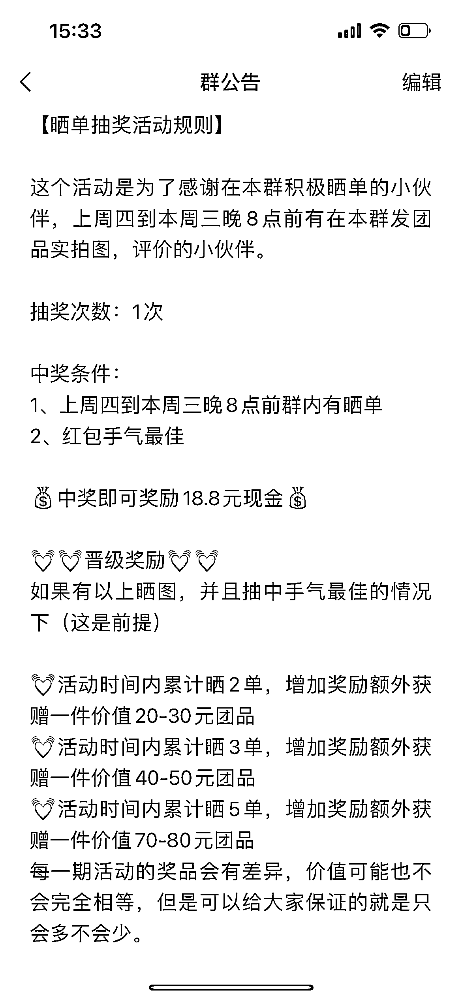

把群活跃起来这个事情，我就不用说了，固定时间固定抽奖，晒单不晒单大家都可以参与。弥补了我平时不喜欢在群里 BB 的缺陷。

我的会员日基本上也是我一周出单的集中日。

来说说我群外都干了一些什么？

•群外用功 1：深度链接客户

1 对 1 的回访每一个客户，刚开始的时候我基本上会 1 对 1 的回访每一个客户，后来我发现单太多，我已经没有办法做到了，所以就会留意一些需要时效尽快收件的品，比如说芒果、猕猴桃、冷冻产品等，甚至我帮别人代买的产品不赚钱，我也会时不时地问下对方有没有在吃，身体感觉如何等等。就在这个过程中，与客户建立深度连接。

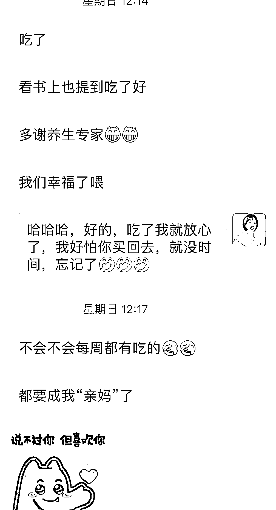

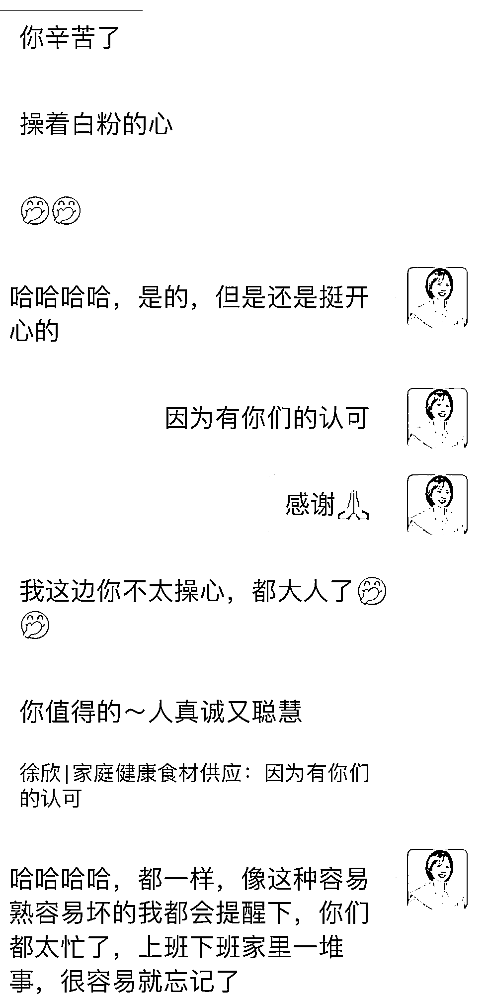

•群外用功 2：有售后，不解释，永远站在客户这边

有售后，不解释，永远站在客户这边，平台不认，就自己赔付。我记得有个梨子我在回访的时候，客户跟我说有两个水分不足，这个事情一般来说都不算售后的，因为照片没法体现呀。我当时二话不说，按照个数赔钱给她。

结果她不收，说我不可能从供货商那里要到索赔，没理由要我来赔，所以就没跟我说。后来我还是把这个情况反馈给了大团长，因为我的帮卖成绩还不错，人家就直接给赔了。

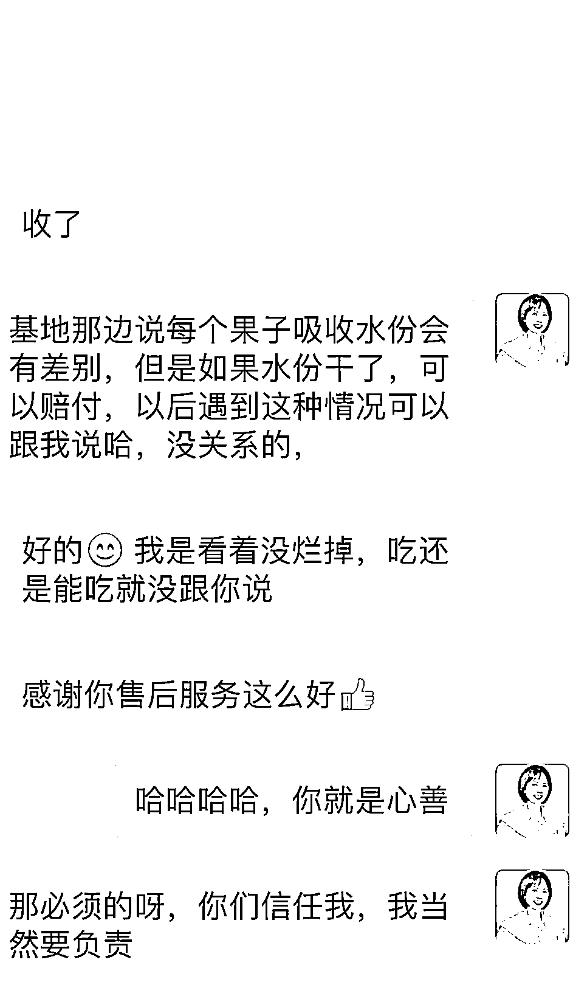

•群外用功 3：学习养生和营养专业知识，分享给群友

我自己从去年年底确定做生鲜后，就报考了公共营养师，一来是自己感兴趣，二来我不想只是卖货。

在学习的过程中，我会把我日常养生以及学到的知识分享给群友，牢牢锁定本群的“健康”二字。给本群做专业赋能。

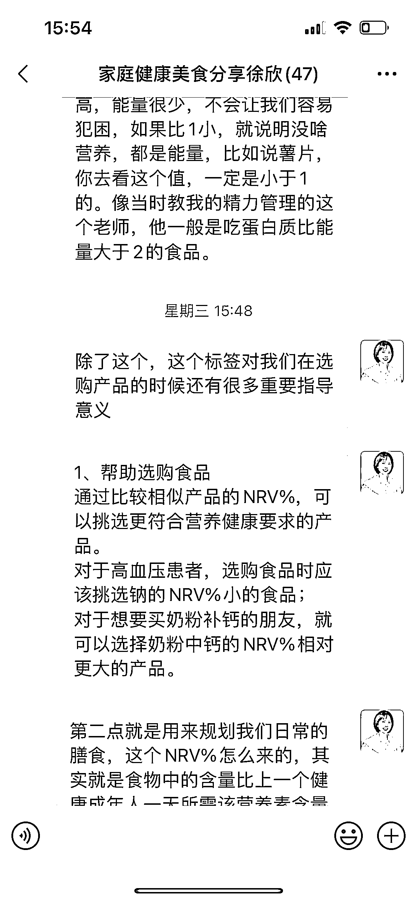

再来说说我遇到的 3 个问题

•问题 1：运营成本高

刚开始的时候，听了一些大团长的，说要在群里发大红包，所以大的活动节点，我都是 40 元一个的红包发，抽奖也是用的 5 元的红包，后来做总结，发现没有必要，没有你会因为老板大方发红包而下单，所以后来一不发节日红包，二不发大红包，三所有抽奖红包减为 1 元。

做生意，小数怕长计，一定要减掉日常不必要开支。

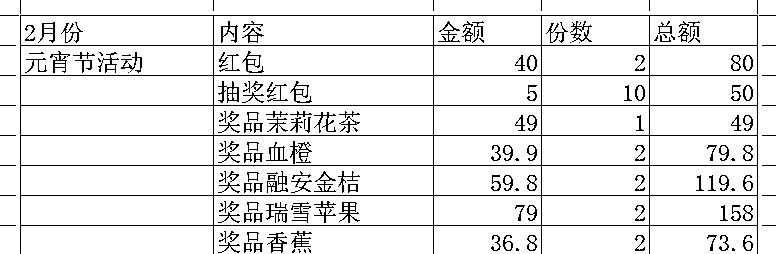

•问题 2：盲目裂变，导致成本上来却没有效果

运营了一段时间，想要裂变，于是在元宵节的时候告诉群友，只要新增一个团员，就在群里抽奖一次。后来发现完全没有必要，因为大家也不会 CARE，但是群运营成本又上来了。同时还增加了我自己为了选合适价格与合适产品的运营负担。

•问题 3：活动时间的摸索

刚开始会员日我是定在晚上 8 点，但是群里的成员都是有家有孩子的人，晚上 8 点基本上都在辅导孩子做作业，所以最后把时间定在了中午 12 点多，这个时候反而是上班族最放松的时候。

运营社群三个意外的收获：

•1、收获了陌生链接与信任赚钱我觉得分两个层次，一个是面上的赚钱，就比如说我做这个事情实际赚了多少钱。二就是收获了别人对你的信任，后面才会有可能衍生出更有价值的事情。这个事情我暂时不知道是什么，但是以一个做了四年实体生意的人来说，一定是值得投资的。我觉得这个就是条形马老师说的“贵人”。

•2、帮助朋友走出困境我有一个很好的朋友去年的时候确诊了重度抑郁症，其实这个事情对我确定做健康这条线也有非常大的促动，过程中我一直在找怎么帮助她康复的饮食方案。后来她也想做快团团，就把我的经验复制给她，并帮助她快速完成了从 0-1 的打通

•3、企业团采刚开始的时候我就遇到买五箱苹果给公司员工的。
后来就遇到一个朋友因为觉得茉莉花茶太好喝，要给企业采购 800 份，但是我自己没重视，在与供应商谈团采环境时间没有控制好，导致错过了机会。但是这对我是个非常好的提醒，就是企业团采这个事情可以做。

最后，我想告诉所有还没起步或者刚刚起步的朋友，我们会遇到很多困难，但是我相信一个定律，就是竹子定律。

竹子用了 4 年的时间，仅仅长了 3cm，从第五年开始，以每天 30cm 的速度疯狂地生长，仅仅用了六周的时间就长到了 15 米。其实，在前面的四年，竹子在土壤里积蓄扎根，为它以后的生长做好了充足的准备。

内容来源：《新手如何从 0 到 1 打造拥有高复购率的小社群》

