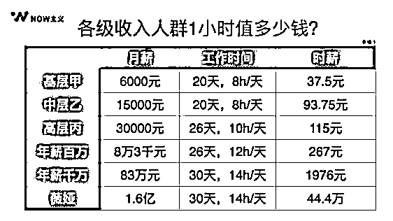

# 1.1 时间管理的重要性和应用场景

在开始这趟时间管理之旅前，我想请你先来回答三个问题：

第一：你的余生还有多少奋斗的时间？

第二：你现在的时薪是多少？

第三：你期望的时薪是多少？你希望什么时候能达到？

对于第一个问题，算法很简单，用你希望退休的，减去你现在的年龄，再乘以 1/3（其他的 1/3 用来睡觉，1/3 用来吃喝拉撒娱乐等事项）。如果你今年 30 岁，退休的年龄是 60 岁，那么你实际能用来奋斗的时间就是（60-30）*1/3，也就是 10 年。

怎么样，比你想象的多还是少呢？

第二个问题，你现在的时薪是多少，也很简单，如果你有一份全职的工作，就用你的收入除以（ 21 天 * 8 小时），如果你是创业者或者自由职业者，就用你的收入除以（ 30 * 10 ），创业或自由职业者的工作时间，一定是比正常上班要多得多的，由此带来的回报也相应会更大。

这里有一张《各级收入人群时薪》的图片，你可以作为参考。

第三个问题，你的时薪达到了你的期望值吗，如果没有达到的话，你希望的数值是多少，你准备以多快的速度达到呢？

哦，对了，这里我们只计算了赚钱的时间，但没有算花钱的时间。实际上，我们用退休前 1/3 的时间赚的钱，要养活自己另外 2/3 的生活，以及退休后直到离开的生活，这还没有包括我们的孩子、父母等需要照顾的家人。

相信你已经感受到了，虽然“死亡”距离我们还很遥远，但留给年富力强的我们努力奋斗的时间，实在不算多。

如今，一提到赚钱、变现，大家第一反应就是要找机会、找风口、找资源，但却忘记了这些外部要素可以无限多，赚钱的方法千千万，但每个人一天还是只有 24 小时，一生也不过百年。

如果没有管理好时间这个唯一人人平等的资源，没有关注提升自己的时薪，而是忙乱中将珍贵的时间随意地花在各种各样的杂事中，最终不但浪费了时间，也很难真正收获到成果。

人从出生的那一刻起，就生活在时间的河流中，无法截断也不能退出，做任何事情都要花时间。唯一的办法就是静下心来，按照工作、生活、家庭等板块，用心管理好自己的时间，实现自己各阶段的目标，活出自己想要的人生。

