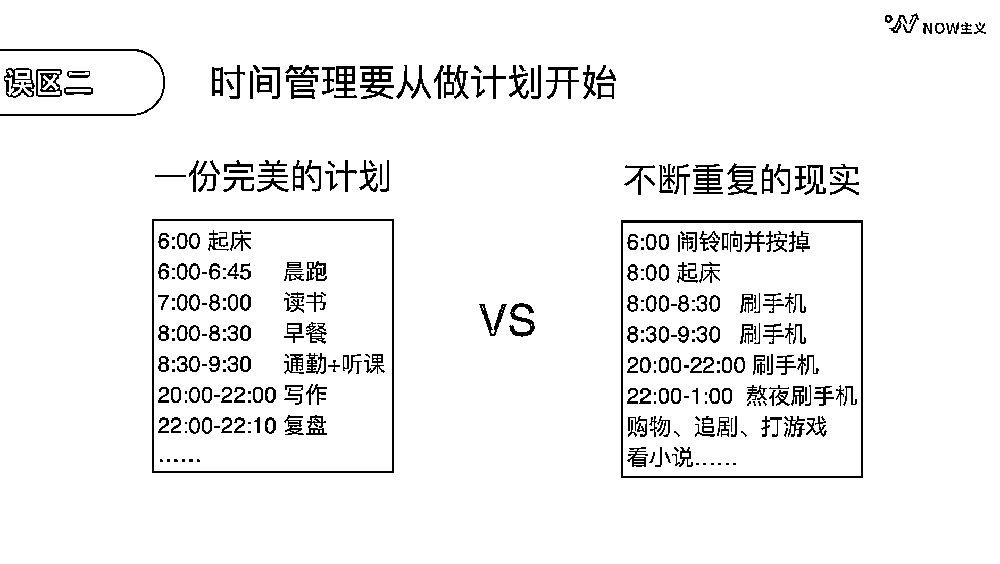
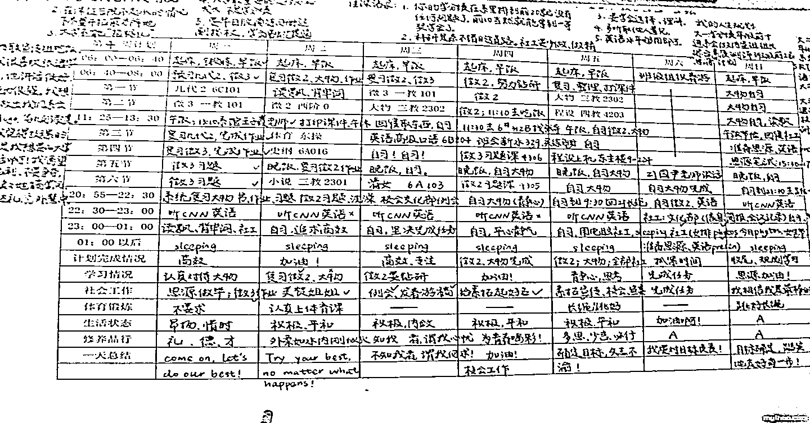
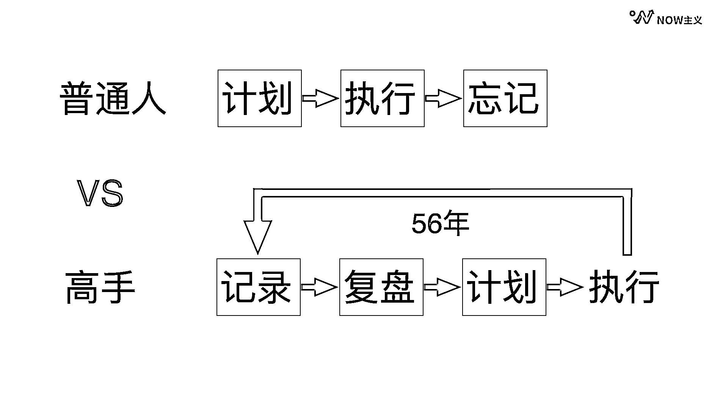

# 1.2 时间管理的常见误区

误区一：认为时间管理，顾名思义就是管理好时间

当我们静下心来想一想，就会发现时间有四个主要特征：

第一，不管你愿不愿意，它一直在流逝。

第二，没有任何人能够人为控制它。

第三，一生当中无论我们做什么事情，都需要花时间。

第四，所有过去的时间，过去就过去了，永远不能复返。

这么一分析，我们就能发现，时间根本不可能被管理。好消息是，时间也是这个世界上唯一真正平等的资源。即便是一个亿万富豪，想拥有好的身材，也需要花时间到健身房里去挥汗如雨。所以，时间管理管的并不是时间，而是自己。通过管理自己，更好地去利用时间，完成自己想做的事情。

误区二：觉得时间管理要从做计划开始

回想一下，你是否有这样的经历，明明做了一份图中左边这样很完美的计划，然而每天重复的现实却是右边这样的。更可怕的是，这样的循环不断地出现在你的生活当中，让你逐渐地失去了信心，觉得自己实在是没有办法成为一个自律高效的人。

为什么看似完美的计划往往行不通呢？底层的原因是惯性的力量在指引着我们。

研究发现，一个人一天当中 95% 以上的行为都来自于惯性。我们所看到的那些高效人士所谓的自律只是一个表象，实际他们早已经习惯这么做了。妄想用一天就能达成别人花了一年甚至几年的时间养成的习惯，当然是不可能的。如果想要改变，只能逐步优化自己的时间分配，这也是那些长期高效自律的人真正在使用的办法。

之前网络上就有一张时间管理表格，这张表的主人是清华的特等奖学霸马东涵。上面从周一到周日，从早上 6 点到晚上 1 点写的满满当当。第一眼看过去往往都以为这是一张计划表，但她后来澄清了这其实是一张记录表。

通过记录来逐步优化自己的时间分配，才是开启时间管理的正确姿势。

这个方法的源头是著名的时间管理大师柳比歇夫，他一生当中完成了 70 多部专著， 12500 页的论文，自学了 3 门外语，收集了 13000 只的地蚤标本，留下了大量的通信回忆录，不仅如此，他一天还有时间睡 10 个小时。

听完之后是不是内心大受震撼？对比一下普通人和高手的时间管理方式就可以看出，普通人的常规操作是先计划再执行，但因为缺乏记录和反馈，没做几天也就忘记这回事了。

而高手则是先记录自己真实的时间使用情况，再通过复盘，从中找出可以优化的部分，设定计划并且执行，提升自己的时间使用效率。并且把自己的执行情况再一次记录下来，重新复盘，优化执行。如此反复。

而高手中的高手柳比歇夫，坚持了整整 56 年。所以即使看起来才华横溢、天资聪颖的人，也需要在时间管理上下苦功夫，才能取得杰出的成就。普通人更是要按照记录、复盘、计划、执行。如此反复的坚持，日拱一卒，才能真正的管理好自己的时间，创造属于自己的价值。

想要更好地理解这一点，可以把人生想象成一条河流。从出生的那一刻起就开始不停地向前奔腾。当我们想要发生改变的时候，没有人能够把长江直接搬到黄河。能落地的做法是，先知道自己当前在哪，再沿着自己期望的方向，耐心地修建新的河道。所以，忘掉那些不靠谱的计划，正确的时间管理，要从记录和复盘开始。

误区三：认为计划中断 = 不自律

这几年各种各样的打卡盛行，而众多打卡比较一致的特征就是一天都不能落。所以在大家眼中，高手就是那些每天都锻炼，每天都读书的人。但事实真的是这样吗？

高手也只是一个活生生的人而已，他也会有紧急的事，也会有身体不舒服的时候。除了非常极少数真的能够排除万难，做到每天坚持一件事的人以外，大部分的人其实都不具备这样的条件和能力。所以，拉开我们跟高手距离的，其实是我们对自律这件事的认知。

普通人辛辛苦苦地坚持了 7 天，第 8 天因为一些事情没能坚持，马上产生了极其强烈的愧疚和自责，然后就放弃了。但一个高手遇到这样的问题，会先坦然地面对现实，然后第二天继续行动起来。从长远来看，断断续续的积累，远好过于短期冲刺式的坚持。

要想生动地理解这个概念，我们可以想，每坚持做一次，就相当于往家里搬了一块金砖，即使第二天你没做，前一天搬的金砖也不会跑掉，对吧？所以中断很正常，更重要的是要继续开始。因为我们的每一次努力都不会白费，它们会沉淀下来，成为只属于我们自己的财富。

所以，不要再执拗于连续打卡了，做时间管理，积累比连续更重要。

