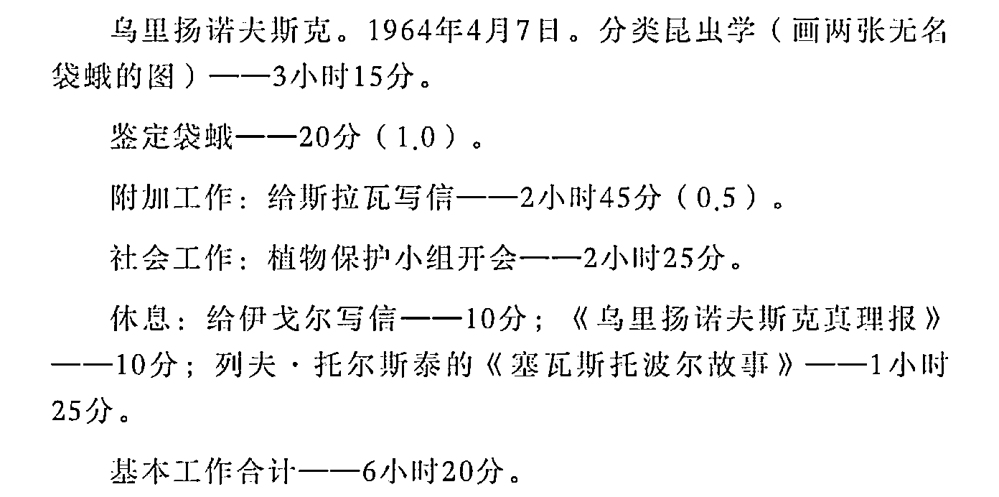
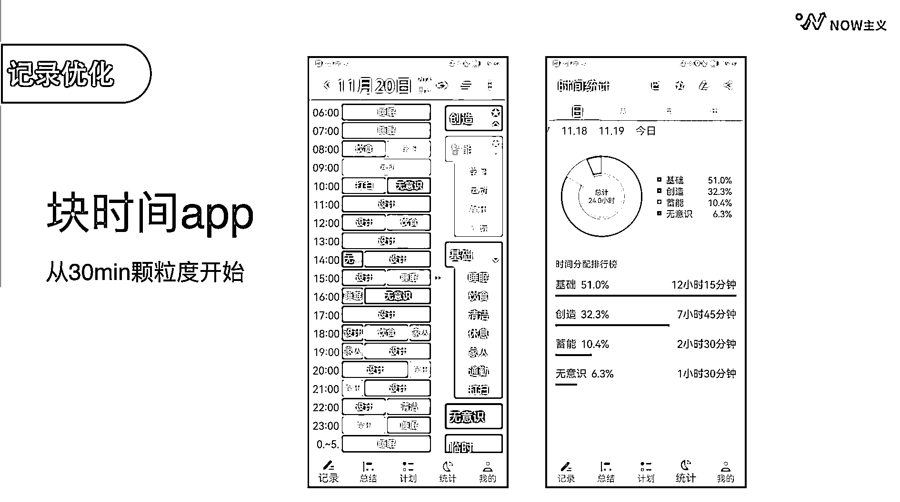
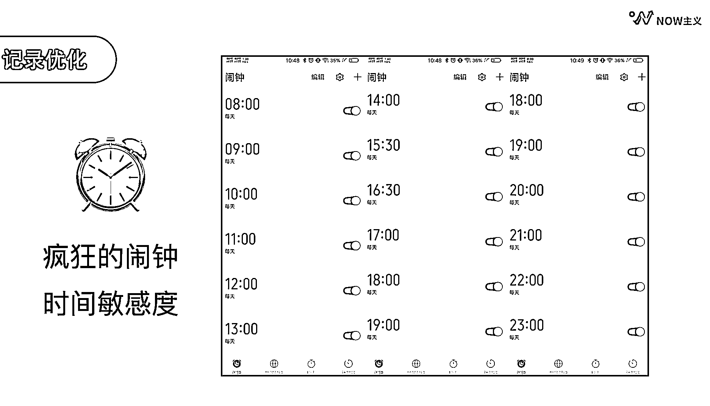

# 2.2.1 记录

首先第一步：记录。在《奇特的一生》这本书当中，我们可以看到柳比歇夫记录时间的方式非常详细。

这样的传统记录很有效，但工作量大，难以坚持。为了更高效地记录，我找到了一款软件，叫做块时间 App 。块时间 App 在安卓和苹果平台有不同的名字，安卓的平台叫「块时间」，苹果平台有两个版本，免费版叫「时间块青春版」，收费版叫「时间块」。收费版的色块可以显示标签的名称，并且可以设置二级的分类标签，大家按需下载即可。下面这张图就是安卓版本的使用界面。

块时间的使用方式非常简单，我们先在右侧栏当中列出我们常做的事件分类，选中左边需要标记的时间模块，再在右侧的对应色块上轻轻点一下，就可以完成记录了。

一开始建议大家选择 30 分钟的颗粒度，然后再逐步过渡到更精确的 15 分钟颗粒度。大家熟悉的企业家俞敏洪和王健林，其时间颗粒度也都是在 15 分钟左右。

关于记录时间本身需要花费的时间，请放心，在这个便捷工具的协助下，每天最多不超过 10 分钟。

可能有人会想：这也太事无巨细了吧，而且我根本不记得我这一天干了什么。怎么办？

这里，我们就要上第二个工具了，也就是我们手机里的闹钟。在第一天做记录的时候，请你和我们一起玩一个游戏：为你起床之后的时间，每整点定一个闹钟，一直定到睡觉之前。听起来是不是很疯狂？没错，这个游戏就叫做「疯狂的闹钟」。

因为我们对时间流失的主观感受往往跟客观是不同的，比如玩游戏的时候会觉得时间过得很快，但做一件很不喜欢的事情时，又会觉得时间太慢了。这样一天体验下来，首先我们能精准地知道自己每个小时都干了什么，不会再有“我很忙，却好像没做什么”的认知失调；其次，每个小时的准点闹铃，也能培养我们对时间的敏感度，校正一下主观中对时间流逝的感知。

这里特别要强调一下，对一刷手机就停不下来的朋友，「疯狂的闹钟」有奇效。原理也很简单，一旦你意识到自己在肆无忌惮地浪费时间，就不会愿意再继续浪费下去了。

块时间 app 搭配「疯狂的闹钟」，我们就可以轻松地记录自己一天到底做了什么。「疯狂的闹钟」只需体验一天就好了，块时间 app 我建议大家至少持续记录一整周。这样，我们日常工作和生活中会发生的每一件事，具体花了多长时间，以及各项任务到底为什么没完成，就会一目了然了。

你会发现一天的时间真的比我们想象的还要不禁用，但当你真正用心去管理和安排的时候，又会大大提升时间的使用效率，这就是时间管理的神奇之处。