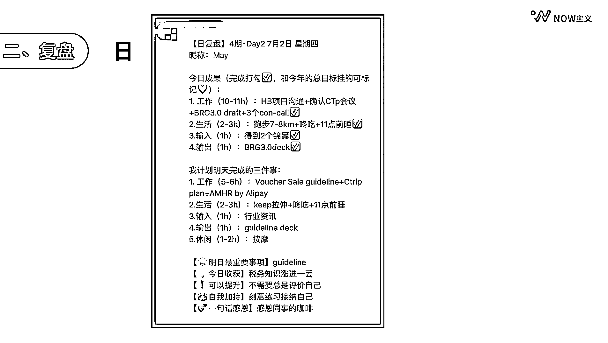
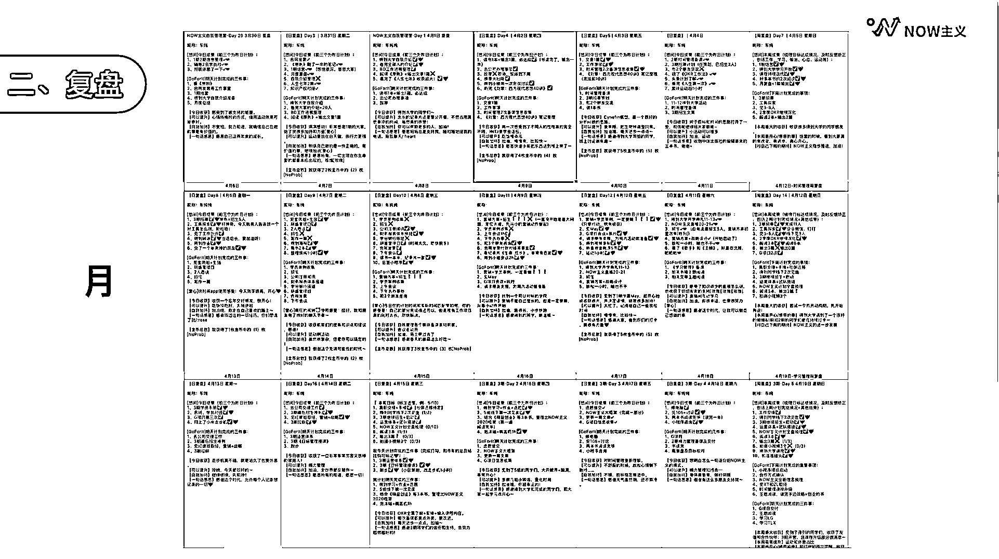
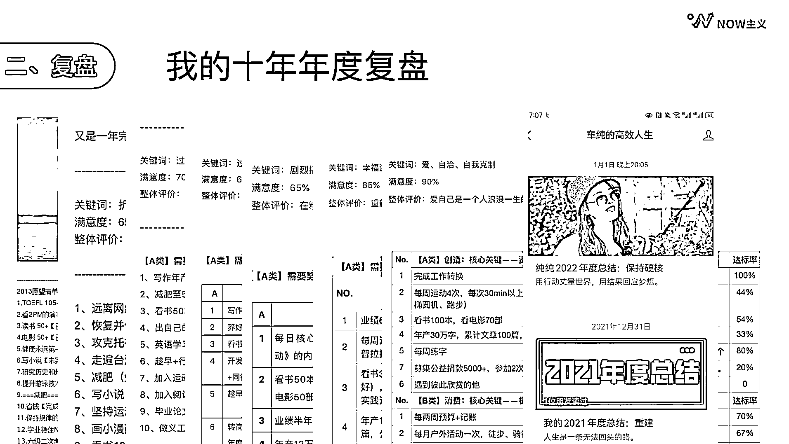

# 2.2.2 复盘

如果人是一条河流，记录让我们知道了我们身在何处，下一步就是要去做复盘了。

常见的复盘格式有很多，比如女孩子喜欢的贴纸手账、非常流行的九宫格晨间日记等。但它们的统一特点是太复杂，填完一份至少得花小半个小时，很难坚持。

那么，如何优化复盘的模式呢？我们要从“复盘到底盘什么”这个问题出发来思考，复盘最主要的目的有三个：

•今天的成果

•明天的计划

•今日的反思

回答了这三个问题，就可以快速清晰地对自己的一天进行全面审视了。

今天开始，我们就可以参考这个模式来做日复盘的打卡。第一次上手可能需要 10 分钟，但只要熟悉了这这个结构， 5 分钟左右就能完成一份全面、详细、有反思、有指导的日复盘&日计划。

（日复盘举例）

上面这个例子，在模板的基础上又对每件事情所用的时间进行了具体的标注，可以为之后的事项计划做指导。

做一天的复盘可能没什么大不了的，但如果坚持一周，你就会对这周做了哪些事情，获得了哪些成果了如指掌，再也不会觉得时间都荒废了。如果坚持一个月，你就会得到一份详尽的月复盘表，一个月的行动收获近在眼底。

如果坚持 10 年，我们就能清楚地看见自己的成长脉络。这是我每一年的年度复盘和计划表，我很清晰地知道自己每一年都做了哪些事情，有哪些进步和需要提升的地方，并且对于新一年的计划有清晰的目标和落地。坦白地说，这样的生活有计划，有成果、有期待，感觉真的好极了。

每个人的人生都有自己独特的方向，而复盘让我们知道哪里需要改进，让我们逐渐变成更好的自己。这就是复盘的意义。

相信你已经开始关注自己当前时间安排的习惯了，那么记录和复盘这两件事也请一定要坚持下来。你会对自己的时间安排越来越了解，从而越来越有自信做好时间管理。那么按照记录、复盘、计划、执行的模型，接下来，我们一起看看如何做计划，才能提升时间效率吧。

